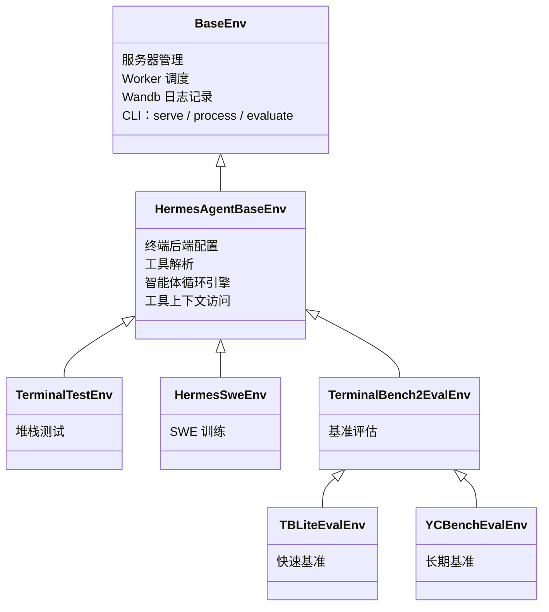

# 环境、基准测试与数据生成

Hermes 智能体包含一个完整的环境框架，将其工具调用能力连接到 [Atropos](https://github.com/NousResearch/atropos) RL 训练框架。这支持三种工作流：

1. **RL 训练** — 使用 GRPO 在多轮智能体任务上训练语言模型
2. **基准测试** — 在标准化的智能体基准上评估模型
3. **数据生成** — 从智能体轨迹中生成 SFT 训练数据

这三者共享一个共同的核心：一个**环境**类，它定义任务、运行智能体循环并对输出进行评分。

:::info 代码库环境 vs RL 训练工具
此处文档记录的 Python 环境框架位于代码库的 `environments/` 目录下，是 Hermes/Atropos 集成的实现级 API。这与面向用户的 `rl_*` 工具是分开的，后者作为远程 RL 训练工作流的编排层。
:::

:::tip 快速链接
- **想运行基准测试？** 跳转至 [可用基准测试](#available-benchmarks)
- **想使用 RL 训练？** 参阅 [RL 训练工具](/user-guide/features/rl-training) 了解智能体驱动的界面，或参阅 [运行环境](#running-environments) 了解手动执行方式
- **想创建新环境？** 参阅 [创建环境](#creating-environments)
:::

## 架构

环境系统基于一个三层继承链构建：



### BaseEnv (Atropos)

来自 `atroposlib` 的基础层。提供：
- **服务器管理** — 连接到 OpenAI 兼容 API (VLLM, SGLang, OpenRouter)
- **Worker 调度** — 并行轨迹协调
- **Wandb 集成** — 指标日志记录和轨迹可视化
- **CLI 界面** — 三个子命令：`serve`、`process`、`evaluate`
- **评估日志** — `evaluate_log()` 将结果保存为 JSON + JSONL 格式

### HermesAgentBaseEnv

Hermes 智能体层 (`environments/hermes_base_env.py`)。新增：
- **终端后端配置** — 设置 `TERMINAL_ENV` 用于沙盒执行（本地、Docker、Modal、Daytona、SSH、Singularity）
- **工具解析** — `_resolve_tools_for_group()` 调用 hermes-agent 的 `get_tool_definitions()` 以根据启用/禁用的工具集获取正确的工具 schema
- **智能体循环集成** — `collect_trajectory()` 运行 `HermesAgentLoop` 并对结果进行评分
- **两阶段操作** — 第一阶段（OpenAI 服务器）用于评估/SFT，第二阶段（VLLM ManagedServer）用于带有 logprobs 的完整 RL
- **异步安全补丁** — 对 Modal 后端进行猴子补丁，使其能在 Atropos 的事件循环内工作

### 具体环境

您的环境继承自 `HermesAgentBaseEnv` 并实现以下五个方法：

| 方法 | 用途 |
|--------|---------|
| `setup()` | 加载数据集，初始化状态 |
| `get_next_item()` | 返回下一个待处理的项 |
| `format_prompt(item)` | 将一个项转换为用户消息 |
| `compute_reward(item, result, ctx)` | 对轨迹评分（0.0–1.0） |
| `evaluate()` | 定期评估逻辑 |

## 核心组件

### 智能体循环

`HermesAgentLoop`（位于 `environments/agent_loop.py`）是可复用的多轮智能体引擎。它运行与 hermes-agent 主循环相同的工具调用模式：

1.  通过 `server.chat_completion()` 将消息 + 工具模式发送到 API
2.  如果响应包含 `tool_calls`，则通过 `handle_function_call()` 调度每个调用
3.  将工具结果追加到对话中，然后返回步骤 1
4.  如果没有 `tool_calls`，则智能体完成

工具调用在线程池（`ThreadPoolExecutor(128)`）中执行，以确保异步后端（Modal, Docker）在 Atropos 的事件循环中不会死锁。

返回一个 `AgentResult`：

```python
@dataclass
class AgentResult:
    messages: List[Dict[str, Any]]       # 完整的对话历史
    turns_used: int                       # 进行的 LLM 调用次数
    finished_naturally: bool              # 如果模型自行停止则为 True
    reasoning_per_turn: List[Optional[str]]  # 提取的推理内容
    tool_errors: List[ToolError]          # 工具调度期间遇到的错误
    managed_state: Optional[Dict]         # VLLM ManagedServer 状态（第 2 阶段）
```

### 工具上下文

`ToolContext`（位于 `environments/tool_context.py`）使奖励函数能够直接访问模型在部署期间使用的**同一个沙箱**。`task_id` 的作用域意味着所有状态（文件、进程、浏览器标签页）都会被保留。

```python
async def compute_reward(self, item, result, ctx: ToolContext):
    # 在模型的终端沙箱中运行测试
    test = ctx.terminal("pytest -v")
    if test["exit_code"] == 0:
        return 1.0

    # 检查文件是否已创建
    content = ctx.read_file("/workspace/solution.py")
    if content.get("content"):
        return 0.5

    # 下载文件用于本地验证
    ctx.download_file("/remote/output.bin", "/local/output.bin")
    return 0.0
```

可用方法：

| 类别 | 方法 |
|----------|----------|
| **终端** | `terminal(command, timeout)` |
| **文件** | `read_file(path)`, `write_file(path, content)`, `search(query, path)` |
| **传输** | `upload_file()`, `upload_dir()`, `download_file()`, `download_dir()` |
| **网络** | `web_search(query)`, `web_extract(urls)` |
| **浏览器** | `browser_navigate(url)`, `browser_snapshot()` |
| **通用** | `call_tool(name, args)` — 用于任何 hermes-agent 工具的应急方案 |
| **清理** | `cleanup()` — 释放所有资源 |

### 工具调用解析器

对于**第 2 阶段**（VLLM ManagedServer），服务器返回原始文本，没有结构化的工具调用。`environments/tool_call_parsers/` 中的客户端解析器从原始输出中提取 `tool_calls`：

```python
from environments.tool_call_parsers import get_parser

parser = get_parser("hermes")  # 或 "mistral", "llama3_json", "qwen", "deepseek_v3" 等
content, tool_calls = parser.parse(raw_model_output)
```

可用解析器：`hermes`、`mistral`、`llama3_json`、`llama4_json`、`qwen`、`qwen3_coder`、`deepseek_v3`、`deepseek_v3_1`（别名 `deepseek_v31`）、`kimi_k2`、`longcat`、`glm45`、`glm47`。

在第 1 阶段（OpenAI 服务器类型），不需要解析器——服务器原生处理工具调用解析。

## 可用基准测试

### TerminalBench2

**89 个具有挑战性的终端任务**，每个任务都有独立的 Docker 沙箱环境。

| | |
|---|---|
| **测试内容** | 单一任务编码/系统管理能力 |
| **评分** | 二元通过/失败（测试套件验证） |
| **沙箱** | Modal 云沙箱（每个任务独立的 Docker 镜像） |
| **工具** | `terminal` + `file` |
| **任务** | 涵盖多个类别的 89 个任务 |
| **成本** | 完整评估约 $50–200（并行执行） |
| **时间** | 约 2–4 小时 |

```bash
python environments/benchmarks/terminalbench_2/terminalbench2_env.py evaluate \
    --config environments/benchmarks/terminalbench_2/default.yaml

# 运行特定任务
python environments/benchmarks/terminalbench_2/terminalbench2_env.py evaluate \
    --config environments/benchmarks/terminalbench_2/default.yaml \
    --env.task_filter fix-git,git-multibranch
```

数据集：HuggingFace 上的 [NousResearch/terminal-bench-2](https://huggingface.co/datasets/NousResearch/terminal-bench-2)。

### TBLite（OpenThoughts Terminal Bench Lite）

**100 个难度校准的任务** —— 一个比 TerminalBench2 更快的代理。

| | |
|---|---|
| **测试内容** | 与 TB2 相同（编码/系统管理），校准的难度等级 |
| **评分** | 二元通过/失败 |
| **沙箱** | Modal 云沙箱 |
| **工具** | `terminal` + `file` |
| **任务** | 100 个任务：简单 (40)，中等 (26)，困难 (26)，极难 (8) |
| **相关性** | 与完整 TB2 的 r=0.911 |
| **速度** | 比 TB2 快 2.6–8 倍 |

```bash
python environments/benchmarks/tblite/tblite_env.py evaluate \
    --config environments/benchmarks/tblite/default.yaml
```

TBLite 是 TerminalBench2 的一个轻量子类——只有数据集和超时时间不同。由 OpenThoughts Agent 团队（Snorkel AI + Bespoke Labs）创建。数据集：[NousResearch/openthoughts-tblite](https://huggingface.co/datasets/NousResearch/openthoughts-tblite)。

### YC-Bench

**长期战略基准测试** —— 智能体扮演一家 AI 创业公司的 CEO。

| | |
|---|---|
| **测试内容** | 在数百轮交互中保持多轮战略连贯性 |
| **评分** | 综合评分：`0.5 × 生存 + 0.5 × 标准化资金` |
| **沙箱** | 本地终端（无需 Modal） |
| **工具** | 仅 `terminal` |
| **运行次数** | 默认 9 次（3 个预设 × 3 个种子），顺序执行 |
| **成本** | 完整评估约 $50–200 |
| **时间** | 约 3–6 小时 |

```bash
# 安装 yc-bench（可选依赖）
pip install "hermes-agent[yc-bench]"

# 运行评估
bash environments/benchmarks/yc_bench/run_eval.sh

# 或直接运行
python environments/benchmarks/yc_bench/yc_bench_env.py evaluate \
    --config environments/benchmarks/yc_bench/default.yaml

# 快速单预设测试
python environments/benchmarks/yc_bench/yc_bench_env.py evaluate \
    --config environments/benchmarks/yc_bench/default.yaml \
    --env.presets '["fast_test"]' --env.seeds '[1]'
```

YC-Bench 使用 [collinear-ai/yc-bench](https://github.com/collinear-ai/yc-bench) —— 一个包含 4 个技能领域（研究、推理、数据环境、训练）、声望系统、员工管理和财务压力的确定性模拟。与 TB2 每个任务的二元评分不同，YC-Bench 衡量的是智能体能否在数百个复合决策中保持战略连贯性。

## 训练环境

### TerminalTestEnv

一个最小化自包含环境，包含内联任务（无需外部数据集）。用于 **验证完整技术栈** 的端到端运行。每个任务要求模型在指定路径创建文件；验证器将检查文件内容。

```bash
# 进程模式（将rollouts保存到JSONL，无需训练服务器）
python environments/terminal_test_env/terminal_test_env.py process \
    --env.data_path_to_save_groups terminal_test_output.jsonl

# 服务模式（连接Atropos API进行强化学习训练）
python environments/terminal_test_env/terminal_test_env.py serve
```

### HermesSweEnv

SWE-bench 风格的训练环境。模型接收编程任务，使用终端、文件和网络工具解决问题，奖励函数在同一 Modal 沙盒中运行测试。

```bash
python environments/hermes_swe_env/hermes_swe_env.py serve \
    --openai.model_name YourModel \
    --env.dataset_name bigcode/humanevalpack \
    --env.terminal_backend modal
```

## 运行环境

每个环境都是一个独立的 Python 脚本，包含三个 CLI 子命令：

### `evaluate` — 运行基准测试

用于仅评估的环境（基准测试）。运行所有项目，计算指标，记录到 wandb。

```bash
python environments/benchmarks/tblite/tblite_env.py evaluate \
    --config environments/benchmarks/tblite/default.yaml \
    --openai.model_name anthropic/claude-sonnet-4.6
```

无需训练服务器或 `run-api`。环境自行处理所有内容。

### `process` — 生成 SFT 数据

运行rollouts并将评分轨迹保存到 JSONL。用于在没有完整强化学习循环的情况下生成训练数据。

```bash
python environments/terminal_test_env/terminal_test_env.py process \
    --env.data_path_to_save_groups output.jsonl \
    --openai.model_name anthropic/claude-sonnet-4.6
```

输出格式：每行是一个评分轨迹，包含完整对话历史、奖励和元数据。

### `serve` — 连接 Atropos 进行强化学习训练

将环境连接到正在运行的 Atropos API 服务器 (`run-api`)。用于实时强化学习训练。

```bash
# 终端 1：启动 Atropos API
run-api

# 终端 2：启动环境
python environments/hermes_swe_env/hermes_swe_env.py serve \
    --openai.model_name YourModel
```

环境从 Atropos 接收项目，运行智能体rollouts，计算奖励，并将评分轨迹发送回去用于训练。

## 两阶段操作

### 阶段 1：OpenAI 服务器（评估 / SFT）

使用 `server.chat_completion()` 和 `tools=` 参数。服务器（VLLM, SGLang, OpenRouter, OpenAI）原生处理工具调用解析。返回带有结构化 `tool_calls` 的 `ChatCompletion` 对象。

- **用于**：评估、SFT 数据生成、基准测试、测试
- 为 Atropos 管道创建 **占位符标记**（因为 OpenAI API 不提供真实标记 ID）

### 阶段 2：VLLM ManagedServer（完整强化学习）

使用 ManagedServer 通过 `/generate` 获取精确的标记 ID 和对数概率。客户端 [工具调用解析器](#tool-call-parsers) 从原始输出重建结构化 `tool_calls`。

- **用于**：使用 GRPO/PPO 的完整强化学习训练
- **真实标记**、掩码和对数概率在管道中流动
- 在配置中设置 `tool_call_parser` 以匹配你的模型格式（例如，`"hermes"`, `"qwen"`, `"mistral"`）

## 创建环境

### 训练环境

```python
from environments.hermes_base_env import HermesAgentBaseEnv, HermesAgentEnvConfig
from atroposlib.envs.server_handling.server_manager import APIServerConfig

class MyEnvConfig(HermesAgentEnvConfig):
    my_custom_field: str = "default_value"

class MyEnv(HermesAgentBaseEnv):
    name = "my-env"
    env_config_cls = MyEnvConfig

    @classmethod
    def config_init(cls):
        env_config = MyEnvConfig(
            enabled_toolsets=["terminal", "file"],
            terminal_backend="modal",
            max_agent_turns=30,
        )
        server_configs = [APIServerConfig(
            base_url="https://openrouter.ai/api/v1",
            model_name="anthropic/claude-sonnet-4.6",
            server_type="openai",
        )]
        return env_config, server_configs

    async def setup(self):
        from datasets import load_dataset
        self.dataset = list(load_dataset("my-dataset", split="train"))
        self.iter = 0

    async def get_next_item(self):
        item = self.dataset[self.iter % len(self.dataset)]
        self.iter += 1
        return item

    def format_prompt(self, item):
        return item["instruction"]

    async def compute_reward(self, item, result, ctx):
        # ctx 提供对rollout沙盒的完全工具访问
        test = ctx.terminal("pytest -v")
        return 1.0 if test["exit_code"] == 0 else 0.0

    async def evaluate(self, *args, **kwargs):
        # 训练期间的定期评估
        pass

if __name__ == "__main__":
    MyEnv.cli()
```

### 仅评估的基准测试

对于基准测试，请遵循 TerminalBench2、TBLite 和 YC-Bench 使用的模式：

1. **在** `environments/benchmarks/your-benchmark/` **下创建**
2. **设置仅评估配置**：`eval_handling=STOP_TRAIN`, `steps_per_eval=1`, `total_steps=1`
3. **存根训练方法**：`collect_trajectories()` 返回 `(None, [])`, `score()` 返回 `None`
4. **实现** `rollout_and_score_eval(eval_item)` — 每个项目的智能体循环 + 评分
5. **实现** `evaluate()` — 编排所有运行，计算聚合指标
6. **添加流式 JSONL** 以实现崩溃安全的结果持久化
7. **添加清理**：`KeyboardInterrupt` 处理, `cleanup_all_environments()`, `_tool_executor.shutdown()`
8. **使用** `evaluate` 子命令运行

参见 `environments/benchmarks/yc_bench/yc_bench_env.py` 获取一个清晰、文档完善的参考实现。

## 配置参考

### HermesAgentEnvConfig 字段

| 字段 | 类型 | 默认值 | 描述 |
|------|------|--------|------|
| `enabled_toolsets` | `List[str]` | `None` (全部) | 启用哪些 hermes 工具集 |
| `disabled_toolsets` | `List[str]` | `None` | 要过滤掉的工具集 |
| `distribution` | `str` | `None` | 概率性工具集分布名称 |
| `max_agent_turns` | `int` | `30` | 每次rollout的最大 LLM 调用次数 |
| `agent_temperature` | `float` | `1.0` | 采样温度 |
| `system_prompt` | `str` | `None` | 智能体的系统消息 |
| `terminal_backend` | `str` | `"local"` | `local`, `docker`, `modal`, `daytona`, `ssh`, `singularity` |
| `terminal_timeout` | `int` | `120` | 每条终端命令的超时秒数 |
| `terminal_lifetime` | `int` | `3600` | 沙盒最大生存期 |
| `dataset_name` | `str` | `None` | HuggingFace 数据集标识符 |
| `tool_pool_size` | `int` | `128` | 工具执行的线程池大小 |
| `tool_call_parser` | `str` | `"hermes"` | 阶段 2 原始输出的解析器 |
| `extra_body` | `Dict` | `None` | OpenAI API 的额外参数（例如 OpenRouter 提供商偏好） |
| `eval_handling` | `Enum` | `STOP_TRAIN` | `STOP_TRAIN`, `LIMIT_TRAIN`, `NONE` |

### YAML 配置

环境可以通过使用 `--config` 传递的 YAML 文件进行配置：

```yaml
env:
  enabled_toolsets: ["terminal", "file"]
  max_agent_turns: 60
  max_token_length: 32000
  agent_temperature: 0.8
  terminal_backend: "modal"
  terminal_timeout: 300
  dataset_name: "NousResearch/terminal-bench-2"
  tokenizer_name: "NousResearch/Hermes-3-Llama-3.1-8B"
  use_wandb: true
  wandb_name: "my-benchmark"

openai:
  base_url: "https://openrouter.ai/api/v1"
  model_name: "anthropic/claude-sonnet-4.6"
  server_type: "openai"
  health_check: false
```

YAML 值覆盖 `config_init()` 默认值。CLI 参数覆盖 YAML 值：

```bash
python my_env.py evaluate \
    --config my_config.yaml \
    --openai.model_name anthropic/claude-opus-4.6  # 覆盖 YAML
```

## 先决条件

### 对于所有环境

- Python >= 3.11
- `atroposlib`: `pip install git+https://github.com/NousResearch/atropos.git`
- 一个 LLM API 密钥（OpenRouter, OpenAI 或自托管 VLLM/SGLang）

### 对于 Modal 沙盒基准测试 (TB2, TBLite)

- [Modal](https://modal.com) 账户和 CLI: `pip install "hermes-agent[modal]"`
- `MODAL_TOKEN_ID` 和 `MODAL_TOKEN_SECRET` 环境变量

### 对于 YC-Bench

- `pip install "hermes-agent[yc-bench]"`（安装 yc-bench CLI + SQLAlchemy）
- 无需 Modal — 使用本地终端后端运行

### 对于强化学习训练

- `TINKER_API_KEY` — [Tinker](https://tinker.computer) 训练服务的 API 密钥
- `WANDB_API_KEY` — 用于 Weights & Biases 指标跟踪
- `tinker-atropos` 子模块（位于仓库中的 `tinker-atropos/`）

参见[强化学习训练](/user-guide/features/rl-training)了解智能体驱动的强化学习工作流。

## 目录结构

```
environments/
├── hermes_base_env.py          # 抽象基类 (HermesAgentBaseEnv)
├── agent_loop.py               # 多轮智能体引擎 (HermesAgentLoop)
├── tool_context.py             # 用于奖励函数的每轮rollout工具访问
├── patches.py                  # Modal 后端的异步安全补丁
│
├── tool_call_parsers/          # 阶段 2 客户端解析器
│   ├── hermes_parser.py        # Hermes/ChatML <tool_call> 格式
│   ├── mistral_parser.py       # Mistral [TOOL_CALLS] 格式
│   ├── llama_parser.py         # Llama 3 JSON 工具调用
│   ├── qwen_parser.py          # Qwen 格式
│   ├── deepseek_v3_parser.py   # DeepSeek V3 格式
│   └── ...                     # + kimi_k2, longcat, glm45/47 等。
│
├── terminal_test_env/          # 栈验证（内联任务）
├── hermes_swe_env/             # SWE-bench 训练环境
│
└── benchmarks/                 # 评估基准测试
    ├── terminalbench_2/        # 89 个终端任务，Modal 沙盒
    ├── tblite/                 # 100 个校准任务（快速 TB2 代理）
    └── yc_bench/               # 长期策略基准测试
```