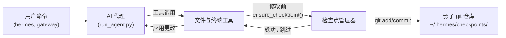

# 检查点与 `/rollback`

Hermes Agent 会在**破坏性操作**之前自动快照您的项目，并允许您通过单个命令恢复。检查点默认**已启用**——当没有文件修改工具触发时，零成本。

此安全网由内部**检查点管理器**提供支持，它在 `~/.hermes/checkpoints/` 下维护一个独立的影子 git 仓库——您的真实项目 `.git` 永远不会被触碰。

## 什么会触发检查点

检查点会在以下情况之前自动创建：

- **文件工具** — `write_file` 和 `patch`
- **破坏性终端命令** — `rm`, `mv`, `sed -i`, `truncate`, `shred`, 输出重定向 (`>`)，以及 `git reset`/`clean`/`checkout`

代理每次会话轮次**每个目录最多创建一次检查点**，因此长时间运行的会话不会 spam 快照。

## 快速参考

| 命令 | 描述 |
|---------|-------------|
| `/rollback` | 列出所有检查点及变更统计 |
| `/rollback <N>` | 恢复到检查点 N（同时撤销上一次对话轮次） |
| `/rollback diff <N>` | 预览检查点 N 与当前状态之间的差异 |
| `/rollback <N> <file>` | 从检查点 N 恢复单个文件 |

## 检查点的工作原理

在高层面上：

- Hermes 检测到工具即将**修改**工作树中的文件时。
- 每次对话轮次（每个目录）：
  - 为文件解析合理的项目根目录。
  - 初始化或重用与该目录关联的**影子 git 仓库**。
  - 使用简短、人类可读的原因暂存并提交当前状态。
- 这些提交形成检查点历史记录，您可以通过 `/rollback` 进行检查和恢复。



## 配置

检查点默认已启用。在 `~/.hermes/config.yaml` 中配置：

```yaml
checkpoints:
  enabled: true          # 主开关（默认：true）
  max_snapshots: 50      # 每个目录的最大检查点数量
```

要禁用：

```yaml
checkpoints:
  enabled: false
```

禁用时，检查点管理器为空操作，永远不会尝试 git 操作。

## 列出检查点

从 CLI 会话中：

```
/rollback
```

Hermes 会回复格式化的列表，显示变更统计：

```text
📸 /path/to/project 的检查点：

  1. 4270a8c  2026-03-16 04:36  before patch  (1 个文件，+1/-0)
  2. eaf4c1f  2026-03-16 04:35  before write_file
  3. b3f9d2e  2026-03-16 04:34  before terminal: sed -i s/old/new/ config.py  (1 个文件，+1/-1)

  /rollback <N>             恢复到检查点 N
  /rollback diff <N>        预览自检查点 N 以来的更改
  /rollback <N> <file>      从检查点 N 恢复单个文件
```

每个条目显示：

- 短哈希
- 时间戳
- 原因（触发快照的内容）
- 变更摘要（更改的文件、增删行数）

## 使用 `/rollback diff` 预览更改

在提交恢复之前，预览自检查点以来发生了哪些更改：

```
/rollback diff 1
```

这将显示 git diff 统计摘要，随后是实际差异：

```text
test.py | 2 +-
 1 file changed, 1 insertion(+), 1 deletion(-)

diff --git a/test.py b/test.py
--- a/test.py
+++ b/test.py
@@ -1 +1 @@
-print('original content')
+print('modified content')
```

长差异限制为 80 行，以避免淹没终端。

## 使用 `/rollback` 恢复

通过编号恢复到检查点：

```
/rollback 1
```

在幕后，Hermes：

1. 验证目标提交存在于影子仓库中。
2. 对当前状态采取**回滚前快照**，以便您稍后“撤销撤销”。
3. 恢复工作目录中的跟踪文件。
4. **撤销上一次对话轮次**，以便代理上下文与恢复的文件系统状态匹配。

成功时：

```text
✅ 已恢复到检查点 4270a8c5：before patch
已自动保存回滚前快照。
(^_^)b 撤销了 4 条消息。已移除："Now update test.py to ..."
  历史中剩余 4 条消息。
  对话轮次已撤销以匹配恢复的文件状态。
```

对话撤销确保代理不会“记住”已回滚的更改，避免在下一轮造成混淆。

## 单文件恢复

仅从检查点恢复一个文件，而不影响目录的其余部分：

```
/rollback 1 src/broken_file.py
```

当代理对多个文件进行了更改但只需恢复一个文件时，这很有用。

## 安全与性能保护

为了保持检查点安全且快速，Hermes 应用了几个保护机制：

- **Git 可用性** — 如果 `PATH` 中未找到 `git`，检查点将被透明禁用。
- **目录范围** — Hermes 跳过过于宽泛的目录（根 `/`，家目录 `$HOME`）。
- **仓库大小** — 跳过包含超过 50,000 个文件的目录，以避免缓慢的 git 操作。
- **无变更快照** — 如果自上次快照以来没有更改，则跳过检查点。
- **非致命错误** — 检查点管理器内部的所有错误均以调试级别记录；您的工具将继续运行。

## 检查点的位置

所有影子仓库都位于：

```text
~/.hermes/checkpoints/
  ├── <hash1>/   # 一个工作目录的影子 git 仓库
  ├── <hash2>/
  └── ...
```

每个 `<hash>` 源自工作目录的绝对路径。在每个影子仓库中，您将找到：

- 标准 git 内部（`HEAD`, `refs/`, `objects/`）
- 包含精选忽略列表的 `info/exclude` 文件
- 指向原始项目根目录的 `HERMES_WORKDIR` 文件

您通常不需要手动触碰这些内容。

## 最佳实践

- **保持检查点启用** — 它们默认开启，当没有文件修改时零成本。
- **恢复前使用 `/rollback diff`** — 预览将发生什么更改以选择正确的检查点。
- **仅撤销代理驱动的更改时使用 `/rollback` 而非 `git reset`**。
- **与 Git 工作树结合使用**以获得最大安全性 — 将每个 Hermes 会话保留在自己的工作树/分支中，检查点作为额外层。

要在同一仓库上并行运行多个代理，请查看 [Git 工作树](./git-worktrees.md) 指南。