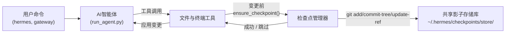

# 检查点和 `/rollback`

Hermes 智能体可以在执行**破坏性操作**之前自动为您的项目创建快照，并可通过单个命令恢复项目。自 v2 版本起，检查点功能是**可选的**——大多数用户从不使用 `/rollback`，且影子存储会随时间推移占用可观空间，因此默认处于关闭状态。

可通过 `--checkpoints` 参数按会话启用检查点：

```bash
hermes chat --checkpoints
```

或在 `~/.hermes/config.yaml` 中全局启用：

```yaml
checkpoints:
  enabled: true
```

此安全网由一个内部**检查点管理器**提供支持，该管理器在 `~/.hermes/checkpoints/store/` 下维护一个共享的影子 Git 仓库——您的真实项目 `.git` 永远不会被触及。智能体工作的每个项目都共享同一个存储库，因此 Git 的内容寻址对象数据库可在项目和会话轮次之间实现去重。

## 什么情况下会触发检查点

在以下操作之前会自动创建检查点：

- **文件工具** — `write_file` 和 `patch`
- **破坏性终端命令** — `rm`、`rmdir`、`cp`、`install`、`mv`、`sed -i`、`truncate`、`dd`、`shred`、输出重定向（`>`）以及 `git reset`/`clean`/`checkout`

智能体**每轮会话（每个目录）最多创建一个检查点**，因此长时间运行的会话不会产生大量快照。

## 快速参考

会话内斜杠命令：

| 命令 | 描述 |
|---------|-------------|
| `/rollback` | 列出所有检查点及其变更统计信息 |
| `/rollback <N>` | 恢复到第 N 个检查点（同时撤销上一轮聊天） |
| `/rollback diff <N>` | 预览第 N 个检查点与当前状态之间的差异 |
| `/rollback <N> <file>` | 从第 N 个检查点恢复单个文件 |

用于在会话外检查和管理局域存储库的命令行工具：

| 命令 | 描述 |
|---------|-------------|
| `hermes checkpoints` | 显示总大小、项目数量、每个项目的详细 breakdown |
| `hermes checkpoints status` | 与 `checkpoints` 相同 |
| `hermes checkpoints list` | `status` 的别名 |
| `hermes checkpoints prune` | 强制执行清理：删除孤立/过期条目、执行垃圾回收、强制执行大小上限 |
| `hermes checkpoints clear` | 彻底清除整个检查点基础目录（会先询问确认） |
| `hermes checkpoints clear-legacy` | 仅删除 v1 迁移产生的 `legacy-*` 存档 |

## 检查点的工作原理

从高层面来看：

- Hermes 检测到工具即将**修改工作树中的文件**。
- 每轮对话（每个目录）执行一次以下操作：
  - 为文件解析一个合理的项目根目录。
  - 初始化或复用位于 `~/.hermes/checkpoints/store/` 的**单一共享影子存储库**。
  - 将内容暂存到每个项目的索引中，构建树对象，并提交到每个项目的引用（`refs/hermes/<project-hash>`）。
- 这些按项目划分的引用构成了可检查和恢复的检查点历史记录，您可通过 `/rollback` 进行操作。



## 配置

在 `~/.hermes/config.yaml` 中配置：

```yaml
checkpoints:
  enabled: false              # 主开关（默认：false — 可选开启）
  max_snapshots: 20           # 每个项目的最大检查点数量（通过引用重写 + 垃圾回收强制执行）
  max_total_size_mb: 500      # 存储库总大小的硬性上限；最旧的提交将被丢弃
  max_file_size_mb: 10        # 跳过任何大于此值的单个文件

  # 自动维护（默认开启）：在启动时扫描 ~/.hermes/checkpoints/，
  # 并删除其工作目录不再存在的项目条目（孤立条目）或其 last_touch 早于 retention_days 的条目。
  # 最多每 min_interval_hours 运行一次，通过 .last_prune 标记进行跟踪。
  auto_prune: true
  retention_days: 7
  delete_orphans: true
  min_interval_hours: 24
```

要完全禁用所有功能：

```yaml
checkpoints:
  enabled: false
  auto_prune: false
```

当 `enabled: false` 时，检查点管理器为空操作，从不尝试执行 Git 操作。当 `auto_prune: false` 时，存储库将持续增长，直到您手动运行 `hermes checkpoints prune`。

## 列出检查点

在 CLI 会话中：

```
/rollback
```

Hermes 将返回一个格式化的列表，显示变更统计信息：

```text
📸 /path/to/project 的检查点：

  1. 4270a8c  2026-03-16 04:36  patch 之前  (1 个文件, +1/-0)
  2. eaf4c1f  2026-03-16 04:35  write_file 之前
  3. b3f9d2e  2026-03-16 04:34  终端命令之前: sed -i s/old/new/ config.py  (1 个文件, +1/-1)

  /rollback <N>             恢复到第 N 个检查点
  /rollback diff <N>        预览自第 N 个检查点以来的变更
  /rollback <N> <file>      从第 N 个检查点恢复单个文件
```

## 从 Shell 检查存储库

```bash
hermes checkpoints
```

示例输出：

```text
检查点基础目录: /home/you/.hermes/checkpoints
总大小:      142.3 MB
  store/         138.1 MB
  legacy-*       4.2 MB
项目数:        12

  工作目录                                                       提交数    最后访问时间  状态
  /home/you/code/hermes-agent                                        20       2小时前  活跃
  /home/you/code/experiments/rl-runner                                8       1天前  活跃
  /home/you/code/old-prototype                                        3       9天前  孤立
  ...

遗留存档 (1):
  legacy-20260506-050616                           4.2 MB

清除命令: hermes checkpoints clear-legacy
```

强制执行完整清理（忽略 24 小时幂等标记）：

```bash
hermes checkpoints prune --retention-days 3 --max-size-mb 200
```

## 使用 `/rollback diff` 预览变更

在确认恢复之前，预览自某个检查点以来发生的变更：

```
/rollback diff 1
```

这将显示 Git 差异统计摘要以及实际的差异内容。

## 使用 `/rollback` 恢复

```
/rollback 1
```

在后台，Hermes 将：

1. 验证目标提交是否存在于影子存储库中。
2. 对当前状态拍摄**回滚前快照**，以便您稍后可以“撤销回滚”。
3. 恢复工作目录中已跟踪的文件。
4. **撤销上一轮对话**，使智能体的上下文与恢复后的文件系统状态匹配。

## 单个文件恢复

仅从检查点恢复一个文件，而不影响目录中的其他内容：

```
/rollback 1 src/broken_file.py
```

## 安全性与性能保护机制

- **Git 可用性** — 如果在 `PATH` 中找不到 `git`，检查点将被透明地禁用。
- **目录范围** — Hermes 跳过过于宽泛的目录（根目录 `/`、家目录 `$HOME`）。
- **仓库大小** — 文件数超过 50,000 的目录将被跳过。
- **单个文件大小上限** — 大于 `max_file_size_mb`（默认 10 MB）的文件将被排除在快照之外。防止意外包含数据集、模型权重或生成的媒体文件。
- **总存储库大小上限** — 当存储库超过 `max_total_size_mb`（默认 500 MB）时，将按轮询方式丢弃每个项目中最旧的提交，直至低于上限。
- **真实清理** — `max_snapshots` 通过重写每个项目的引用并在之后运行 `git gc --prune=now` 来强制执行，因此不会积累松散对象。
- **无变更快照** — 如果自上次快照以来没有发生任何变更，则跳过检查点。
- **非致命错误** — 检查点管理器内部的所有错误均以调试级别记录；您的工具将继续运行。

## 检查点的存储位置

```text
~/.hermes/checkpoints/
  ├── store/                 # 单一共享裸 Git 仓库
  │   ├── HEAD, objects/     # Git 内部数据（跨项目共享）
  │   ├── refs/hermes/<hash> # 每个项目的分支顶端
  │   ├── indexes/<hash>     # 每个项目的 Git 索引
  │   ├── projects/<hash>.json  # 工作目录 + 创建时间 + 最后访问时间
  │   └── info/exclude
  ├── .last_prune            # 自动清理幂等标记
  └── legacy-<ts>/           # 存档的 v2 之前每个项目的影子仓库
```

每个 `<hash>` 均由工作目录的绝对路径派生而来。您通常无需手动操作这些内容——请使用 `hermes checkpoints status` / `prune` / `clear` 替代。

### 从 v1 迁移

在 v2 重写之前，每个工作目录都在 `~/.hermes/checkpoints/<hash>/` 下拥有自己的完整影子 Git 仓库。这种布局无法在项目之间对对象进行去重，且其清理程序被记录为空操作——存储库将无限增长。

在首次运行 v2 时，任何 v2 之前的影子仓库都会被移动到 `~/.hermes/checkpoints/legacy-<timestamp>/` 中，以便新的单一存储布局可以从干净状态开始。通过手动使用 `git` 检查遗留存档，仍可访问旧的 `/rollback` 历史记录；一旦您确信不再需要它，请运行：

```bash
hermes checkpoints clear-legacy
```

以回收空间。遗留存档也会在 `retention_days` 后被 `auto_prune` 清理。

## 最佳实践

- **仅在需要时启用检查点** — 使用 `hermes chat --checkpoints` 或在每个配置文件中设置 `enabled: true`。
- **恢复前使用 `/rollback diff`** — 预览将要发生的变更，以选择合适的检查点。
- **当只想撤销智能体驱动的变更时，请使用 `/rollback` 而非 `git reset`**。
- **如果您经常使用检查点，请偶尔检查 `hermes checkpoints status`** — 显示哪些项目处于活跃状态以及存储库的成本。
- **结合 Git 工作树以获得最大安全性** — 将每个 Hermes 会话保留在其独立的工作树/分支中，并将检查点作为额外的一层保护。

有关在同一仓库上并行运行多个智能体，请参阅 [Git 工作树](./git-worktrees.md) 指南。