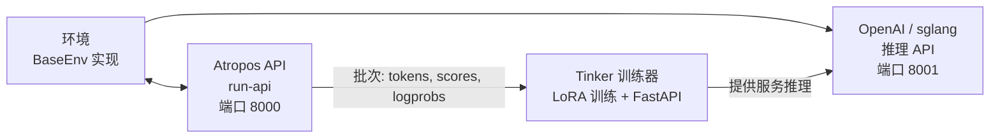

# 强化学习训练

Hermes 智能体包含一个基于 **Tinker-Atropos** 的集成强化学习（Reinforcement Learning, RL）训练流水线。它支持通过 GRPO（Group Relative Policy Optimization，分组相对策略优化）结合 LoRA 适配器，在特定任务上训练语言模型，整个流程完全由智能体的工具接口编排。

## 概述

RL 训练系统由三个组件构成：

1. **[Atropos](https://github.com/NousResearch/atropos)** — 轨迹 API 服务器，负责协调环境交互、管理 rollout 组并计算优势值
2. **[Tinker](https://thinkingmachines.ai/tinker/)** — 训练服务，处理模型权重、LoRA 训练、采样/推理以及优化器步骤
3. **环境（Environments）** — Python 类，定义任务、评分机制和奖励函数（例如 GSM8K 数学题）

智能体可通过一组 `rl_*` 工具发现环境、配置训练参数、启动训练任务并监控指标。

## 要求

进行 RL 训练需要满足以下条件：

- **Python >= 3.11** （Tinker 包的要求）
- **TINKER_API_KEY** — Tinker 训练服务的 API 密钥
- **WANDB_API_KEY** — [Weights & Biases](https://wandb.ai/) 指标跟踪的 API 密钥
- `tinker-atropos` 子模块（相对于 Hermes 根目录位于 `tinker-atropos/`）

```bash
# 设置 API 密钥
hermes config set TINKER_API_KEY your-tinker-key
hermes config set WANDB_API_KEY your-wandb-key
```

当两个密钥均存在且 Python >= 3.11 可用时，`rl` 工具集将自动启用。

## 可用工具

| 工具 | 描述 |
|------|-------------|
| `rl_list_environments` | 发现可用的 RL 环境 |
| `rl_select_environment` | 选择一个环境并加载其配置 |
| `rl_get_current_config` | 查看可配置和锁定字段 |
| `rl_edit_config` | 修改可配置的训练参数 |
| `rl_start_training` | 启动训练任务（启动 3 个进程） |
| `rl_check_status` | 监控训练进度和 WandB 指标 |
| `rl_stop_training` | 停止正在运行的训练作业 |
| `rl_get_results` | 获取最终指标和模型权重路径 |
| `rl_list_runs` | 列出所有活跃和已完成的运行 |
| `rl_test_inference` | 使用 OpenRouter 快速进行推理测试 |

## 工作流程

### 1. 发现环境

```
列出可用的 RL 环境
```

智能体调用 `rl_list_environments()`，扫描 `tinker-atropos/tinker_atropos/environments/` 目录，利用 AST 解析查找继承自 `BaseEnv` 的 Python 类。每个环境定义了：

- **数据集加载** — 训练数据来源（例如 HuggingFace 数据集）
- **提示构造** — 如何格式化项目以供模型处理
- **评分/验证** — 如何评估模型输出并分配奖励

### 2. 选择并配置

```
选择 GSM8K 环境并显示其配置
```

智能体调用 `rl_select_environment("gsm8k_tinker")`，然后调用 `rl_get_current_config()` 查看所有参数。

配置字段分为两类：

**可配置字段**（可以修改）：
- `group_size` — 每项的补全数量（默认：16）
- `batch_size` — 训练批次大小（默认：128）
- `wandb_name` — WandB 运行名称（自动设置为 `{env}-{timestamp}`）
- 其他环境特定参数

**锁定字段**（基础设施设置，不可更改）：
- `tokenizer_name` — 模型分词器（例如 `Qwen/Qwen3-8B`）
- `rollout_server_url` — Atropos API URL（`http://localhost:8000`）
- `max_token_length` — 最大 token 长度（8192）
- `max_num_workers` — 最大并行工作线程数（2048）
- `total_steps` — 总训练步数（2500）
- `lora_rank` — LoRA 适配器秩（32）
- `learning_rate` — 学习率（4e-5）
- `max_token_trainer_length` — 训练器最大 token 数（9000）

### 3. 开始训练

```
开始训练任务
```

智能体调用 `rl_start_training()`，执行以下操作：

1. 生成 YAML 配置文件，合并锁定设置和可覆盖的可配置参数
2. 创建唯一运行 ID
3. 启动三个进程：
   - **Atropos API 服务器**（`run-api`）— 轨迹协调
   - **Tinker 训练器**（`launch_training.py`）— LoRA 训练 + FastAPI 推理服务器（端口 8001）
   - **环境**（`environment.py serve`）— 所选环境与 Atropos 连接

进程按顺序延迟启动（API 5秒，训练器 30秒，环境再延迟 90秒），以确保正确的初始化顺序。

### 4. 监控进度

```
检查运行 abc12345 的状态
```

智能体调用 `rl_check_status(run_id)`，报告：

- 各进程状态（运行中/已退出）
- 运行时间
- WandB 指标（步数、平均奖励、正确率百分比、评估准确率）
- 调试用的日志文件位置

:::note 速率限制
状态检查被限制为每 **30 分钟**一次（每个 run_id）。这防止了在耗时较长的训练任务（可能持续数小时）期间过度轮询。
:::

### 5. 停止或获取结果

```
停止训练任务
# 或者
获取运行 abc12345 的最终结果
```

`rl_stop_training()` 以逆序终止所有三个进程（环境 → 训练器 → API）。`rl_get_results()` 检索最终的 WandB 指标和训练历史。

## 推理测试

在投入完整训练之前，可使用 `rl_test_inference` 测试环境是否正常工作。该测试使用 OpenRouter 运行几步推理和评分 — 无需 Tinker API，只需 `OPENROUTER_API_KEY`。

```
用推理测试所选环境
```

默认配置：
- **3 步 × 16 次补全 = 每模型 48 次 rollout**
- 测试三种不同规模的模型以确保鲁棒性：
  - `qwen/qwen3-8b`（小型）
  - `z-ai/glm-4.7-flash`（中型）
  - `minimax/minimax-m2.7`（大型）
- 总计约 144 次 rollout

此测试验证：
- 环境正确加载
- 提示构造正常工作
- 推理响应解析在不同模型规模下具有鲁棒性
- 验证器/评分逻辑产生有效奖励

## Tinker API 集成

训练器使用 [Tinker](https://tinker.computer) API 进行模型训练操作：

- **ServiceClient** — 创建训练和采样客户端
- **训练客户端** — 处理前向-后向传播、重要性采样损失、优化器步骤（Adam）和权重检查点保存
- **采样客户端** — 提供使用最新训练权重的推理

训练循环如下：
1. 从 Atropos 获取一批 rollout（提示 + 补全 + 分数）
2. 转换为带填充 logprobs 和优势值的 Tinker Datum 对象
3. 运行前向-后向传播，使用重要性采样损失
4. 执行优化器步骤（Adam：lr=4e-5, β1=0.9, β2=0.95）
5. 保存权重并创建新的采样客户端用于下一步推理
6. 将指标记录到 WandB

## 架构图



## 创建自定义环境

要创建新的 RL 环境：

1. 在 `tinker-atropos/tinker_atropos/environments/` 目录下创建一个 Python 文件
2. 定义一个继承自 `BaseEnv` 的类
3. 实现必需的方法：
   - `load_dataset()` — 加载您的训练数据
   - `get_next_item()` — 为模型提供下一个项目
   - `score_answer()` — 对模型输出进行评分并分配奖励
   - `collect_trajectories()` — 收集并返回轨迹
4. 可选地定义一个继承自 `BaseEnvConfig` 的自定义配置类

以现有的 `gsm8k_tinker.py` 作为模板参考。智能体可以帮助您创建新环境 — 它可以读取现有环境文件、检查 HuggingFace 数据集并编写新的环境代码。

## WandB 指标

训练任务会向 Weights & Biases 记录以下关键指标：

| 指标 | 描述 |
|--------|-------------|
| `train/loss` | 训练损失（重要性采样） |
| `train/learning_rate` | 当前学习率 |
| `reward/mean` | 跨组的平均奖励 |
| `logprobs/mean` | 平均参考 logprobs |
| `logprobs/mean_training` | 平均训练 logprobs |
| `logprobs/diff` | Logprob 漂移（参考 - 训练） |
| `advantages/mean` | 平均优势值 |
| `advantages/std` | 优势标准差 |

## 日志文件

每次训练任务都会生成日志文件，位于 `~/.hermes/logs/rl_training/`：

```
logs/
├── api_{run_id}.log        # Atropos API 服务器日志
├── trainer_{run_id}.log    # Tinker 训练器日志
├── env_{run_id}.log        # 环境进程日志
└── inference_tests/        # 推理测试结果
    ├── test_{env}_{model}.jsonl
    └── test_{env}_{model}.log
```

当训练失败或产生意外结果时，这些日志文件对于调试至关重要。