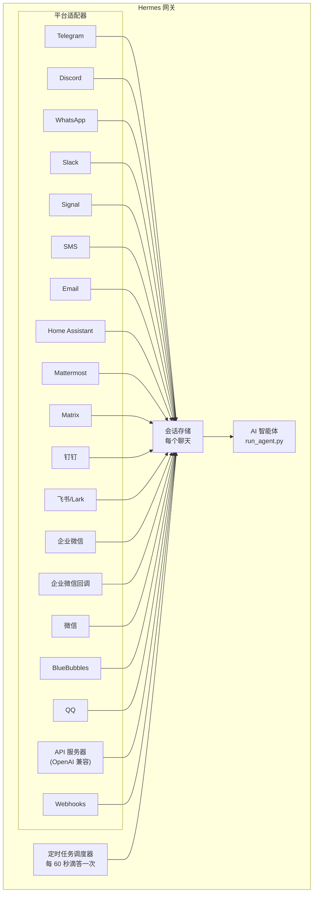

# 消息网关

通过 Telegram、Discord、Slack、WhatsApp、Signal、SMS、Email、Home Assistant、Mattermost、Matrix、钉钉、飞书/Lark、企业微信、微信、BlueBubbles（iMessage）或您的浏览器与 Hermes 对话。该网关是一个单一的后台进程，负责连接到您配置的所有平台、处理会话、运行定时任务（cron jobs）和发送语音消息。

有关完整的语音功能集——包括 CLI 麦克风模式、消息中的语音回复和 Discord 语音频道对话——请参阅 [语音模式](/docs/user-guide/features/voice-mode) 和 [使用 Hermes 的语音模式](/docs/guides/use-voice-mode-with-hermes)。

## 平台对比

| 平台 | 语音 | 图片 | 文件 | 线程 | 反应 | 输入状态 | 流媒体 |
|----------|:-----:|:------:|:-----:|:-------:|:---------:|:------:|:---------:|
| Telegram | ✅ | ✅ | ✅ | ✅ | — | ✅ | ✅ |
| Discord | ✅ | ✅ | ✅ | ✅ | ✅ | ✅ | ✅ |
| Slack | ✅ | ✅ | ✅ | ✅ | ✅ | ✅ | ✅ |
| WhatsApp | — | ✅ | ✅ | — | — | ✅ | ✅ |
| Signal | — | ✅ | ✅ | — | — | ✅ | ✅ |
| SMS | — | — | — | — | — | — | — |
| Email | — | ✅ | ✅ | ✅ | — | — | — |
| Home Assistant | — | — | — | — | — | — | — |
| Mattermost | ✅ | ✅ | ✅ | ✅ | — | ✅ | ✅ |
| Matrix | ✅ | ✅ | ✅ | ✅ | ✅ | ✅ | ✅ |
| 钉钉 | — | — | — | — | — | ✅ | ✅ |
| 飞书/Lark | ✅ | ✅ | ✅ | ✅ | ✅ | ✅ | ✅ |
| 企业微信 | ✅ | ✅ | ✅ | — | — | ✅ | ✅ |
| 企业微信回调 | — | — | — | — | — | — | — |
| 微信 | ✅ | ✅ | ✅ | — | — | ✅ | ✅ |
| BlueBubbles | — | ✅ | ✅ | — | ✅ | ✅ | — |
| QQ | ✅ | ✅ | ✅ | — | — | ✅ | — |

**语音** = TTS 音频回复和/或语音消息转录。**图片** = 发送/接收图片。**文件** = 发送/接收文件附件。**线程** = 线程化对话。**反应** = 消息上的表情符号反应。**输入状态** = 处理时的输入状态指示器。**流媒体** = 通过编辑进行的渐进式消息更新。

## 架构



每个平台适配器接收消息，通过每个聊天会话存储进行路由，并将消息分派给 AI 智能体进行处理。网关还运行定时任务调度器，每 60 秒滴答一次，以执行任何到期的任务。

## 快速设置

配置消息平台最简单的方法是交互式向导：

```bash
hermes gateway setup        # 所有消息平台的交互式设置
```

该命令将引导您使用方向键选择配置每个平台，显示已配置的平台，并在完成后提供开始/重启网关的选项。

## 网关命令

```bash
hermes gateway              # 前台运行
hermes gateway setup        # 交互式配置消息平台
hermes gateway install      # 安装为用户服务 (Linux) / launchd 服务 (macOS)
sudo hermes gateway install --system   # 仅限 Linux：安装启动时系统服务
hermes gateway start        # 启动默认服务
hermes gateway stop         # 停止默认服务
hermes gateway status       # 检查默认服务状态
hermes gateway status --system         # 仅限 Linux：明确检查系统服务
```

## 聊天命令（消息内）

| 命令 | 描述 |
|---------|-------------|
| `/new` 或 `/reset` | 开始新的对话 |
| `/model [provider:model]` | 显示或更改模型（支持 `provider:model` 语法） |
| `/provider` | 显示可用提供商及其认证状态 |
| `/personality [name]` | 设置个性 |
| `/retry` | 重试上一条消息 |
| `/undo` | 撤销上一次交流 |
| `/status` | 显示会话信息 |
| `/stop` | 停止运行的智能体 |
| `/approve` | 批准待处理的危险命令 |
| `/deny` | 拒绝待处理的危险命令 |
| `/sethome` | 将此聊天设置为主频道 |
| `/compress` | 手动压缩对话上下文 |
| `/title [name]` | 设置或显示会话标题 |
| `/resume [name]` | 恢复先前命名的会话 |
| `/usage` | 显示本次会话的 Token 用量 |
| `/insights [days]` | 显示使用情况洞察和分析 |
| `/reasoning [level\|show\|hide]` | 更改推理努力或切换推理显示 |
| `/voice [on\|off\|tts\|join\|leave\|status]` | 控制消息语音回复和 Discord 语音频道行为 |
| `/rollback [number]` | 列出或恢复文件系统检查点 |
| `/background <prompt>` | 在单独的后台会话中运行提示 |
| `/reload-mcp` | 从配置重新加载 MCP 服务器 |
| `/update` | 将 Hermes 智能体更新到最新版本 |
| `/help` | 显示可用命令 |
| `/<skill-name>` | 调用任何已安装的技能 |

## 会话管理

### 会话持久性

会话在重置之前会持续存在。智能体会记住您的对话上下文。

### 重置策略

会话根据可配置的策略重置：

| 策略 | 默认值 | 描述 |
|--------|---------|-------------|
| 每日 | 4:00 AM | 每天特定时间重置 |
| 空闲 | 1440 分钟 | 超过 N 分钟不活动后重置 |
| 两者都 | (组合) | 以先触发的为准 |

请在 `~/.hermes/gateway.json` 中配置每个平台的覆盖设置：

```json
{
  "reset_by_platform": {
    "telegram": { "mode": "idle", "idle_minutes": 240 },
    "discord": { "mode": "idle", "idle_minutes": 60 }
  }
}
```

## 安全性

**默认情况下，网关会拒绝所有不在白名单内或未通过私信 (DM) 配对的用户。** 这是具有终端访问权限的机器人的安全默认设置。

```bash
# 限制到特定用户 (推荐):
TELEGRAM_ALLOWED_USERS=123456789,987654321
DISCORD_ALLOWED_USERS=123456789012345678
SIGNAL_ALLOWED_USERS=+155****4567,+155****6543
SMS_ALLOWED_USERS=+155****4567,+155****6543
EMAIL_ALLOWED_USERS=trusted@example.com,colleague@work.com
MATTERMOST_ALLOWED_USERS=3uo8dkh1p7g1mfk49ear5fzs5c
MATRIX_ALLOWED_USERS=@alice:matrix.org
DINGTALK_ALLOWED_USERS=user-id-1
FEISHU_ALLOWED_USERS=ou_xxxxxxxx,ou_yyyyyyyy
WECOM_ALLOWED_USERS=user-id-1,user-id-2
WECOM_CALLBACK_ALLOWED_USERS=user-id-1,user-id-2

# 或允许
GATEWAY_ALLOWED_USERS=123456789,987654321

# 或明确允许所有用户 (不推荐用于具有终端访问权限的机器人):
GATEWAY_ALLOW_ALL_USERS=true
```

### 私信配对 (替代白名单)

与手动配置用户 ID 不同，未知用户在私信机器人时会收到一个一次性配对代码：

```bash
# 用户看到: "配对代码: XKGH5N7P"
# 您使用以下命令批准他们:
hermes pairing approve telegram XKGH5N7P

# 其他配对命令:
hermes pairing list          # 查看待处理和已批准用户
hermes pairing revoke telegram 123456789  # 移除访问权限
```

配对代码在 1 小时后过期，并受到速率限制，使用加密随机性。

## 中断智能体

发送任何消息即可中断正在工作的智能体。关键行为：

- **进行中的终端命令会立即被终止** (SIGTERM，然后 1 秒后 SIGKILL)
- **工具调用会被取消** — 只有当前执行的调用会运行，其余的将被跳过
- **多条消息会被合并** — 在中断期间发送的消息将合并成一个提示
- **`/stop` 命令** — 不会排队后续消息而中断

## 工具进度通知

在 `~/.hermes/config.yaml` 中控制显示的工具活动量：

```yaml
display:
  tool_progress: all    # off | new | all | verbose
  tool_progress_command: false  # 设置为 true 可在消息中启用 /verbose
```

启用后，机器人工作时会发送状态消息：

```text
💻 `ls -la`...
🔍 web_search...
📄 web_extract...
🐍 execute_code...
```

## 后台会话

在单独的后台会话中运行提示，这样智能体可以在后台独立工作，而您的主聊天保持响应：

```
/background 检查集群中的所有服务器，并报告任何离线的服务器
```

Hermes 会立即确认：

```
🔄 后台任务已启动: "检查集群中的所有服务器..."
   任务 ID: bg_143022_a1b2c3
```

### 工作原理

每个 `/background` 提示都会生成一个**独立的智能体实例**，异步运行：

- **隔离会话** — 后台智能体拥有自己的会话和对话历史。它不知道您当前聊天的上下文，只接收您提供的提示。
- **相同配置** — 从当前的网关设置继承您的模型、提供商、工具集、推理设置和提供商路由。
- **非阻塞** — 您的主聊天保持完全交互。在它工作时，您可以发送消息、运行其他命令或启动更多后台任务。
- **结果交付** — 当任务完成后，结果会发送回您发出命令的**同一聊天或频道**，并在前面加上 "✅ 后台任务完成"。如果失败，您将看到 "❌ 后台任务失败" 和错误信息。

### 后台进程通知

当运行后台会话的智能体使用 `terminal(background=true)` 启动长时间运行的进程（服务器、构建等）时，网关可以向您的聊天推送状态更新。请在 `~/.hermes/config.yaml` 中使用 `display.background_process_notifications` 控制此功能：

```yaml
display:
  background_process_notifications: all    # all | result | error | off
```

| 模式 | 您收到的内容 |
|------|-----------------|
| `all` | 运行输出更新 **和** 最终完成消息 (默认) |
| `result` | 仅最终完成消息 (无论退出代码如何) |
| `error` | 仅退出代码非零时的最终消息 |
| `off` | 完全没有进程观察者消息 |

您也可以通过环境变量设置此项：

```bash
HERMES_BACKGROUND_NOTIFICATIONS=result
```

### 用例

- **服务器监控** — "/background 检查所有服务的健康状况，如果任何服务离线请提醒我"
- **长时间构建** — "/background 构建并部署预发布环境"，同时您继续聊天
- **研究任务** — "/background 研究竞争对手定价并以表格总结"
- **文件操作** — "/background 按日期整理 ~/Downloads 中的照片到文件夹中"

:::tip
消息平台上的后台任务是“发送即忘”——您不需要等待或检查它们。任务完成后，结果会自动发送到同一聊天中。
:::

## 服务管理

### Linux (systemd)

```bash
hermes gateway install               # 安装为用户服务
hermes gateway start                 # 启动服务
hermes gateway stop                  # 停止服务
hermes gateway status                # 检查状态
journalctl --user -u hermes-gateway -f  # 查看日志

# 启用持续运行 (退出登录后仍保持运行)
sudo loginctl enable-linger $USER

# 或安装一个启动时系统服务，但仍以您的用户身份运行
sudo hermes gateway install --system
sudo hermes gateway start --system
sudo hermes gateway status --system
journalctl -u hermes-gateway -f
```

在笔记本电脑和开发机上使用用户服务。在 VPS 或无头主机上使用系统服务，这些服务在启动时应恢复运行，而无需依赖 systemd linger。

除非您确实需要，否则请避免同时安装用户和系统网关单元。如果检测到两者都已安装，Hermes 将发出警告，因为启动/停止/状态的行为会变得模糊。

:::info 多次安装
如果您在同一台机器上运行多个 Hermes 安装（具有不同的 `HERMES_HOME` 目录），每个安装都会获得自己的 systemd 服务名称。默认的 `~/.hermes` 使用 `hermes-gateway`；其他安装使用 `hermes-gateway-<hash>`。`hermes gateway` 命令会自动针对您当前 `HERMES_HOME` 的正确服务。
:::

### macOS (launchd)

```bash
hermes gateway install               # 安装为 launchd 代理
hermes gateway start                 # 启动服务
hermes gateway stop                  # 停止服务
hermes gateway status                # 检查状态
tail -f ~/.hermes/logs/gateway.log   # 查看日志
```

生成的 plist 文件位于 `~/Library/LaunchAgents/ai.hermes.gateway.plist`。它包含三个环境变量：

- **PATH** — 安装时的完整 shell PATH，并在前面加上了 venv 的 `bin/` 和 `node_modules/.bin`。这确保了用户安装的工具（Node.js、ffmpeg 等）可用于像 WhatsApp 桥接这样的网关子进程。
- **VIRTUAL_ENV** — 指向 Python 虚拟环境，以便工具能够正确解析包。
- **HERMES_HOME** — 将网关范围限定到您的 Hermes 安装。

:::tip 安装后 PATH 会改变
launchd plists 是静态的——如果您在设置网关后安装了新工具（例如，通过 nvm 安装了新的 Node.js 版本，或通过 Homebrew 安装了 ffmpeg），请再次运行 `hermes gateway install` 以捕获更新后的 PATH。网关将检测到过时的 plist 并自动重新加载。
:::

:::info 多次安装
与 Linux systemd 服务类似，每个 `HERMES_HOME` 目录都会获得自己的 launchd 标签。默认的 `~/.hermes` 使用 `ai.hermes.gateway`；其他安装使用 `ai.hermes.gateway-<suffix>`。
:::

## 平台特定工具集

每个平台都有自己的工具集：

| 平台 | 工具集 | 功能 |
|----------|---------|--------------|
| CLI | `hermes-cli` | 完全访问 |
| Telegram | `hermes-telegram` | 完全工具集，包括终端 |
| Discord | `hermes-discord` | 完全工具集，包括终端 |
| WhatsApp | `hermes-whatsapp` | 完全工具集，包括终端 |
| Slack | `hermes-slack` | 完全工具集，包括终端 |
| Signal | `hermes-signal` | 完全工具集，包括终端 |
| SMS | `hermes-sms` | 完全工具集，包括终端 |
| Email | `hermes-email` | 完全工具集，包括终端 |
| Home Assistant | `hermes-homeassistant` | 完全工具集 + HA 设备控制 (ha_list_entities, ha_get_state, ha_call_service, ha_list_services) |
| Mattermost | `hermes-mattermost` | 完全工具集，包括终端 |
| Matrix | `hermes-matrix` | 完全工具集，包括终端 |
| 钉钉 | `hermes-dingtalk` | 完全工具集，包括终端 |
| 飞书/Lark | `hermes-feishu` | 完全工具集，包括终端 |
| 企业微信 | `hermes-wecom` | 完全工具集，包括终端 |
| 企业微信回调 | `hermes-wecom-callback` | 完全工具集，包括终端 |
| 微信 | `hermes-weixin` | 完全工具集，包括终端 |
| BlueBubbles | `hermes-bluebubbles` | 完全工具集，包括终端 |
| QQBot | `hermes-qqbot` | 完全工具集，包括终端 |
| API Server | `hermes` (默认) | 完全工具集，包括终端 |
| Webhooks | `hermes-webhook` | 完全工具集，包括终端 |

## 下一步

- [Telegram 设置](telegram.md)
- [Discord 设置](discord.md)
- [Slack 设置](slack.md)
- [WhatsApp 设置](whatsapp.md)
- [Signal 设置](signal.md)
- [SMS 设置 (Twilio)](sms.md)
- [Email 设置](email.md)
- [Home Assistant 集成](homeassistant.md)
- [Mattermost 设置](mattermost.md)
- [Matrix 设置](matrix.md)
- [钉钉设置](dingtalk.md)
- [飞书/Lark 设置](feishu.md)
- [企业微信设置](wecom.md)
- [企业微信回调设置](wecom-callback.md)
- [微信设置 (WeChat)](weixin.md)
- [BlueBubbles 设置 (iMessage)](bluebubbles.md)
- [QQBot 设置](qqbot.md)
- [Open WebUI + API 服务器](open-webui.md)
- [Webhooks](webhooks.md)