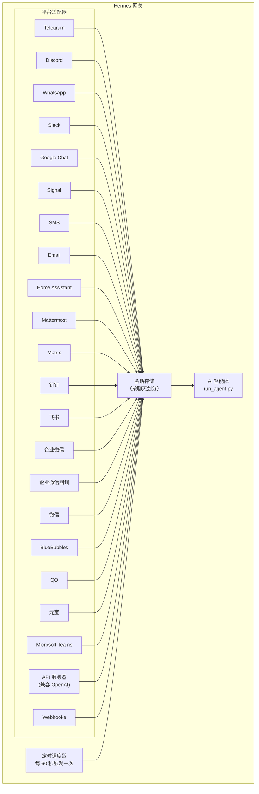

# 消息网关

通过Telegram、Discord、Slack、WhatsApp、Signal、短信、电子邮件、Home Assistant、Mattermost、Matrix、钉钉、飞书/Lark、企业微信、微信、BlueBubbles (iMessage)、QQ、元宝、Microsoft Teams、LINE或您的浏览器与Hermes聊天。网关是一个单一的后台进程，可连接到您配置的所有平台、管理会话、运行定时任务并传递语音消息。

如需了解完整的语音功能集——包括CLI麦克风模式、消息中的语音回复以及Discord语音频道对话——请参阅[语音模式](/docs/user-guide/features/voice-mode)和[在Hermes中使用语音模式](/docs/guides/use-voice-mode-with-hermes)。

## 平台对比

| 平台 | 语音 | 图片 | 文件 | 线程 | 反应 | 打字指示 | 流式传输 |
|----------|:-----:|:------:|:-----:|:-------:|:---------:|:------:|:---------:|
| Telegram | ✅ | ✅ | ✅ | ✅ | — | ✅ | ✅ |
| Discord | ✅ | ✅ | ✅ | ✅ | ✅ | ✅ | ✅ |
| Slack | ✅ | ✅ | ✅ | ✅ | ✅ | ✅ | ✅ |
| Google Chat | — | ✅ | ✅ | ✅ | — | ✅ | — |
| WhatsApp | — | ✅ | ✅ | — | — | ✅ | ✅ |
| Signal | — | ✅ | ✅ | — | — | ✅ | ✅ |
| 短信 | — | — | — | — | — | — | — |
| 电子邮件 | — | ✅ | ✅ | ✅ | — | — | — |
| Home Assistant | — | — | — | — | — | — | — |
| Mattermost | ✅ | ✅ | ✅ | ✅ | — | ✅ | ✅ |
| Matrix | ✅ | ✅ | ✅ | ✅ | ✅ | ✅ | ✅ |
| 钉钉 | — | ✅ | ✅ | — | ✅ | — | ✅ |
| 飞书/Lark | ✅ | ✅ | ✅ | ✅ | ✅ | ✅ | ✅ |
| 企业微信 | ✅ | ✅ | ✅ | — | — | ✅ | ✅ |
| 企业微信回调 | — | — | — | — | — | — | — |
| 微信 | ✅ | ✅ | ✅ | — | — | ✅ | ✅ |
| BlueBubbles | — | ✅ | ✅ | — | ✅ | ✅ | — |
| QQ | ✅ | ✅ | ✅ | — | — | ✅ | — |
| 元宝 | ✅ | ✅ | ✅ | — | — | ✅ | ✅ |
| Microsoft Teams | — | ✅ | — | ✅ | — | ✅ | — |
| LINE | — | ✅ | ✅ | — | — | ✅ | — |

**语音** = TTS音频回复和/或语音消息转录。**图片** = 发送/接收图片。**文件** = 发送/接收文件附件。**线程** = 线程化对话。**反应** = 消息上的表情符号反应。**打字指示** = 处理时的打字指示器。**流式传输** = 通过编辑进行渐进式消息更新。

## 架构



每个平台适配器接收消息，通过按聊天划分的会话存储进行路由，并将其分派给 AI 智能体进行处理。网关还运行定时调度器，每 60 秒触发一次以执行任何到期的任务。

## 快速设置

配置消息平台的最简单方法是使用交互式向导：

```bash
hermes gateway setup        # 所有消息平台的交互式设置
```

这将引导您使用箭头键选择来配置每个平台，显示哪些平台已经配置好，并在完成后提供启动/重启网关的选项。

## 网关命令

```bash
hermes gateway              # 在前台运行
hermes gateway setup        # 交互式配置消息平台
hermes gateway install      # 安装为用户服务（Linux）/ launchd 服务（macOS）
sudo hermes gateway install --system   # 仅限 Linux：安装为启动时系统服务
hermes gateway start        # 启动默认服务
hermes gateway stop         # 停止默认服务
hermes gateway status       # 检查默认服务状态
hermes gateway status --system         # 仅限 Linux：显式检查系统服务
```

## 聊天命令（在消息应用内）

| 命令 | 描述 |
|---------|-------------|
| `/new` 或 `/reset` | 开始一个全新的对话 |
| `/model [provider:model]` | 显示或更改模型（支持 `provider:model` 语法） |
| `/personality [name]` | 设置一个个性 |
| `/retry` | 重试最后一条消息 |
| `/undo` | 移除最后一轮交互 |
| `/status` | 显示会话信息 |
| `/whoami` | 显示您在此范围（管理员/用户/不受限）内的斜杠命令访问权限 |
| `/stop` | 停止正在运行的智能体 |
| `/approve` | 批准一个待处理的危险命令 |
| `/deny` | 拒绝一个待处理的危险命令 |
| `/sethome` | 将此聊天设置为主频道 |
| `/compress` | 手动压缩对话上下文 |
| `/title [name]` | 设置或显示会话标题 |
| `/resume [name]` | 恢复一个先前命名的会话 |
| `/usage` | 显示此会话的 Token 用量 |
| `/insights [days]` | 显示使用洞察和分析 |
| `/reasoning [level\|show\|hide]` | 更改推理强度或切换推理显示 |
| `/voice [on\|off\|tts\|join\|leave\|status]` | 控制消息语音回复和 Discord 语音频道行为 |
| `/rollback [number]` | 列出或恢复文件系统检查点 |
| `/background <prompt>` | 在一个单独的后台会话中运行提示 |
| `/reload-mcp` | 从配置重新加载 MCP 服务器 |
| `/update` | 将 Hermes 智能体更新到最新版本 |
| `/help` | 显示可用命令 |
| `/<skill-name>` | 调用任何已安装的技能 |

## 会话管理

### 会话持久性

会话在消息之间持续存在，直到被重置。智能体会记住您的对话上下文。

### 重置策略

会话根据可配置的策略重置：

| 策略 | 默认值 | 描述 |
|--------|---------|-------------|
| 每日 | 凌晨 4:00 | 在每天特定时间重置 |
| 空闲 | 1440 分钟 | 在 N 分钟不活动后重置 |
| 两者 | （结合） | 哪个先触发就执行哪个 |

在 `~/.hermes/gateway.json` 中配置每个平台的覆盖设置：

```json
{
  "reset_by_platform": {
    "telegram": { "mode": "idle", "idle_minutes": 240 },
    "discord": { "mode": "idle", "idle_minutes": 60 }
  }
}
```

## 安全

**默认情况下，网关会拒绝所有不在允许列表中或未通过私信配对的用户。** 这是对于一个拥有终端访问权限的机器人来说安全的默认设置。

```bash
# 限制特定用户（推荐）：
TELEGRAM_ALLOWED_USERS=123456789,987654321
DISCORD_ALLOWED_USERS=123456789012345678
SIGNAL_ALLOWED_USERS=+155****4567,+155****6543
SMS_ALLOWED_USERS=+155****4567,+155****6543
EMAIL_ALLOWED_USERS=trusted@example.com,colleague@work.com
MATTERMOST_ALLOWED_USERS=3uo8dkh1p7g1mfk49ear5fzs5c
MATRIX_ALLOWED_USERS=@alice:matrix.org
DINGTALK_ALLOWED_USERS=user-id-1
FEISHU_ALLOWED_USERS=ou_xxxxxxxx,ou_yyyyyyyy
WECOM_ALLOWED_USERS=user-id-1,user-id-2
WECOM_CALLBACK_ALLOWED_USERS=user-id-1,user-id-2
TEAMS_ALLOWED_USERS=aad-object-id-1,aad-object-id-2

# 或者允许
GATEWAY_ALLOWED_USERS=123456789,987654321

# 或者明确允许所有用户（对于拥有终端访问权限的机器人不推荐）：
GATEWAY_ALLOW_ALL_USERS=true
```

### 私信配对（允许列表的替代方案）

无需手动配置用户 ID，未知用户在私信机器人时会收到一个一次性配对码：

```bash
# 用户看到："配对码：XKGH5N7P"
# 您通过以下命令批准他们：
hermes pairing approve telegram XKGH5N7P

# 其他配对命令：
hermes pairing list          # 查看待处理 + 已批准的用户
hermes pairing revoke telegram 123456789  # 移除访问权限
```

配对码在 1 小时后过期，有频率限制，并使用加密随机性。

### 斜杠命令访问控制

一旦用户被允许进入，您可以将他们分为 **管理员**（拥有完整的斜杠命令访问权限）和 **普通用户**（仅拥有您明确启用的斜杠命令）。这按平台和范围（私信 vs 群组/频道）划分，并通过实时命令注册表工作，因此它涵盖了内置的和插件注册的斜杠命令，无需为每个功能单独布线。

```yaml
gateway:
  platforms:
    discord:
      extra:
        allow_from: ["111", "222", "333"]
        allow_admin_from: ["111"]                    # 管理员 → 所有斜杠命令
        user_allowed_commands: [status, model]       # 非管理员可运行的命令
        # 可选：区分群组/频道范围
        group_allow_admin_from: ["111"]
        group_user_allowed_commands: [status]
```

行为：

- 对于某个范围在 `allow_admin_from` 中的用户可以运行**所有**注册的斜杠命令。
- 在 `allow_from` 中但不在 `allow_admin_from` 中的用户只能运行 `user_allowed_commands` 中的命令，加上始终允许的底线：`/help` 和 `/whoami`。
- 普通聊天不受影响。非管理员仍然可以正常与智能体交谈；他们只是无法触发任意命令。
- **向后兼容性：** 如果某个范围没有设置 `allow_admin_from`，则该范围的斜杠命令门控将被禁用。现有安装无需更改即可继续工作。
- 私信管理员状态并不意味着群组/频道管理员状态。每个范围都有自己的管理员列表。

在任何平台使用 `/whoami` 来查看当前活动范围、您的层级（管理员 / 用户 / 不受限）以及您可以运行的斜杠命令。请参阅 [Telegram](/docs/user-guide/messaging/telegram#slash-command-access-control) 和 [Discord](/docs/user-guide/messaging/discord#slash-command-access-control) 页面了解特定平台的示例。

## 中断智能体

在智能体工作时发送任何消息即可中断它。关键行为：

- **进行中的终端命令会立即终止**（先发送SIGTERM，1秒后若无响应则发送SIGKILL）
- **工具调用会被取消**——只有当前正在执行的一个会运行，其余会被跳过
- **多条消息会被合并**——中断期间发送的消息会被组合成一个提示
- **`/stop` 命令**——中断但不排队后续消息

### 队列 vs 中断 vs 引导（忙碌输入模式）

默认情况下，给忙碌的智能体发消息会中断它。还有另外两种可用模式：

- `queue`（队列）——后续消息会等待，并在当前任务完成后作为下一轮运行。
- `steer`（引导）——后续消息通过 `/steer` 注入当前运行，在下一个工具调用后送达智能体。既不会中断，也不会开启新的一轮。如果智能体尚未启动，则回退为 `queue` 行为。

```yaml
display:
  busy_input_mode: steer   # 或 queue，或 interrupt（默认）
  busy_ack_enabled: true   # 设置为 false 以完全禁止聊天中的 ⚡/⏳/⏩ 回复
```

在任何平台上首次给忙碌的智能体发消息时，Hermes 会在忙碌确认消息后附加一行提示，说明这个设置（`"💡 First-time tip — …"`）。此提示仅在每次安装时触发一次——`onboarding.seen.busy_input_prompt` 下的标志位会将其锁存。删除该键可以再次看到提示。

如果你觉得忙碌确认消息很吵闹——尤其是在使用语音输入或快速连续发消息时——请设置 `display.busy_ack_enabled: false`。你的输入仍然会正常排队/引导/中断，只是聊天回复被静默了。

## 工具进度通知

在 `~/.hermes/config.yaml` 中控制工具活动的显示详细程度：

```yaml
display:
  tool_progress: all    # off | new | all | verbose
  tool_progress_command: false  # 设置为 true 以在消息中启用 /verbose 命令
```

启用后，机器人会在工作时发送状态消息：

```text
💻 `ls -la`...
🔍 web_search...
📄 web_extract...
🐍 execute_code...
```

## 后台会话

在单独的后台会话中运行提示，这样智能体可以独立处理它，而你的主聊天保持响应：

```
/background 检查集群中的所有服务器并报告任何宕机的服务器
```

Hermes 会立即确认：

```
🔄 后台任务已启动："检查集群中的所有服务器..."
   任务 ID: bg_143022_a1b2c3
```

### 工作原理

每个 `/background` 提示会生成一个**独立的智能体实例**，异步运行：

- **隔离的会话** ——后台智能体拥有自己的会话和对话历史。它对你当前的聊天上下文一无所知，只接收你提供的提示。
- **相同的配置** ——继承你当前网关设置中的模型、供应商、工具集、推理设置和供应商路由。
- **非阻塞** ——你的主聊天保持完全交互。在它工作时，你可以发送消息、运行其他命令或启动更多后台任务。
- **结果交付** ——当任务完成时，结果会被发送回你发出命令的**同一聊天或频道**，并以"✅ 后台任务完成"为前缀。如果失败，你将看到"❌ 后台任务失败"以及错误信息。

### 后台进程通知

当运行后台会话的智能体使用 `terminal(background=true)` 启动长时间运行的进程（服务器、构建等）时，网关可以向你的聊天推送状态更新。在 `~/.hermes/config.yaml` 中通过 `display.background_process_notifications` 控制：

```yaml
display:
  background_process_notifications: all    # all | result | error | off
```

| 模式 | 你会收到什么 |
|------|------------|
| `all` | 运行时输出更新**和**最终的完成消息（默认） |
| `result` | 仅最终的完成消息（无论退出码如何） |
| `error` | 仅当退出码非零时收到最终消息 |
| `off` | 完全没有进程监视器消息 |

你也可以通过环境变量设置：

```bash
HERMES_BACKGROUND_NOTIFICATIONS=result
```

### 使用场景

- **服务器监控** —— "/background 检查所有服务的健康状况，如果有任何服务宕机请提醒我"
- **长时间构建** —— "/background 构建并部署预发布环境"，同时你可以继续聊天
- **研究任务** —— "/background 研究竞争对手的定价并总结成表格"
- **文件操作** —— "/background 按日期整理 ~/Downloads 中的照片到文件夹"

:::tip
消息平台上的后台任务是即发即忘的——你不需要等待或检查它们。任务完成后，结果会自动到达同一个聊天。
:::

## 服务管理

### Linux (systemd)

```bash
hermes gateway install               # 作为用户服务安装
hermes gateway start                 # 启动服务
hermes gateway stop                  # 停止服务
hermes gateway status                # 检查状态
journalctl --user -u hermes-gateway -f  # 查看日志

# 启用 lingering（注销后继续运行）
sudo loginctl enable-linger $USER

# 或者安装一个在启动时运行的系统服务，但仍以你的用户身份运行
sudo hermes gateway install --system
sudo hermes gateway start --system
sudo hermes gateway status --system
journalctl -u hermes-gateway -f
```

在笔记本和开发机上使用用户服务。在 VPS 或无头主机上使用系统服务，这样可以在启动时自动恢复，而无需依赖 systemd linger。

除非你有意为之，否则避免同时安装用户和系统网关单元。Hermes 如果检测到两者并存会发出警告，因为 start/stop/status 行为会变得模糊。

:::info 多个安装
如果你在同一台机器上运行多个 Hermes 安装（使用不同的 `HERMES_HOME` 目录），每个安装都有自己的 systemd 服务名称。默认的 `~/.hermes` 使用 `hermes-gateway`；其他安装使用 `hermes-gateway-<hash>`。`hermes gateway` 命令会自动针对你当前 `HERMES_HOME` 对应的服务。
:::

### macOS (launchd)

```bash
hermes gateway install               # 作为 launchd 代理安装
hermes gateway start                 # 启动服务
hermes gateway stop                  # 停止服务
hermes gateway status                # 检查状态
tail -f ~/.hermes/logs/gateway.log   # 查看日志
```

生成的 plist 文件位于 `~/Library/LaunchAgents/ai.hermes.gateway.plist`。它包含三个环境变量：

- **PATH** —— 安装时你完整的 shell PATH，其中前置了 venv 的 `bin/` 和 `node_modules/.bin`。这确保用户安装的工具（Node.js、ffmpeg 等）对于网关子进程（如 WhatsApp 桥）可用。
- **VIRTUAL_ENV** —— 指向 Python 虚拟环境，以便工具能正确解析包。
- **HERMES_HOME** —— 将网关限定到你的 Hermes 安装。

:::tip 安装后的 PATH 变化
launchd plist 是静态的——如果在设置网关后安装了新工具（例如通过 nvm 安装了新的 Node.js 版本，或通过 Homebrew 安装了 ffmpeg），请再次运行 `hermes gateway install` 以捕获更新的 PATH。网关会检测到过时的 plist 并自动重新加载。
:::

:::info 多个安装
与 Linux systemd 服务类似，每个 `HERMES_HOME` 目录都有自己的 launchd 标签。默认的 `~/.hermes` 使用 `ai.hermes.gateway`；其他安装使用 `ai.hermes.gateway-<suffix>`。
:::

## 平台特定工具集

每个平台都有自己的工具集：

| 平台 | 工具集 | 功能 |
|------|--------|------|
| CLI | `hermes-cli` | 完全访问 |
| Telegram | `hermes-telegram` | 包含终端在内的完整工具 |
| Discord | `hermes-discord` | 包含终端在内的完整工具 |
| WhatsApp | `hermes-whatsapp` | 包含终端在内的完整工具 |
| Slack | `hermes-slack` | 包含终端在内的完整工具 |
| Google Chat | `hermes-google_chat` | 包含终端在内的完整工具 |
| Signal | `hermes-signal` | 包含终端在内的完整工具 |
| SMS | `hermes-sms` | 包含终端在内的完整工具 |
| Email | `hermes-email` | 包含终端在内的完整工具 |
| Home Assistant | `hermes-homeassistant` | 完整工具 + HA 设备控制 (ha_list_entities, ha_get_state, ha_call_service, ha_list_services) |
| Mattermost | `hermes-mattermost` | 包含终端在内的完整工具 |
| Matrix | `hermes-matrix` | 包含终端在内的完整工具 |
| DingTalk | `hermes-dingtalk` | 包含终端在内的完整工具 |
| Feishu/Lark | `hermes-feishu` | 包含终端在内的完整工具 |
| WeCom | `hermes-wecom` | 包含终端在内的完整工具 |
| WeCom Callback | `hermes-wecom-callback` | 包含终端在内的完整工具 |
| Weixin | `hermes-weixin` | 包含终端在内的完整工具 |
| BlueBubbles | `hermes-bluebubbles` | 包含终端在内的完整工具 |
| QQBot | `hermes-qqbot` | 包含终端在内的完整工具 |
| Yuanbao | `hermes-yuanbao` | 包含终端在内的完整工具 |
| Microsoft Teams | `hermes-teams` | 包含终端在内的完整工具 |
| API Server | `hermes-api-server` | 完整工具（不包括 `clarify`, `send_message`, `text_to_speech` —— 程序化访问没有交互式用户） |
| Webhooks | `hermes-webhook` | 包含终端在内的完整工具 |

## 下一步

- [Telegram 设置](telegram.md)
- [Discord 设置](discord.md)
- [Slack 设置](slack.md)
- [Google Chat 设置](google_chat.md)
- [WhatsApp 设置](whatsapp.md)
- [Signal 设置](signal.md)
- [短信设置 (Twilio)](sms.md)
- [邮件设置](email.md)
- [Home Assistant 集成](homeassistant.md)
- [Mattermost 设置](mattermost.md)
- [Matrix 设置](matrix.md)
- [DingTalk 设置](dingtalk.md)
- [Feishu/Lark 设置](feishu.md)
- [WeCom 设置](wecom.md)
- [WeCom 回调设置](wecom-callback.md)
- [微信设置](weixin.md)
- [BlueBubbles 设置 (iMessage)](bluebubbles.md)
- [QQBot 设置](qqbot.md)
- [Yuanbao 设置](yuanbao.md)
- [Microsoft Teams 设置](teams.md)
- [Teams 会议管道](teams-meetings.md)
- [Open WebUI + API Server](open-webui.md)
- [Webhooks](webhooks.md)