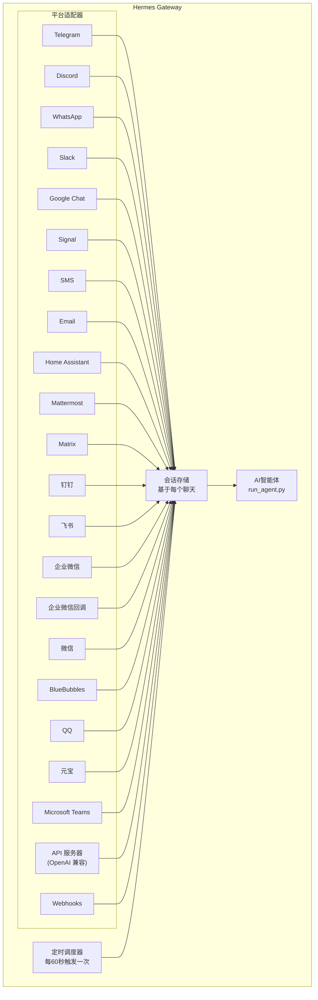

# 消息网关

你可以从 Telegram、Discord、Slack、WhatsApp、Signal、短信、电子邮件、Home Assistant、Mattermost、Matrix、钉钉、飞书/Lark、企业微信、微信、BlueBubbles（iMessage）、QQ、元宝、Microsoft Teams、LINE、ntfy 或你的浏览器与 Hermes 聊天。该网关是一个单一的后台进程，用于连接你配置的所有平台、管理会话、运行定时任务并传递语音消息。

要了解完整的语音功能集——包括命令行麦克风模式、消息中的语音回复以及 Discord 语音频道对话——请参阅[语音模式](/user-guide/features/voice-mode)和[将语音模式与 Hermes 配合使用](/guides/use-voice-mode-with-hermes)。

:::tip
机器人既需要一个模型提供者，也需要工具提供者（TTS、网页）。[Nous Portal](/integrations/nous-portal) 订阅捆绑了所有这些。
:::

## 平台比较

| 平台 | 语音 | 图片 | 文件 | 线程 | 表情回应 | 输入指示器 | 流式更新 |
|----------|:-----:|:------:|:-----:|:-------:|:---------:|:------:|:---------:|
| Telegram | ✅ | ✅ | ✅ | ✅ | — | ✅ | ✅ |
| Discord | ✅ | ✅ | ✅ | ✅ | ✅ | ✅ | ✅ |
| Slack | ✅ | ✅ | ✅ | ✅ | ✅ | ✅ | ✅ |
| Google Chat | — | ✅ | ✅ | ✅ | — | ✅ | — |
| WhatsApp | — | ✅ | ✅ | — | — | ✅ | ✅ |
| Signal | — | ✅ | ✅ | — | — | ✅ | ✅ |
| 短信 | — | — | — | — | — | — | — |
| 电子邮件 | — | ✅ | ✅ | ✅ | — | — | — |
| Home Assistant | — | — | — | — | — | — | — |
| Mattermost | ✅ | ✅ | ✅ | ✅ | — | ✅ | ✅ |
| Matrix | ✅ | ✅ | ✅ | ✅ | ✅ | ✅ | ✅ |
| 钉钉 | — | ✅ | ✅ | — | ✅ | — | ✅ |
| 飞书/Lark | ✅ | ✅ | ✅ | ✅ | ✅ | ✅ | ✅ |
| 企业微信 | ✅ | ✅ | ✅ | — | — | ✅ | ✅ |
| 企业微信回调 | — | — | — | — | — | — | — |
| 微信 | ✅ | ✅ | ✅ | — | — | ✅ | ✅ |
| BlueBubbles | — | ✅ | ✅ | — | ✅ | ✅ | — |
| QQ | ✅ | ✅ | ✅ | — | — | ✅ | — |
| 元宝 | ✅ | ✅ | ✅ | — | — | ✅ | ✅ |
| Microsoft Teams | — | ✅ | — | ✅ | — | ✅ | — |
| LINE | — | ✅ | ✅ | — | — | ✅ | — |
| ntfy | — | — | — | — | — | — | — |

**语音** = TTS 音频回复和/或语音消息转录。**图片** = 发送/接收图片。**文件** = 发送/接收文件附件。**线程** = 线程化对话。**表情回应** = 消息上的表情符号回应。**输入指示器** = 处理时的输入状态指示。**流式更新** = 通过编辑进行渐进式消息更新。

## 架构



每个平台适配器接收消息，通过基于每个聊天的会话存储进行路由，并分派给AI智能体进行处理。网关还运行定时调度器，每60秒触发一次以执行任何到期任务。

## 快速设置

配置消息平台最简单的方式是使用交互式向导：

```bash
hermes gateway setup        # 为所有消息平台进行交互式设置
```

这将引导您配置每个平台，通过箭头键选择，显示哪些平台已经配置好，并在完成后提供启动/重启网关的选项。

## 网关命令

```bash
hermes gateway              # 在前台运行
hermes gateway setup        # 交互式配置消息平台
hermes gateway install      # 安装为用户服务 (Linux) / launchd 服务 (macOS)
sudo hermes gateway install --system   # 仅限 Linux：安装为开机启动的系统服务
hermes gateway start        # 启动默认服务
hermes gateway stop         # 停止默认服务
hermes gateway status       # 检查默认服务状态
hermes gateway status --system         # 仅限 Linux：显式检查系统服务状态
```

## 聊天命令（在消息平台内使用）

| 命令 | 描述 |
|---------|-------------|
| `/new` 或 `/reset` | 开始新的对话 |
| `/model [provider:model]` | 显示或更改模型（支持 `provider:model` 语法） |
| `/personality [name]` | 设置人格 |
| `/retry` | 重试最后一条消息 |
| `/undo` | 移除最后一轮交互 |
| `/status` | 显示会话信息 |
| `/whoami` | 显示您在此范围（管理员/用户/无限制）内的斜杠命令访问权限 |
| `/stop` | 停止正在运行的智能体 |
| `/approve` | 批准一个待处理的危险命令 |
| `/deny` | 拒绝一个待处理的危险命令 |
| `/sethome` | 将此聊天设置为家频道 |
| `/compress` | 手动压缩对话上下文 |
| `/title [name]` | 设置或显示会话标题 |
| `/resume [name]` | 恢复一个之前命名的会话 |
| `/usage` | 显示此会话的 token 使用量 |
| `/insights [days]` | 显示使用洞察和分析 |
| `/reasoning [level\|show\|hide]` | 更改推理强度或切换推理显示 |
| `/voice [on\|off\|tts\|join\|leave\|status]` | 控制消息语音回复和 Discord 语音频道行为 |
| `/rollback [number]` | 列出或恢复文件系统检查点 |
| `/background <prompt>` | 在单独的后台会话中运行一个提示 |
| `/reload-mcp` | 从配置重新加载 MCP 服务器 |
| `/update` | 将 Hermes 智能体更新到最新版本 |
| `/help` | 显示可用命令 |
| `/<skill-name>` | 调用任何已安装的技能 |

## 会话管理

### 会话持久性

会话在重置之前跨消息持续。智能体会记住您的对话上下文。

### 重置策略

会话根据可配置的策略重置：

| 策略 | 默认值 | 描述 |
|--------|---------|-------------|
| 每日 | 凌晨 4:00 | 每天在特定时间重置 |
| 空闲 | 1440 分钟 | 空闲 N 分钟后重置 |
| 两者结合 | （结合） | 以先触发者为准 |

在 `~/.hermes/gateway.json` 中为每个平台配置覆盖设置：

```json
{
  "reset_by_platform": {
    "telegram": { "mode": "idle", "idle_minutes": 240 },
    "discord": { "mode": "idle", "idle_minutes": 60 }
  }
}
```

## 安全

**默认情况下，网关会拒绝所有不在白名单中或未通过私信配对的用户。** 对于具有终端访问权限的机器人来说，这是安全的默认设置。

```bash
# 限制特定用户（推荐）：
TELEGRAM_ALLOWED_USERS=123456789,987654321
DISCORD_ALLOWED_USERS=123456789012345678
SIGNAL_ALLOWED_USERS=+155****4567,+155****6543
SMS_ALLOWED_USERS=+155****4567,+155****6543
EMAIL_ALLOWED_USERS=trusted@example.com,colleague@work.com
MATTERMOST_ALLOWED_USERS=3uo8dkh1p7g1mfk49ear5fzs5c
MATRIX_ALLOWED_USERS=@alice:matrix.org
DINGTALK_ALLOWED_USERS=user-id-1
FEISHU_ALLOWED_USERS=ou_xxxxxxxx,ou_yyyyyyyy
WECOM_ALLOWED_USERS=user-id-1,user-id-2
WECOM_CALLBACK_ALLOWED_USERS=user-id-1,user-id-2
TEAMS_ALLOWED_USERS=aad-object-id-1,aad-object-id-2

# 或允许：
GATEWAY_ALLOWED_USERS=123456789,987654321

# 或明确允许所有用户（对于具有终端访问权限的机器人不推荐）：
GATEWAY_ALLOW_ALL_USERS=true
```

### 私信配对（白名单的替代方案）

无需手动配置用户 ID，未知用户在私信机器人时会收到一个一次性配对码：

```bash
# 用户会看到: "配对码: XKGH5N7P"
# 您通过以下命令批准他们：
hermes pairing approve telegram XKGH5N7P

# 其他配对命令：
hermes pairing list          # 查看待处理 + 已批准的用户
hermes pairing revoke telegram 123456789  # 移除访问权限
```

配对码在 1 小时后过期，有频率限制，并使用加密随机性。

### 管理员与普通用户

白名单回答“这个人是否可以访问机器人？” **管理员/普通用户的区分** 回答“现在他们进入了，他们被允许做什么？”

每个允许的用户在每个范围（私信 vs 群组/频道）内都属于两个层级之一：

- **管理员** — 完全访问权限。可以运行每个已注册的斜杠命令（内置 + 插件）并使用每个受控功能。
- **普通用户** — 受限访问权限。可以与智能体正常聊天，但只能运行您明确启用的斜杠命令。始终允许的底线是 `/help` 和 `/whoami`。

层级是按平台和范围配置的。私信的管理员状态并不意味着群组/频道的管理员状态——每个范围都有自己的管理员列表。

**这些层级目前控制什么：** 斜杠命令。这种区分贯穿于实时命令注册表，因此它涵盖了内置命令和插件注册的命令，无需为每个功能单独配置。普通聊天不受影响——非管理员仍然可以与智能体交谈。

**未来可能受控的内容：** 更多功能界面（工具访问、模型切换、昂贵操作）将随着我们添加它们而附加到相同的管理员/用户区分上。现在配置这种区分意味着未来的限制可以无缝实施，您无需重新建模谁是管理员。

#### 配置

```yaml
gateway:
  platforms:
    discord:
      extra:
        allow_from: ["111", "222", "333"]
        allow_admin_from: ["111"]                    # 管理员 → 所有斜杠命令
        user_allowed_commands: [status, model]       # 非管理员可运行的命令
        # 可选：单独的群组/频道范围
        group_allow_admin_from: ["111"]
        group_user_allowed_commands: [status]
```

**向后兼容：** 如果某个范围未设置 `allow_admin_from`，则该范围的层级区分将被禁用，每个允许的用户都拥有完全访问权限。现有安装无需更改即可继续工作——当您想要这种区分时再选择启用。

#### 检查您的访问权限

在任何平台使用 `/whoami` 来查看活动范围、您的层级（管理员/普通用户/无限制）以及您可以运行哪些斜杠命令。有关平台特定示例，请参阅 [Telegram](/user-guide/messaging/telegram#slash-command-access-control) 和 [Discord](/user-guide/messaging/discord#slash-command-access-control) 页面。

## 中断智能体

在智能体工作时发送任何消息即可中断它。主要行为：

- **正在执行的终端命令会立即终止**（先发送 SIGTERM，1 秒后发送 SIGKILL）
- **工具调用被取消** — 仅当前正在执行的调用会运行，其余将被跳过
- **多条消息被合并** — 中断期间发送的消息会被合并为一个提示
- **`/stop` 命令** — 中断且不排队后续消息

### 队列 vs 中断 vs 引导（繁忙输入模式）

默认情况下，向繁忙的智能体发送消息会中断它。另外还有两种可用模式：

- `queue` — 后续消息将等待，并在当前任务完成后作为下一轮运行。
- `steer` — 后续消息通过 `/steer` 注入当前运行，在下一次工具调用后到达智能体。不中断，不开启新轮次。如果智能体尚未启动，则回退到 `queue` 行为。

```yaml
display:
  busy_input_mode: steer   # 或 queue，或 interrupt（默认）
  busy_ack_enabled: true   # 设为 false 可完全抑制聊天回复中的 ⚡/⏳/⏩ 提示
```

首次在任何平台上向繁忙的智能体发送消息时，Hermes 会在繁忙确认提示中附加一行说明（`"💡 首次提示 — …"`）。该提醒每次安装仅触发一次 — `onboarding.seen.busy_input_prompt` 下的标志会锁定它。删除该键可再次看到提示。

如果您觉得繁忙确认提示很烦人 — 尤其在使用语音输入或快速连续消息时 — 请将 `display.busy_ack_enabled` 设置为 `false`。您的输入仍会正常排队/引导/中断，只是聊天回复被静音了。

## 工具进度通知

在 `~/.hermes/config.yaml` 中控制显示多少工具活动：

```yaml
display:
  tool_progress: all    # off | new | all | verbose
  tool_progress_command: false  # 设为 true 可在消息中启用 /verbose
```

启用后，机器人会在工作时发送状态消息：

```text
💻 `ls -la`...
🔍 web_search...
📄 web_extract...
🐍 execute_code...
```

## 后台会话

在独立的后台会话中运行提示，让智能体独立处理，同时保持主聊天响应：

```
/bckground 检查集群中所有服务器，报告任何已停机的服务器
```

Hermes 立即确认：

```
🔄 后台任务已启动："检查集群中所有服务器..."
   任务 ID：bg_143022_a1b2c3
```

### 工作原理

每个 `/background` 提示都会生成一个**独立的智能体实例**异步运行：

- **隔离会话** — 后台智能体拥有自己的会话和对话历史。它不了解您当前的聊天上下文，只接收您提供的提示。
- **相同配置** — 从当前网关设置继承您的模型、提供商、工具集、推理设置和提供商路由。
- **非阻塞** — 您的主聊天保持完全交互。在它工作时发送消息、运行其他命令或启动更多后台任务。
- **结果传递** — 任务完成后，结果会发送回您发出命令的**同一聊天或频道**，前缀为“✅ 后台任务完成”。如果失败，您会看到“❌ 后台任务失败”及错误信息。

### 后台进程通知

当运行后台会话的智能体使用 `terminal(background=true)` 启动长时间运行的进程（服务器、构建等）时，网关可以向您的聊天推送状态更新。通过 `~/.hermes/config.yaml` 中的 `display.background_process_notifications` 控制：

```yaml
display:
  background_process_notifications: all    # all | result | error | off
```

| 模式 | 您将收到的内容 |
|------|-----------------|
| `all` | 运行输出更新**和**最终完成消息（默认） |
| `result` | 仅最终完成消息（无论退出代码如何） |
| `error` | 仅当退出代码非零时的最终消息 |
| `off` | 不接收任何进程监视消息 |

您也可以通过环境变量设置：

```bash
HERMES_BACKGROUND_NOTIFICATIONS=result
```

### 用例

- **服务器监控** — "/background 检查所有服务的健康状况，如有任何服务停机则告警"
- **长时间构建** — "/background 构建并部署预发布环境"，同时您可以继续聊天
- **研究任务** — "/background 研究竞争对手定价并汇总成表格"
- **文件操作** — "/background 按日期将 ~/Downloads 中的照片整理到文件夹"

:::tip
消息平台上的后台任务是发后即忘的——您无需等待或检查它们。任务完成后，结果会自动出现在同一聊天中。
:::

## 服务管理

### Linux (systemd)

```bash
hermes gateway install               # 安装为用户服务
hermes gateway start                 # 启动服务
hermes gateway stop                  # 停止服务
hermes gateway status                # 检查状态
journalctl --user -u hermes-gateway -f  # 查看日志

# 启用 lingering（注销后保持运行）
sudo loginctl enable-linger $USER

# 或安装引导时系统服务，仍以您的用户身份运行
sudo hermes gateway install --system
sudo hermes gateway start --system
sudo hermes gateway status --system
journalctl -u hermes-gateway -f
```

在笔记本电脑和开发机上使用用户服务。在 VPS 或无头主机上使用系统服务，以便在引导时启动，无需依赖 systemd linger。

除非确实需要，否则避免同时安装用户和系统网关单元。如果检测到两者，Hermes 会发出警告，因为启动/停止/状态行为会变得模糊。

:::info 多个安装
如果您在同一台机器上运行多个 Hermes 安装（具有不同的 `HERMES_HOME` 目录），每个都会获得自己的 systemd 服务名称。默认的 `~/.hermes` 使用 `hermes-gateway`；其他安装使用 `hermes-gateway-<hash>`。`hermes gateway` 命令会自动针对您当前 `HERMES_HOME` 的正确服务。
:::

### macOS (launchd)

```bash
hermes gateway install               # 安装为 launchd 智能体
hermes gateway start                 # 启动服务
hermes gateway stop                  # 停止服务
hermes gateway status                # 检查状态
tail -f ~/.hermes/logs/gateway.log   # 查看日志
```

生成的 plist 位于 `~/Library/LaunchAgents/ai.hermes.gateway.plist`。它包含三个环境变量：

- **PATH** — 您在安装时的完整 shell PATH，其中 venv `bin/` 和 `node_modules/.bin` 已预先添加。这确保了用户安装的工具（Node.js、ffmpeg 等）可用于网关子进程，如 WhatsApp 桥接。
- **VIRTUAL_ENV** — 指向 Python 虚拟环境，以便工具可以正确解析包。
- **HERMES_HOME** — 将网关范围限定为您的 Hermes 安装。

:::tip 安装后 PATH 更改
launchd plist 是静态的——如果您在设置网关后安装了新工具（例如，通过 nvm 安装了新版本的 Node.js，或通过 Homebrew 安装了 ffmpeg），请再次运行 `hermes gateway install` 以捕获更新的 PATH。网关将检测到过时的 plist 并自动重新加载。
:::

:::info 多个安装
与 Linux systemd 服务类似，每个 `HERMES_HOME` 目录都有自己的 launchd 标签。默认的 `~/.hermes` 使用 `ai.hermes.gateway`；其他安装使用 `ai.hermes.gateway-<suffix>`。
:::

## 特定平台的工具集

每个平台都有自己的工具集：

| 平台 | 工具集 | 功能 |
|----------|---------|--------------|
| CLI | `hermes-cli` | 完全访问权限 |
| Telegram | `hermes-telegram` | 完全工具，包括终端 |
| Discord | `hermes-discord` | 完全工具，包括终端 |
| WhatsApp | `hermes-whatsapp` | 完全工具，包括终端 |
| Slack | `hermes-slack` | 完全工具，包括终端 |
| Google Chat | `hermes-google_chat` | 完全工具，包括终端 |
| Signal | `hermes-signal` | 完全工具，包括终端 |
| SMS | `hermes-sms` | 完全工具，包括终端 |
| 邮件 | `hermes-email` | 完全工具，包括终端 |
| Home Assistant | `hermes-homeassistant` | 完全工具 + HA 设备控制（ha_list_entities, ha_get_state, ha_call_service, ha_list_services） |
| Mattermost | `hermes-mattermost` | 完全工具，包括终端 |
| Matrix | `hermes-matrix` | 完全工具，包括终端 |
| 钉钉 | `hermes-dingtalk` | 完全工具，包括终端 |
| 飞书 | `hermes-feishu` | 完全工具，包括终端 |
| 企业微信 | `hermes-wecom` | 完全工具，包括终端 |
| 企业微信回调 | `hermes-wecom-callback` | 完全工具，包括终端 |
| 微信 | `hermes-weixin` | 完全工具，包括终端 |
| BlueBubbles | `hermes-bluebubbles` | 完全工具，包括终端 |
| QQBot | `hermes-qqbot` | 完全工具，包括终端 |
| 元宝 | `hermes-yuanbao` | 完全工具，包括终端 |
| Microsoft Teams | `hermes-teams` | 完全工具，包括终端 |
| API 服务器 | `hermes-api-server` | 完全工具（不包含 `clarify`、`send_message`、`text_to_speech`——编程访问没有交互式用户） |
| Webhooks | `hermes-webhook` | 完全工具，包括终端 |

## 运行多平台网关

网关通常同时运行多个适配器（Telegram + Discord + Slack 等）。以下部分涵盖跨所有平台的日常运维操作。

### `/platform` 命令

网关运行后，从任何连接的 CLI 会话或聊天中使用 `/platform` 斜杠命令来检查和控制单个适配器，而无需重启整个网关：

```
/platform list                  # 显示所有适配器及其状态
/platform pause <name>          # 停止向一个适配器分派新消息
/platform resume <name>         # 重新启用已暂停的适配器
```

`/platform list` 显示每个适配器是否处于 `running`、`paused`（手动）或 `paused-by-breaker`（见下文）。暂停会保持适配器加载并使其后台循环活跃——传入的消息会被丢弃，但连接本身保持打开，因此恢复是即时的。

另请参阅更广泛的状态摘要命令 [`/platforms`](../../reference/slash-commands.md#info)。

### 自动断路器

每个适配器都包装在一个断路器中。重复的可重试故障（网络中断、速率限制回复、上游 5xx 响应、websocket 断开连接）会导致断路器跳闸——适配器会自动暂停，如果配置了另一个活动平台的操作员通知，会发送到该平台的家庭频道，并发出结构化日志行。

断路器**不会**自动恢复——它会一直保持打开状态，直到您手动运行 `/platform resume <name>`。这是有意为之的：如果某个平台持续中断，您不希望网关频繁重连。

### 平台暂停时检查的位置

当适配器暂停时，请检查：

1.  **网关日志**（`~/.hermes/logs/gateway.log` 或 systemd / launchd 单元日志）。搜索平台名称和 `circuit breaker`、`paused` 或 `disabled`。跳闸事件包括失败次数和最后一个错误。
2.  **`/platform list`** 输出——显示当前状态和最后一个原因。
3.  **提供商的状态页面**（Telegram bot API 状态、Discord 状态等）。断路器跳闸是因为平台不健康；不要尝试恢复，直到它恢复。

一旦上游健康，`/platform resume <name>` 会清除断路器并重新启用适配器。

### 重启通知

当网关重启（或在存在进行中的会话时关闭）时，它可以向每个平台的家庭频道发送一次性“智能体已恢复”/“智能体已中断”消息。这通过 `gateway-config.yaml` 中的 `gateway_restart_notification` 标志按平台控制，默认为 `true`：

```yaml
gateway:
  platforms:
    telegram:
      home_chat_id: "123456789"
      gateway_restart_notification: false   # 为此平台选择退出
    discord:
      home_chat_id: "987654321"
      # 省略 gateway_restart_notification → 默认为 true
```

在嘈杂或低优先级平台上禁用它，同时在您的主要聊天中保留它。无论有多少会话正在进行，每个重启只发送一次通知。

### 跨网关重启的会话恢复

当网关在存在进行中的工具调用或生成时关闭时，受影响的会话会被标记为 `restart_interrupted`。在下一次启动时，网关会为每个会话安排自动恢复——用户会在聊天中收到一条简短提示（“重启后发送任何消息，我会尝试从您中断的地方继续。”），当他们回复时，会话会从最后一次提交的回合继续。

此行为默认开启，并在网关启动时记录：

```
已为 N 个重启中断的会话安排自动恢复
```

无需配置。如果您不希望提示，请在平台上设置 `gateway_restart_notification: false`。

### 移动端友好的进度默认值

Telegram 通常是移动收件箱，因此默认值针对该界面进行了调整：

- **`tool_progress`** 默认为 **`off`** — 不会有工具级面包屑流填充聊天。
- **`busy_ack_detail`** 默认为 **`off`** — 忙碌状态确认和长时间运行的心跳保持简洁（无 `iteration 21/60` 调试详情）。
- **`interim_assistant_messages`** 保持 **开启** — 真实的中间轮次助手评论（模型实际告诉您它将要做什么）是信号，而非噪音。
- **`long_running_notifications`** 保持 **开启** — 一个就地编辑的“⏳ 正在工作 — N 分钟”气泡每隔几分钟更新一次，因此您会收到心跳，而不是盯着 `typing…` 半小时。

选择退出任一保持开启的默认值，或按平台重新选择进入详细进度：

```yaml
display:
  platforms:
    telegram:
      # 重新启用工具进度流
      tool_progress: new
      # 在心跳和忙碌确认中显示 "iteration N/M, running: tool"
      busy_ack_detail: true
      # 或完全静默
      interim_assistant_messages: false
      long_running_notifications: false
```

### 进度气泡清理（选择加入）

工具进度消息、“仍在工作…”心跳和状态回调气泡也可以在最终响应后自动删除。通过 `display.platforms.<platform>.cleanup_progress` 按平台启用：

```yaml
display:
  platforms:
    telegram:
      cleanup_progress: true
    discord:
      cleanup_progress: true
```

默认为 `false`。只有其适配器实现了 `delete_message` 的平台才会遵守该设置（目前为 Telegram 和 Discord）。失败的运行**跳过**清理，因此气泡会作为面包屑保留。

## 后续步骤

- [Telegram 设置](telegram.md)
- [Discord 设置](discord.md)
- [Slack 设置](slack.md)
- [Google Chat 设置](google_chat.md)
- [WhatsApp 设置](whatsapp.md)
- [Signal 设置](signal.md)
- [短信设置 (Twilio)](sms.md)
- [电子邮件设置](email.md)
- [Home Assistant 集成](homeassistant.md)
- [Mattermost 设置](mattermost.md)
- [Matrix 设置](matrix.md)
- [钉钉设置](dingtalk.md)
- [飞书设置](feishu.md)
- [企业微信设置](wecom.md)
- [企业微信回调设置](wecom-callback.md)
- [微信设置 (WeChat)](weixin.md)
- [BlueBubbles 设置 (iMessage)](bluebubbles.md)
- [QQBot 设置](qqbot.md)
- [元宝设置](yuanbao.md)
- [Microsoft Teams 设置](teams.md)
- [Teams 会议管道](teams-meetings.md)
- [Open WebUI + API 服务器](open-webui.md)
- [Webhooks](webhooks.md)