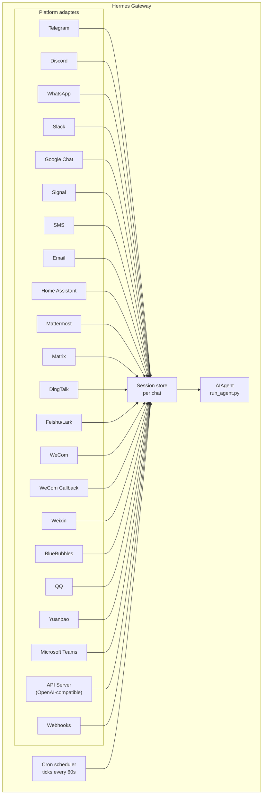

# 消息网关

从 Telegram、Discord、Slack、WhatsApp、Signal、SMS、Email、Home Assistant、Mattermost、Matrix、DingTalk、Feishu/Lark、WeCom、Weixin、BlueBubbles (iMessage)、QQ、Yuanbao、Microsoft Teams、LINE、ntfy 或您的浏览器与 Hermes 对话。该网关是一个单一的后台进程，它连接到所有已配置的平台，处理会话，运行定时任务，并发送语音消息。

有关完整的语音功能集——包括 CLI 麦克风模式、消息中的语音回复和 Discord 语音频道对话——请参阅 [语音模式](/user-guide/features/voice-mode) 和 [使用语音模式与 Hermes](/guides/use-voice-mode-with-hermes)。

:::tip
机器人需要模型提供商和工具提供商（TTS、Web）。[Nous Portal](/integrations/nous-portal) 订阅将所有这些功能打包在一起。
:::

## 平台对比

| Platform | Voice | Images | Files | Threads | Reactions | Typing | Streaming |
|----------|:-----:|:------:|:-----:|:-------:|:---------:|:------:|:---------:|
| Telegram | ✅ | ✅ | ✅ | ✅ | — | ✅ | ✅ |
| Discord | ✅ | ✅ | ✅ | ✅ | ✅ | ✅ | ✅ |
| Slack | ✅ | ✅ | ✅ | ✅ | ✅ | ✅ | ✅ |
| Google Chat | — | ✅ | ✅ | ✅ | — | ✅ | — |
| WhatsApp | — | ✅ | ✅ | — | — | ✅ | ✅ |
| Signal | — | ✅ | ✅ | — | — | ✅ | ✅ |
| SMS | — | — | — | — | — | — | — |
| Email | — | ✅ | ✅ | ✅ | — | — | — |
| Home Assistant | — | — | — | — | — | — | — |
| Mattermost | ✅ | ✅ | ✅ | ✅ | — | ✅ | ✅ |
| Matrix | ✅ | ✅ | ✅ | ✅ | ✅ | ✅ | ✅ |
| DingTalk | — | ✅ | ✅ | — | ✅ | — | ✅ |
| Feishu/Lark | ✅ | ✅ | ✅ | ✅ | ✅ | ✅ | ✅ |
| WeCom | ✅ | ✅ | ✅ | — | — | — | — |
| WeCom Callback | — | — | — | — | — | — | — |
| Weixin | ✅ | ✅ | ✅ | — | — | ✅ | ✅ |
| BlueBubbles | — | ✅ | ✅ | — | ✅ | ✅ | — |
| QQ | ✅ | ✅ | ✅ | — | — | ✅ | — |
| Yuanbao | ✅ | ✅ | ✅ | — | — | ✅ | ✅ |
| Microsoft Teams | — | ✅ | — | ✅ | — | ✅ | — |
| LINE | — | ✅ | ✅ | — | — | ✅ | — |
| ntfy | — | — | — | — | — | — | — |
| Raft | — | — | — | — | — | — | — |

**Voice** = TTS 语音回复和/或语音消息转录。**Images** = 发送/接收图片。**Files** = 发送/接收文件附件。**Threads** = 线程对话。**Reactions** = 对消息的表情符号反应。**Typing** = 处理过程中的输入指示器。**Streaming** = 通过编辑进行的渐进式消息更新。

## 架构 (Architecture)



每个平台适配器都会接收消息，通过聊天会话存储（per-chat session store）进行路由，然后将消息分派给智能体（AIAgent）进行处理。网关还运行定时任务调度器（cron scheduler），每 60 秒滴答一次以执行任何到期的任务。

## 意图静默令牌 (Intentional Silence Tokens)

对于群聊、钩子和自动化流程，Hermes 支持显式的静默令牌。如果智能体的最终回复恰好是支持的某个令牌，网关就会抑制外部交付，对聊天发送空消息。

支持的令牌包括：

- `[SILENT]`
- `SILENT`
- `NO_REPLY`
- `NO REPLY`

空格和大小写会被标准化，但整个最终回复必须是该令牌。例如，“当没有任何变化时使用 `[SILENT]`”这样的句子会正常交付。

静默只是一个交付决策。Hermes 会将助手的静默回合保留在会话记录中，因此对话仍然可以正常交替进行：

```text
user: 侧信道聊天 (side-channel chatter)
assistant: [SILENT]   # 已存储，未交付
user: 下一条消息
```

失败的回合仍会显示为错误；Hermes 不会因为文本看起来像静默令牌就隐藏失败。

## 快速设置 (Quick Setup)

配置消息平台的最简单方法是使用交互式向导：

```bash
hermes gateway setup        # 对所有消息平台的交互式设置
```

它将引导您完成每个平台的配置，通过箭头键选择，显示已配置的平台，并在完成后提供启动/重启网关的选项。

## 网关命令 (Gateway Commands)

```bash
hermes gateway              # 在前台运行
hermes gateway setup        # 交互式配置消息平台
hermes gateway install      # 作为用户服务（Linux）/launchd 服务（macOS）安装
sudo hermes gateway install --system   # 仅限 Linux：安装启动时系统服务
hermes gateway start        # 启动默认服务
hermes gateway stop         # 停止默认服务
hermes gateway status       # 检查默认服务状态
hermes gateway status --system         # 仅限 Linux：显式检查系统服务
```

## 聊天命令 (Chat Commands)（消息内部）

| 命令 | 描述 |
|---------|-------------|
| `/new` 或 `/reset` | 开始新的对话 |
| `/model [provider:model]` | 显示或更改模型（支持 `provider:model` 语法） |
| `/personality [name]` | 设置一个个性 |
| `/retry` | 重试上一条消息 |
| `/undo` | 撤销上一次交流 |
| `/status` | 显示会话信息 |
| `/whoami` | 在当前作用域内显示您的斜杠命令访问权限（管理员 / 用户 / 无限制） |
| `/stop` | 停止正在运行的智能体 |
| `/approve` | 批准一个待定的危险命令 |
| `/deny` | 拒绝一个待定的危险命令 |
| `/sethome` | 将此聊天设置为主频道 |
| `/compress` | 手动压缩对话上下文 |
| `/title [name]` | 设置或显示会话标题 |
| `/resume [name]` | 恢复之前命名的会话 |
| `/usage` | 显示本次会话的令牌使用情况 |
| `/insights [days]` | 显示使用洞察和分析数据 |
| `/reasoning [level\|show\|hide]` | 更改推理投入或切换推理显示 |
| `/voice [on\|off\|tts\|join\|leave\|status]` | 控制消息语音回复和 Discord 语音频道行为 |
| `/rollback [number]` | 列出或恢复文件系统检查点 |
| `/background <prompt>` | 在单独的后台会话中运行提示 |
| `/reload-mcp` | 从配置重新加载 MCP 服务器 |
| `/update` | 将 Hermes Agent 更新到最新版本 |
| `/help` | 显示可用命令 |
| `/<skill-name>` | 调用任何已安装的技能 |

## 会话管理 (Session Management)

### 会话持久性 (Session Persistence)

会话在消息之间持续存在，直到它们被重置。智能体会记住您的对话上下文。

### 重置策略 (Reset Policies)

会话根据可配置的策略进行重置：

| 策略 | 默认值 | 描述 |
|--------|---------|-------------|
| Daily | 4:00 AM | 每天特定小时重置 |
| Idle | 1440 min | 不活动 N 分钟后重置 |
| Both | (组合) | 先触发者即执行 |

请在 `~/.hermes/gateway.json` 中配置每个平台的覆盖设置：

```json
{
  "reset_by_platform": {
    "telegram": { "mode": "idle", "idle_minutes": 240 },
    "discord": { "mode": "idle", "idle_minutes": 60 }
  }
}
```

## 安全性 (Security)

**默认情况下，网关会拒绝所有不在白名单内或未通过私聊（DM）配对的用户。** 这是具有终端访问权限的机器人（bot）的安全默认设置。

```bash
# 限制为特定用户（推荐）：
TELEGRAM_ALLOWED_USERS=123456789,987654321
DISCORD_ALLOWED_USERS=123456789012345678
SIGNAL_ALLOWED_USERS=+155****4567,+155****6543
SMS_ALLOWED_USERS=+155****4567,+155****6543
EMAIL_ALLOWED_USERS=trusted@example.com,colleague@work.com
MATTERMOST_ALLOWED_USERS=3uo8dkh1p7g1mfk49ear5fzs5c
MATRIX_ALLOWED_USERS=@alice:matrix.org
DINGTALK_ALLOWED_USERS=user-id-1
FEISHU_ALLOWED_USERS=ou_xxxxxxxx,ou_yyyyyyyy
WECOM_ALLOWED_USERS=user-id-1,user-id-2
WECOM_CALLBACK_ALLOWED_USERS=user-id-1,user-id-2
TEAMS_ALLOWED_USERS=aad-object-id-1,aad-object-id-2

# 或者允许
GATEWAY_ALLOWED_USERS=123456789,987654321

# 或者显式允许所有用户（不推荐用于具有终端访问权限的机器人）：
GATEWAY_ALLOW_ALL_USERS=true
```

### DM 配对（替代白名单）(DM Pairing)

与手动配置用户 ID 不同，未知用户在他们私聊（DM）机器人时会收到一个一次性的配对代码。电子邮件是例外：除非显式启用了电子邮件配对，否则未知电子邮件发送者将被忽略。

```bash
# 用户将看到：“配对代码: XKGH5N7P”
# 您通过以下命令批准他们：
hermes pairing approve telegram XKGH5N7P

# 其他配对命令：
hermes pairing list          # 查看待定和已批准的用户
hermes pairing revoke telegram 123456789  # 移除访问权限
```

配对代码有效期为 1 小时，并有限制速率，使用加密随机性。

### 管理员 vs 普通用户 (Admins vs Regular Users)

白名单回答的是“这个人是否能联系到机器人？”而**管理员/用户划分（admin / user split）**则回答了“既然他们进来了，他们被允许做什么？”

所有被允许的用户都属于每个作用域（DM 对话 vs 群组/频道）的两个层级之一：

- **管理员 (Admin)** — 完全访问权限。可以运行所有已注册的斜杠命令（内置 + 插件）并使用所有受限功能。
- **普通用户 (Regular user)** — 受限访问权限。可以正常与智能体聊天，但只能运行您明确启用的斜杠命令。永远允许的基础权限是 `/help` 和 `/whoami`。

这些层级是针对每个平台和每个作用域配置的。DM 管理员身份不意味着群组/频道管理员身份——每个作用域都有自己的管理员列表。

**当前限制的功能：** 斜杠命令。该划分会通过实时命令注册表运行，因此它涵盖了内置的和插件注册的命令，而无需进行逐个功能配线。普通聊天不受影响——非管理员仍然可以与智能体对话。

**未来可能受限的功能：** 更多能力表面（工具访问、模型切换、昂贵操作）将基于相同的管理员/用户区分来添加。现在配置该划分意味着未来的限制不会造成混乱，而无需您重新建模谁是管理员。

#### 配置 (Configuration)

```yaml
gateway:
  platforms:
    discord:
      extra:
        allow_from: ["111", "222", "333"]
        allow_admin_from: ["111"]                    # 管理员 -> 所有斜杠命令
        user_allowed_commands: [status, model]       # 非管理员可以运行的内容
        # 可选：单独的群组/频道作用域
        group_allow_admin_from: ["111"]
        group_user_allowed_commands: [status]
```

**向后兼容性 (Backward compat):** 如果某个作用域没有设置 `allow_admin_from`，则该作用域的层级划分将被禁用，所有被允许的用户都将拥有完全访问权限。现有安装保持正常工作，无需更改——您想区分时再选择启用。

#### 检查您的权限 (Inspecting your access)

使用任何平台上的 `/whoami` 来查看活动的作用域、您的层级（管理员 / 用户 / 无限制）以及您可以运行哪些斜杠命令。请参阅 [Telegram](/user-guide/messaging/telegram#slash-command-access-control) 和 [Discord](/user-guide/messaging/discord#slash-command-access-control) 页面以获取特定平台的示例。

## 中断智能体 (Interrupting the Agent)

在智能体正在工作时发送任何消息都可以中断它。关键行为包括：

- **正在进行的终端命令会立即被终止**（SIGTERM，然后等待 1 秒后 SIGKILL）
- **工具调用会被取消** — 只有当前执行的那个会运行，其余的都会跳过
- **多条消息会被合并** — 在中断期间发送的消息将被合并成一个提示
- **`/stop` 命令** — 会中断智能体，而不会排队后续消息

### 队列 vs 中断 vs 指导（繁忙输入模式）(Queue vs interrupt vs steer (busy-input mode))

默认情况下，向正在忙碌的智能体发送消息会中断它。还有另外两种模式可用：

- `queue` — 后续消息会等待，在当前任务完成后作为下一个回合运行。
- `steer` — 后续消息通过 `/steer` 注入到当前的运行中，在下一次工具调用后到达智能体。不会中断，也不会开启新的一轮对话。如果智能体尚未启动，则回退到 `queue` 的行为。

```yaml
display:
  busy_input_mode: steer   # 或 queue，或 interrupt (默认)
  busy_ack_enabled: true   # 设置为 false 可完全抑制 ⚡/⏳/⏩ 的聊天回复
```

您首次向任何平台上的忙碌智能体发送消息时，Hermes 会在忙碌确认（busy-ack）中附加一行提醒说明此功能（“💡 首次使用提示 — …”）。该提醒只会在安装一次后触发一次——它存储在一个 `onboarding.seen.busy_input_prompt` 下的标志中。删除该键可以再次看到此提示。

如果您觉得忙碌确认消息过多——尤其是对于语音输入或快速发送的消息——请设置 `display.busy_ack_enabled: false`。您的输入仍然会像往常一样被排队/指导/中断，只是聊天回复会被静音。

## 工具进度通知

控制在 `~/.hermes/config.yaml` 中显示多少工具活动信息：

```yaml
display:
  tool_progress: all    # off | new | all | verbose
  tool_progress_command: false  # set to true to enable /verbose in messaging
  # How progress is grouped on platforms that support message editing:
  #   accumulate (default) — edit one bubble in place as tools run
  #   separate             — send one message per tool (pre-v0.9 style; noisier)
  # Only applies where tool_progress is already enabled.
  tool_progress_grouping: accumulate   # accumulate | separate
```

### 模型上下文中的消息时间戳

默认关闭。启用后，Hermes 会在每个**用户**消息（*在模型的上下文中*）前添加一个人类可读的时间戳（例如 `[Tue 2026-04-28 13:40:53 CEST]`），从而让智能体知道消息何时发送——这对于时间推理（“你今天早上问的…”、注意到长时间间隔）很有用。它**不会**添加到助手消息或系统提示中。

```yaml
gateway:
  message_timestamps:
    enabled: false   # set true to show send-times to the model
```

持久化的转录记录始终保持干净——无论此开关如何，时间戳都作为消息元数据存储，因此稍后启用它也会显示过去消息的发送时间，重放也不会积累重复的前缀。

启用后，机器人会发送工作状态消息：

```text
💻 `ls -la`...
🔍 web_search...
📄 web_extract...
🐍 execute_code...
```

## 后台会话

在单独的后台会话中运行提示，这样智能体可以独立地处理它，而您的主聊天保持响应状态：

```
/background Check all servers in the cluster and report any that are down
```

Hermes 会立即确认：

```
🔄 Background task started: "Check all servers in the cluster..."
   Task ID: bg_143022_a1b2c3
```

### 工作原理

每个 `/background` 提示都会生成一个**独立的智能体实例**，异步运行：

- **隔离会话** — 后台智能体拥有自己的会话和对话历史。它不知道您当前的聊天上下文，只接收您提供的提示。
- **相同的配置** — 它继承了您当前网关设置中的模型、提供商、工具集、推理设置和提供商路由。
- **非阻塞式** — 您的主聊天保持完全交互状态。在它工作时，您可以发送消息、运行其他命令或启动更多后台任务。
- **结果交付** — 当任务完成后，结果会发送回您发出命令的同一聊天或频道，并以“✅ 后台任务完成”为前缀。如果失败，您将看到带有错误的“❌ 后台任务失败”。

### 后台进程通知

当运行后台会话的智能体使用 `terminal(background=true)` 启动长时间运行的进程（服务器、构建等）时，网关可以向您的聊天推送状态更新。通过 `~/.hermes/config.yaml` 中的 `display.background_process_notifications` 来控制此功能：

```yaml
display:
  background_process_notifications: all    # all | result | error | off
```

| 模式 | 您收到的内容 |
|------|-----------------|
| `all` | 运行输出更新**和**最终完成消息（默认） |
| `result` | 仅最终完成消息（无论退出代码如何） |
| `error` | 仅在退出代码非零时的最终消息 |
| `off` | 完全没有进程监控消息 |

您也可以通过环境变量设置此项：

```bash
HERMES_BACKGROUND_NOTIFICATIONS=result
```

### 用例

- **服务器监控** — “/background 检查所有服务的健康状况，如果任何服务宕机请提醒我”
- **长时间构建** — “/background 构建并部署暂存环境” (同时您继续聊天)
- **研究任务** — “/background 研究竞争对手定价并以表格形式总结”
- **文件操作** — “/background 根据日期将 ~/Downloads 中的照片整理到文件夹中”

:::tip
消息平台的后台任务是“设置即忘”——您不需要等待或检查它们。任务完成后，结果会自动发送到同一聊天中。
:::

## 服务管理

### Linux (systemd)

```bash
hermes gateway install               # Install as user service
hermes gateway start                 # Start the service
hermes gateway stop                  # Stop the service
hermes gateway status                # Check status
journalctl --user -u hermes-gateway -f  # View logs

# Enable lingering (keeps running after logout)
sudo loginctl enable-linger $USER

# Or install a boot-time system service that still runs as your user
sudo hermes gateway install --system
sudo hermes gateway start --system
sudo hermes gateway status --system
journalctl -u hermes-gateway -f
```

在笔记本电脑和开发机上使用用户服务。在应回启动且不依赖 systemd linger 的 VPS 或无头主机上使用系统服务。

:::tip 无头虚拟机：用户服务 + linger 可避免 root 提示
系统服务对于每一次重启（包括 `hermes update` 结束时的自动网关重启）都需要 root 权限。当 `hermes update` 以非 root 用户身份运行时，它会尝试无密码的 `sudo systemctl`；如果这不可用，它将跳过重启并打印出手动执行 `sudo systemctl restart hermes-gateway` 的命令（它绝不会阻塞在交互式密码提示上）。

对于您从不登录的无头虚拟机，启用 linger 的**用户**服务可以提供相同的开机启动行为，而无需任何 root 参与：

```bash
hermes gateway install          # user service
sudo loginctl enable-linger $USER   # one-time: start at boot, survive logout
```

之后，`hermes update` 就可以在没有任何权限的情况下重启网关。如果您想保留系统服务，请使用 `sudo hermes update` 运行更新，或者授予服务账户对 systemctl 的无密码 sudo 权限，例如在 `sudo visudo -f /etc/sudoers.d/hermes-gateway` 中设置：

```
hermes ALL=(root) NOPASSWD: /usr/bin/systemctl --no-ask-password reset-failed hermes-gateway*, /usr/bin/systemctl --no-ask-password start hermes-gateway*, /usr/bin/systemctl --no-ask-password restart hermes-gateway*
```
:::

除非您真的需要，否则请避免同时安装用户和系统网关单元。如果检测到两者都存在，Hermes 会发出警告，因为状态（启动/停止/状态）会变得模糊不清。

:::info 多次安装
如果您在同一台机器上运行多个 Hermes 安装（具有不同的 `HERMES_HOME` 目录），每个安装都会拥有自己的 systemd 服务名称。默认的 `~/.hermes` 使用 `hermes-gateway`；其他安装使用 `hermes-gateway-<hash>`。`hermes gateway` 命令会自动针对您当前的 `HERMES_HOME` 目标正确的服务。
:::

### macOS (launchd)

```bash
hermes gateway install               # Install as launchd agent
hermes gateway start                 # Start the service
hermes gateway stop                  # Stop the service
hermes gateway status                # Check status
tail -f ~/.hermes/logs/gateway.log   # View logs
```

生成的 plist 文件位于 `~/Library/LaunchAgents/ai.hermes.gateway.plist`。它包含三个环境变量：

- **PATH** — 安装时的完整 shell PATH，其中预置了 venv 的 `bin/` 和 `node_modules/.bin`。这确保了用户安装的工具（Node.js, ffmpeg 等）可供 WhatsApp bridge 等网关子进程使用。
- **VIRTUAL_ENV** — 指向 Python 虚拟环境，以便工具可以正确解析包。
- **HERMES_HOME** — 将网关限定到您的 Hermes 安装。

:::tip PATH 更改后需要重新安装
launchd plist 是静态的——如果您在设置网关之后安装了新工具（例如通过 nvm 的新版 Node.js 或 Homebrew 的 ffmpeg），请再次运行 `hermes gateway install` 以捕获更新后的 PATH。网关会检测到过时的 plist 并自动重载。
:::

:::info 多次安装
与 Linux systemd 服务一样，每个 `HERMES_HOME` 目录都会拥有自己的 launchd 标签。默认的 `~/.hermes` 使用 `ai.hermes.gateway`；其他安装使用 `ai.hermes.gateway-<suffix>`。
:::

## 特定平台的工具集

每个平台都有自己的工具集：

| Platform | Toolset | Capabilities |
|----------|---------|--------------|
| CLI | `hermes-cli` | Full access |
| Telegram | `hermes-telegram` | Full tools including terminal |
| Discord | `hermes-discord` | Full tools including terminal |
| WhatsApp | `hermes-whatsapp` | Full tools including terminal |
| WhatsApp Cloud API | `hermes-whatsapp` | Full tools including terminal (shares toolset with the Baileys bridge) |
| Slack | `hermes-slack` | Full tools including terminal |
| Google Chat | `hermes-google_chat` | Full tools including terminal |
| Signal | `hermes-signal` | Full tools including terminal |
| SMS | `hermes-sms` | Full tools including terminal |
| Email | `hermes-email` | Full tools including terminal |
| Home Assistant | `hermes-homeassistant` | Full tools + HA device control (ha_list_entities, ha_get_state, ha_call_service, ha_list_services) |
| Mattermost | `hermes-mattermost` | Full tools including terminal |
| Matrix | `hermes-matrix` | Full tools including terminal |
| DingTalk | `hermes-dingtalk` | Full tools including terminal |
| Feishu/Lark | `hermes-feishu` | Full tools including terminal |
| WeCom | `hermes-wecom` | Full tools including terminal |
| WeCom Callback | `hermes-wecom-callback` | Full tools including terminal |
| Weixin | `hermes-weixin` | Full tools including terminal |
| BlueBubbles | `hermes-bluebubbles` | Full tools including terminal |
| QQBot | `hermes-qqbot` | Full tools including terminal |
| Yuanbao | `hermes-yuanbao` | Full tools including terminal |
| Microsoft Teams | `hermes-teams` | Full tools including terminal |
| API Server | `hermes-api-server` | Full tools (drops `clarify`, `send_message`, `text_to_speech` — programmatic access doesn't have an interactive user) |
| Webhooks | `hermes-webhook` | Full tools including terminal |
| Raft | `hermes-raft` | Wake-only channel; agent uses Raft CLI for message I/O |

## 运行多平台网关

网关通常会同时运行多个适配器（例如 Telegram + Discord + Slack）。下面的部分涵盖了跨所有平台的第 2 天操作。

### `/platform` 命令

一旦网关正在运行，就可以从任何已连接的 CLI 会话或聊天中使用 `/platform` 斜杠命令来检查和引导单个适配器，而无需重启整个网关：

```
/platform list                  # show all adapters and their state
/platform pause <name>          # stop dispatching new messages to one adapter
/platform resume <name>         # re-enable a paused adapter
```

`/platform list` 显示每个适配器是 `running`（运行中）、`paused`（手动暂停）还是 `paused-by-breaker`（由断路器暂停）（见下文）。暂停操作会保持适配器的加载状态及其后台循环的存活——传入的消息会被丢弃，但连接本身仍然保持打开，因此恢复是即时的。

另请参阅更广泛的状态摘要命令 [`/platforms`](../../reference/slash-commands.md#info)。

### 自动断路器

每个适配器都被一个断路器包裹着。重复的、可重试的故障（网络抖动、速率限制回复、5xx 上游响应、websocket 断开）会导致断路器跳闸——该适配器会被自动暂停，如果配置了，则会向另一个活跃平台的主频道发送操作员通知，并发出结构化的日志行。

断路器**不会**自动恢复——它会保持开启状态，直到您手动运行 `/platform resume <name>`。这是故意的：如果某个平台处于持续的宕机状态，您不希望网关疯狂地尝试重新连接。

### 平台被暂停时应查看哪些信息

当一个适配器被暂停时，请检查：

1. **网关日志** (`~/.hermes/logs/gateway.log` 或 systemd / launchd 单元日志)。搜索该平台的名称以及 `circuit breaker`、`paused` 或 `disabled`。跳闸事件会包含故障计数和上一个错误。
2. **`/platform list`** 输出——显示当前状态和最后一个原因。
3. **提供商的状态页面**（Telegram bot API 状态、Discord 状态等）。断路器跳闸是因为该平台不健康；在它恢复之前，不要尝试恢复。

一旦上游恢复正常，运行 `/platform resume <name>` 就会清除断路器并重新激活适配器。

### 重启通知

当网关重启（或伴随正在进行中的会话被关闭）时，它可以向每个平台的主频道发送一次性的“智能体已回来”/“智能体已被中断”消息。这由 `gateway-config.yaml` 中的 `gateway_restart_notification` 标志控制，该标志默认为 `true`：

```yaml
gateway:
  platforms:
    telegram:
      home_chat_id: "123456789"
      gateway_restart_notification: false   # opt out for this platform
    discord:
      home_chat_id: "987654321"
      # gateway_restart_notification omitted → defaults to true
```

在嘈杂或低优先级的平台上禁用它，同时保留给您的主聊天。通知是每次重启发送一次的，无论有多少会话正在进行中。

### 网关重启时的会话恢复

当网关伴随正在进行的工具调用或生成被关闭时，受影响的会话会被标记为 `restart_interrupted`（重启中断）。在下次启动时，网关会为每个会话安排一次自动恢复——用户会在聊天中收到一个简短的提示（“发送任何消息，我将尝试从您上次中断的地方继续。”），并且该会话将在他们回复时从上一个已提交的轮次恢复。

这种行为是默认开启的，并在网关启动时记录下来：

```
Scheduled auto-resume for N restart-interrupted session(s)
```

无需配置。如果您不希望收到此提示，请在平台上设置 `gateway_restart_notification: false`。

### 友好的移动端进度默认设置

Telegram 通常是一个移动收件箱，因此默认设置是针对该界面的：

- **`tool_progress`** 默认为 **`off`** — 不会显示每个工具的面包屑流来填满聊天。
- **`busy_ack_detail`** 默认为 **`off`** — 忙状态确认和长时间运行的心跳保持简洁（不会有 `iteration 21/60` 的调试细节）。
- **`interim_assistant_messages`** 保持 **`on`** — 真实的中间轮次助手评论（模型字面意思是在告诉您它即将要做什么）是信号，而不是噪音。
- **`long_running_notifications`** 保持 **`on`** — 一个单次的“⏳ 正在工作 — N 分钟”内嵌气泡会每隔几分钟更新一次，从而让您有一个心跳反馈，而不是盯着 `typing…` 看半个小时。

您可以选择关闭上述任一默认设置，或为每个平台重新开启详细的进度显示：

```yaml
display:
  platforms:
    telegram:
      # Re-enable the tool-progress stream
      tool_progress: new
      # Show "iteration N/M, running: tool" in heartbeats and busy acks
      busy_ack_detail: true
      # Or quiet them entirely
      interim_assistant_messages: false
      long_running_notifications: false
```

### 进度气泡清理（可选）

工具进度消息、“仍在工作…”的心跳和状态回调气泡也可以在最终响应到达后自动删除。通过 `display.platforms.<platform>.cleanup_progress` 为每个平台启用：

```yaml
display:
  platforms:
    telegram:
      cleanup_progress: true
    discord:
      cleanup_progress: true
```

默认为 `false`。只有实现了 `delete_message` 的适配器（目前是 Telegram 和 Discord）才会响应此设置。失败的运行会**跳过**清理，因此气泡将保留为面包屑。

- [Telegram 设置](telegram.md)
- [Discord 设置](discord.md)
- [Slack 设置](slack.md)
- [Google Chat 设置](google_chat.md)
- [WhatsApp 设置](whatsapp.md)
- [WhatsApp 商业云API设置](whatsapp-cloud.md)
- [Signal 设置](signal.md)
- [短信设置 (Twilio)](sms.md)
- [邮件设置](email.md)
- [Home Assistant 集成](homeassistant.md)
- [Mattermost 设置](mattermost.md)
- [Matrix 设置](matrix.md)
- [钉钉设置](dingtalk.md)
- [飞书/Lark 设置](feishu.md)
- [企业微信设置](wecom.md)
- [企业微信回调设置](wecom-callback.md)
- [微信设置](weixin.md)
- [BlueBubbles 设置 (iMessage)](bluebubbles.md)
- [QQBot 设置](qqbot.md)
- [元宝设置](yuanbao.md)
- [Microsoft Teams 设置](teams.md)
- [Teams 会议流程](teams-meetings.md)
- [Open WebUI + API 服务器](open-webui.md)
- [Raft 设置](raft.md)
- [Webhooks](webhooks.md)