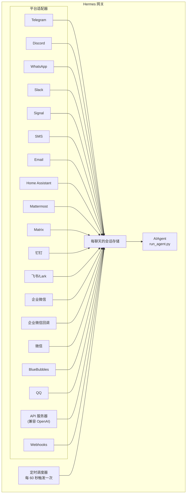

# 消息网关

通过 Telegram、Discord、Slack、WhatsApp、Signal、SMS、Email、Home Assistant、Mattermost、Matrix、钉钉、飞书/Lark、企业微信、微信、BlueBubbles（iMessage）或您的浏览器与 Hermes 聊天。该网关是一个单一后台进程，连接您配置的所有平台，处理会话、运行定时任务并传递语音消息。

如需完整的语音功能集——包括 CLI 麦克风模式、消息中的语音回复以及 Discord 语音频道对话——请参见 [语音模式](/docs/user-guide/features/voice-mode) 和 [使用 Hermes 的语音模式](/docs/guides/use-voice-mode-with-hermes)。

## 平台对比

| 平台 | 语音 | 图片 | 文件 | 线程 | 反应 | 输入提示 | 流式传输 |
|----------|:-----:|:------:|:-----:|:-------:|:---------:|:------:|:---------:|
| Telegram | ✅ | ✅ | ✅ | ✅ | — | ✅ | ✅ |
| Discord | ✅ | ✅ | ✅ | ✅ | ✅ | ✅ | ✅ |
| Slack | ✅ | ✅ | ✅ | ✅ | ✅ | ✅ | ✅ |
| WhatsApp | — | ✅ | ✅ | — | — | ✅ | ✅ |
| Signal | — | ✅ | ✅ | — | — | ✅ | ✅ |
| SMS | — | — | — | — | — | — | — |
| Email | — | ✅ | ✅ | ✅ | — | — | — |
| Home Assistant | — | — | — | — | — | — | — |
| Mattermost | ✅ | ✅ | ✅ | ✅ | — | ✅ | ✅ |
| Matrix | ✅ | ✅ | ✅ | ✅ | ✅ | ✅ | ✅ |
| 钉钉 | — | ✅ | ✅ | — | ✅ | — | ✅ |
| 飞书/Lark | ✅ | ✅ | ✅ | ✅ | ✅ | ✅ | ✅ |
| 企业微信 | ✅ | ✅ | ✅ | — | — | ✅ | ✅ |
| 企业微信回调 | — | — | — | — | — | — | — |
| 微信 | ✅ | ✅ | ✅ | — | — | ✅ | ✅ |
| BlueBubbles | — | ✅ | ✅ | — | ✅ | ✅ | — |
| QQ | ✅ | ✅ | ✅ | — | — | ✅ | — |

**语音** = TTS 音频回复和/或语音消息转录。**图片** = 发送/接收图片。**文件** = 发送/接收附件。**线程** = 线程化对话。**反应** = 对消息添加表情符号反应。**输入提示** = 处理时显示输入提示。**流式传输** = 通过编辑实现渐进式消息更新。

## 架构



每个平台适配器接收消息，将其路由至每聊天的会话存储，然后分发给 AIAgent 进行处理。网关还运行定时调度器，每 60 秒触发一次以执行到期任务。

## 快速设置

配置消息平台最简单的方法是使用交互式向导：

```bash
hermes gateway setup        # 为所有消息平台进行交互式设置
```

此向导将引导您完成每个平台的配置，使用方向键选择，显示已配置的平台，并在完成后提供启动/重启网关的选项。

## 网关命令

```bash
hermes gateway              # 在前台运行
hermes gateway setup        # 交互式配置消息平台
hermes gateway install      # 安装为用户服务（Linux）/ launchd 代理（macOS）
sudo hermes gateway install --system   # Linux 专用：安装开机自启系统服务
hermes gateway start        # 启动默认服务
hermes gateway stop         # 停止默认服务
hermes gateway status       # 检查默认服务状态
hermes gateway status --system         # Linux 专用：显式检查系统服务
```

## 聊天命令（在消息中）

| 命令 | 描述 |
|---------|-------------|
| `/new` 或 `/reset` | 开始新对话 |
| `/model [provider:model]` | 查看或更改模型（支持 `provider:model` 语法） |
| `/provider` | 显示可用提供方及其认证状态 |
| `/personality [name]` | 设置个性 |
| `/retry` | 重试最后一条消息 |
| `/undo` | 删除最后一次交流 |
| `/status` | 显示会话信息 |
| `/stop` | 停止正在运行的代理 |
| `/approve` | 批准待处理的危险命令 |
| `/deny` | 拒绝待处理的危险命令 |
| `/sethome` | 将此聊天设为家庭频道 |
| `/compress` | 手动压缩对话上下文 |
| `/title [name]` | 设置或显示会话标题 |
| `/resume [name]` | 恢复之前命名的会话 |
| `/usage` | 显示此会话的令牌使用情况 |
| `/insights [days]` | 显示使用洞察和分析 |
| `/reasoning [level\|show\|hide]` | 更改推理努力程度或切换推理显示 |
| `/voice [on\|off\|tts\|join\|leave\|status]` | 控制消息语音回复和 Discord 语音频道行为 |
| `/rollback [number]` | 列出或恢复文件系统检查点 |
| `/background <prompt>` | 在单独的后台会话中运行提示 |
| `/reload-mcp` | 从配置重新加载 MCP 服务器 |
| `/update` | 将 Hermes Agent 更新到最新版本 |
| `/help` | 显示可用命令 |
| `/<skill-name>` | 调用任意已安装的技能 |

## 会话管理

### 会话持久化

会话会持续保留直到重置为止。代理会记住您的对话上下文。

### 重置策略

会话根据可配置的策咯重置：

| 策略 | 默认值 | 描述 |
|--------|---------|-------------|
| 每日 | 凌晨 4:00 | 每天特定时间重置 |
| 空闲 | 1440 分钟 | 空闲 N 分钟后重置 |
| 两者 | (组合) | 哪个先触发就执行哪个 |

在 `~/.hermes/gateway.json` 中为每个平台单独配置覆盖项：

```json
{
  "reset_by_platform": {
    "telegram": { "mode": "idle", "idle_minutes": 240 },
    "discord": { "mode": "idle", "idle_minutes": 60 }
  }
}
```

## 安全性

**默认情况下，网关拒绝所有不在白名单内或通过私信配对的用户的访问。** 这是具有终端访问权限机器人的安全默认值。

```bash
# 限制特定用户（推荐）：
TELEGRAM_ALLOWED_USERS=123456789,987654321
DISCORD_ALLOWED_USERS=123456789012345678
SIGNAL_ALLOWED_USERS=+155****4567,+155****6543
SMS_ALLOWED_USERS=+155****4567,+155****6543
EMAIL_ALLOWED_USERS=trusted@example.com,colleague@work.com
MATTERMOST_ALLOWED_USERS=3uo8dkh1p7g1mfk49ear5fzs5c
MATRIX_ALLOWED_USERS=@alice:matrix.org
DINGTALK_ALLOWED_USERS=user-id-1
FEISHU_ALLOWED_USERS=ou_xxxxxxxx,ou_yyyyyyyy
WECOM_ALLOWED_USERS=user-id-1,user-id-2
WECOM_CALLBACK_ALLOWED_USERS=user-id-1,user-id-2

# 或者允许
GATEWAY_ALLOWED_USERS=123456789,987654321

# 或者显式允许所有用户（不推荐用于具有终端访问权限的机器人）：
GATEWAY_ALLOW_ALL_USERS=true
```

### 私信配对（替代白名单）

无需手动配置用户 ID，未知用户在私信机器人时会收到一次性配对码：

```bash
# 用户看到："配对代码：XKGH5N7P"
# 您可通过以下方式批准他们：
hermes pairing approve telegram XKGH5N7P

# 其他配对命令：
hermes pairing list          # 查看待处理和已批准的用戶
hermes pairing revoke telegram 123456789  # 移除访问权限
```

配对码会在 1 小时后过期，受速率限制，并使用加密随机性生成。

## 中断代理

在代理工作时发送任意消息即可中断它。关键行为：

- **正在进行的终端命令会被立即终止**（SIGTERM，1 秒后 SIGKILL）
- **工具调用被取消** — 仅运行当前执行的调用，其余跳过
- **多条消息被合并** — 中断期间发送的消息被合并为一条提示
- **`/stop` 命令** — 中断且不排队后续消息

## 工具进度通知

控制在 `~/.hermes/config.yaml` 中显示多少工具活动：

```yaml
display:
  tool_progress: all    # off | new | all | verbose
  tool_progress_command: false  # 设置为 true 以在消息中启用 /verbose
```

启用后，代理会在工作时发送状态消息：

```text
💻 `ls -la`...
🔍 web_search...
📄 web_extract...
🐍 execute_code...
```

## 后台会话

在单独的后台会话中运行提示，使代理独立工作，同时保持主聊天响应：

```
/background 检查集群中的所有服务器并报告任何离线服务器
```

Hermes 会立即确认：

```
🔄 后台任务已开始："检查集群中的所有服务器..."
   任务 ID：bg_143022_a1b2c3
```

### 工作原理

每个 `/background` 提示都会启动一个**独立的代理实例**异步运行：

- **隔离会话** — 后台代理拥有自己独立的会话和对话历史记录。它对当前聊天上下文一无所知，仅接收您提供的提示。
- **相同配置** — 继承当前网关设置的模型、提供方、工具集、推理设置和提供方路由。
- **非阻塞** — 您的主聊天完全可交互。发送消息、运行其他命令或启动更多后台任务均可。
- **结果交付** — 任务完成时，结果会发回**发出命令的同一聊天或频道**，前缀为 "✅ 后台任务完成"。若失败，您将看到 "❌ 后台任务失败" 及错误信息。

### 后台进程通知

当运行后台会话的代理使用 `terminal(background=true)` 启动长时间运行进程（服务器、构建等）时，网关可向您的聊天推送状态更新。通过 `~/.hermes/config.yaml` 中的 `display.background_process_notifications` 控制此功能：

```yaml
display:
  background_process_notifications: all    # all | result | error | off
```

| 模式 | 您收到的内容 |
|------|-----------------|
| `all` | 运行输出更新 **和** 最终完成消息（默认） |
| `result` | 仅最终完成消息（无论退出代码如何） |
| `error` | 仅退出代码非零时的最终消息 |
| `off` | 完全不发送进程监视器消息 |

您还可通过环境变量设置此选项：

```bash
HERMES_BACKGROUND_NOTIFICATIONS=result
```

### 用例

- **服务器监控** — "/background 检查所有服务的健康状况，如有异常则提醒我"
- **长时间构建** — "/background 构建并部署测试环境"，同时继续聊天
- **研究任务** — "/background 调研竞争对手定价并以表格形式总结"
- **文件操作** — "/background 按日期整理 ~/Downloads 中的照片到文件夹"

:::tip
消息平台上的后台任务是即发即弃的——您无需等待或跟踪它们。任务完成时结果会自动发回同一聊天。
:::

## 服务管理

### Linux (systemd)

```bash
hermes gateway install               # 安装为用户服务
hermes gateway start                 # 启动服务
hermes gateway stop                  # 停止服务
hermes gateway status                # 检查状态
journalctl --user -u hermes-gateway -f  # 查看日志

# 启用 lingering（注销后仍运行）
sudo loginctl enable-linger $USER

# 或在开机时安装系统服务（仍以您的用户身份运行）
sudo hermes gateway install --system
sudo hermes gateway start --system
sudo hermes gateway status --system
journalctl -u hermes-gateway -f
```

在笔记本电脑和开发机上使用用户服务。在 VPS 或无头主机上使用系统服务（开机自启，不依赖 systemd linger）。

请勿同时安装用户和服务网关单元，除非您确实需要。Hermes 检测到两者时会警告，因为 start/stop/status 行为会变得模糊。

:::info 多安装
如果在同一台机器上运行多个 Hermes 安装（使用不同的 `HERMES_HOME` 目录），每个安装都有自己独立的 systemd 服务名称。默认 `~/.hermes` 使用 `hermes-gateway`；其他安装使用 `hermes-gateway-<hash>`。`hermes gateway` 命令会自动针对当前 `HERMES_HOME` 的目标服务。
:::

### macOS (launchd)

```bash
hermes gateway install               # 安装为 launchd 代理
hermes gateway start                 # 启动服务
hermes gateway stop                  # 停止服务
hermes gateway status                # 检查状态
tail -f ~/.hermes/logs/gateway.log   # 查看日志
```

生成的 plist 位于 `~/Library/LaunchAgents/ai.hermes.gateway.plist`。它包含三个环境变量：

- **PATH** — 安装时的完整 shell PATH，前置 venv `bin/` 和 `node_modules/.bin`。这确保用户安装的工具（Node.js、ffmpeg 等）可用于网关子进程（如 WhatsApp 桥接器）。
- **VIRTUAL_ENV** — 指向 Python 虚拟环境，以便工具能正确解析包。
- **HERMES_HOME** — 将网关限定到您的 Hermes 安装。

:::tip 安装后的 PATH 变更
launchd plists 是静态的——如果您在安装网关后安装了新工具（例如通过 nvm 安装新的 Node.js 版本，或通过 Homebrew 安装 ffmpeg），请再次运行 `hermes gateway install` 以捕获更新的 PATH。网关会自动检测过时的 plist 并重新加载。
:::

:::info 多安装
与 Linux systemd 服务类似，每个 `HERMES_HOME` 目录都有自己独立的 launchd 标签。默认 `~/.hermes` 使用 `ai.hermes.gateway`；其他安装使用 `ai.hermes.gateway-<suffix>`。
:::

## 平台专用工具集

每个平台都有自己的工具集：

| 平台 | 工具集 | 能力 |
|----------|---------|--------------|
| CLI | `hermes-cli` | 完全访问 |
| Telegram | `hermes-telegram` | 包括终端在内的完整工具 |
| Discord | `hermes-discord` | 包括终端在内的完整工具 |
| WhatsApp | `hermes-whatsapp` | 包括终端在内的完整工具 |
| Slack | `hermes-slack` | 包括终端在内的完整工具 |
| Signal | `hermes-signal` | 包括终端在内的完整工具 |
| SMS | `hermes-sms` | 包括终端在内的完整工具 |
| Email | `hermes-email` | 包括终端在内的完整工具 |
| Home Assistant | `hermes-homeassistant` | 完整工具 + HA 设备控制（ha_list_entities、ha_get_state、ha_call_service、ha_list_services） |
| Mattermost | `hermes-mattermost` | 包括终端在内的完整工具 |
| Matrix | `hermes-matrix` | 包括终端在内的完整工具 |
| 钉钉 | `hermes-dingtalk` | 包括终端在内的完整工具 |
| 飞书/Lark | `hermes-feishu` | 包括终端在内的完整工具 |
| 企业微信 | `hermes-wecom` | 包括终端在内的完整工具 |
| 企业微信回调 | `hermes-wecom-callback` | 包括终端在内的完整工具 |
| 微信 | `hermes-weixin` | 包括终端在内的完整工具 |
| BlueBubbles | `hermes-bluebubbles` | 包括终端在内的完整工具 |
| QQBot | `hermes-qqbot` | 包括终端在内的完整工具 |
| API 服务器 | `hermes`（默认） | 包括终端在内的完整工具 |
| Webhooks | `hermes-webhook` | 包括终端在内的完整工具 |

## 后续步骤

- [Telegram 设置](telegram.md)
- [Discord 设置](discord.md)
- [Slack 设置](slack.md)
- [WhatsApp 设置](whatsapp.md)
- [Signal 设置](signal.md)
- [SMS 设置（Twilio）](sms.md)
- [Email 设置](email.md)
- [Home Assistant 集成](homeassistant.md)
- [Mattermost 设置](mattermost.md)
- [Matrix 设置](matrix.md)
- [钉钉设置](dingtalk.md)
- [飞书/Lark 设置](feishu.md)
- [企业微信设置](wecom.md)
- [企业微信回调设置](wecom-callback.md)
- [微信设置（WeChat）](weixin.md)
- [BlueBubbles 设置（iMessage）](bluebubbles.md)
- [QQBot 设置](qqbot.md)
- [Open WebUI + API 服务器](open-webui.md)
- [Webhooks](webhooks.md)