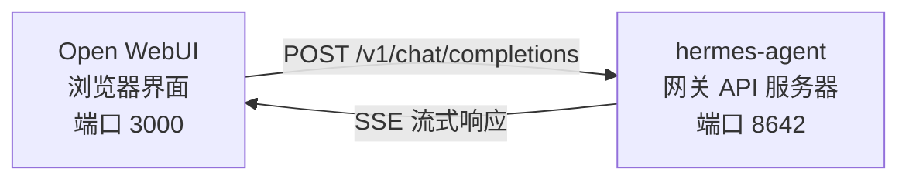

# Open WebUI 集成

[Open WebUI](https://github.com/open-webui/open-webui)（12.6k★）是最受欢迎的自主托管 AI 聊天界面。借助 Hermes Agent 内置的 API 服务器，你可以将 Open WebUI 用作代理的精美网页前端——支持对话管理、用户账户和现代聊天界面。

## 架构



Open WebUI 就像连接到 OpenAI 一样连接到 Hermes Agent 的 API 服务器。你的代理会使用其完整的工具集处理请求——包括终端、文件操作、网络搜索、记忆和技能——并返回最终响应。

Open WebUI 与 Hermes 服务器之间是服务器到服务器的通信，因此你不需要为此集成配置 `API_SERVER_CORS_ORIGINS`。

## 快速设置

### 1. 启用 API 服务器

添加到 `~/.hermes/.env`：

```bash
API_SERVER_ENABLED=true
API_SERVER_KEY=your-secret-key
```

### 2. 启动 Hermes Agent 网关

```bash
hermes gateway
```

你应该看到：

```
[API Server] API 服务器正在监听 http://127.0.0.1:8642
```

### 3. 启动 Open WebUI

```bash
docker run -d -p 3000:8080 \
  -e OPENAI_API_BASE_URL=http://host.docker.internal:8642/v1 \
  -e OPENAI_API_KEY=your-secret-key \
  --add-host=host.docker.internal:host-gateway \
  -v open-webui:/app/backend/data \
  --name open-webui \
  --restart always \
  ghcr.io/open-webui/open-webui:main
```

### 4. 打开用户界面

访问 **http://localhost:3000** 。创建你的管理员账户（第一个用户将成为管理员）。你应该能在模型下拉菜单中看到你的代理（以你的个人资料命名，或默认为 **hermes-agent**）。开始聊天吧！

## Docker Compose 设置

为了更持久的设置，创建一个 `docker-compose.yml`：

```yaml
services:
  open-webui:
    image: ghcr.io/open-webui/open-webui:main
    ports:
      - "3000:8080"
    volumes:
      - open-webui:/app/backend/data
    environment:
      - OPENAI_API_BASE_URL=http://host.docker.internal:8642/v1
      - OPENAI_API_KEY=your-secret-key
    extra_hosts:
      - "host.docker.internal:host-gateway"
    restart: always

volumes:
  open-webui:
```

然后：

```bash
docker compose up -d
```

## 通过管理界面配置

如果你更喜欢通过界面而不是环境变量来配置连接：

1. 登录 Open WebUI 的 **http://localhost:3000**
2. 点击你的 **个人资料头像** → **管理员设置**
3. 转到 **连接**
4. 在 **OpenAI API** 下，点击 **扳手图标**（管理）
5. 点击 **+ 添加新连接**
6. 输入：
   - **URL**: `http://host.docker.internal:8642/v1`
   - **API 密钥**: 你的密钥或任何非空值（例如 `not-needed`）
7. 点击 **勾选标记** 验证连接
8. **保存**

你的代理模型现在应该出现在模型下拉菜单中（以你的个人资料命名，或默认为 **hermes-agent**）。

:::warning
环境变量仅在 Open WebUI 的**首次启动**时生效。之后，连接设置会存储在其内部数据库中。要更改它们，请使用管理员界面或删除 Docker 卷并重新开始。
:::

## API 类型：Chat Completions vs Responses

当连接到后端时，Open WebUI 支持两种 API 模式：

| 模式 | 格式 | 适用场景 |
|------|--------|-------------|
| **Chat Completions**（默认） | `/v1/chat/completions` | 推荐。开箱即用。 |
| **Responses**（实验性） | `/v1/responses` | 用于通过 `previous_response_id` 维护服务器端对话状态。 |

### 使用 Chat Completions（推荐）

这是默认设置，无需额外配置。Open WebUI 发送标准的 OpenAI 格式请求，Hermes Agent 相应地响应。每个请求都包含完整的对话历史。

### 使用 Responses API

要使用 Responses API 模式：

1. 转到 **管理员设置** → **连接** → **OpenAI** → **管理**
2. 编辑你的 hermes-agent 连接
3. 将 **API 类型** 从 "Chat Completions" 更改为 **"Responses（实验性）"**
4. 保存

使用 Responses API 时，Open WebUI 以 Responses 格式发送请求（`input` 数组 + `instructions`），Hermes Agent 可以通过 `previous_response_id` 跨回合保留完整的工具调用历史。当 `stream: true` 时，Hermes 还会流式传输原生的 `function_call` 和 `function_call_output` 项，这允许客户端渲染 Responses 事件的自定义结构化工具调用 UI。

:::note
即使在 Responses 模式下，Open WebUI 目前也在客户端管理对话历史——它在每个请求中发送完整消息历史，而不是使用 `previous_response_id`。今天 Responses 模式的主要优势是结构化的事件流：文本增量、`function_call` 和 `function_call_output` 项作为 OpenAI Responses SSE 事件而不是 Chat Completions 分块到达。
:::

## 工作原理

当你在 Open WebUI 中发送消息时：

1. Open WebUI 发送一个带有你的消息和对话历史的 `POST /v1/chat/completions` 请求
2. Hermes Agent 创建一个带有其完整工具集的 AIAgent 实例
3. 代理处理你的请求——它可能会调用工具（终端、文件操作、网络搜索等）
4. 随着工具执行，**内联进度消息会流式传输到 UI**，让你能看到代理正在做什么（例如 `` `💻 ls -la` ``, `` `🔍 Python 3.12 release` ``）
5. 代理的最终文本响应会流式传输回 Open WebUI
6. Open WebUI 在其聊天界面中显示响应

你的代理拥有与 CLI 或 Telegram 使用时完全相同的工具和能力——唯一区别是前端界面。

:::tip 工具进度
启用流式传输（默认开启）时，你会看到工具运行时的简短内联指示器——工具表情符号及其关键参数。这些会在代理的最终答案之前出现在响应流中，让你能了解幕后发生的情况。
:::

## 配置参考

### Hermes Agent（API 服务器）

| 变量 | 默认值 | 描述 |
|----------|---------|-------------|
| `API_SERVER_ENABLED` | `false` | 启用 API 服务器 |
| `API_SERVER_PORT` | `8642` | HTTP 服务器端口 |
| `API_SERVER_HOST` | `127.0.0.1` | 绑定地址 |
| `API_SERVER_KEY` | _(必需)_ | Bearer token 用于认证。与 `OPENAI_API_KEY` 匹配。 |

### Open WebUI

| 变量 | 描述 |
|----------|-------------|
| `OPENAI_API_BASE_URL` | Hermes Agent 的 API URL（包含 `/v1`） |
| `OPENAI_API_KEY` | 必须为非空。与你的 `API_SERVER_KEY` 匹配。 |

## 故障排除

### 下拉菜单中没有显示模型

- **检查 URL 是否包含 `/v1` 后缀**：`http://host.docker.internal:8642/v1`（不仅仅是 `:8642`）
- **验证网关是否正在运行**：`curl http://localhost:8642/health` 应返回 `{"status": "ok"}`
- **检查模型列表**：`curl http://localhost:8642/v1/models` 应返回包含 `hermes-agent` 的列表
- **Docker 网络**：在 Docker 内部，`localhost` 指的是容器，而不是你的主机。使用 `host.docker.internal` 或 `--network=host`。

### 连接测试通过但没有加载模型

这几乎总是缺少 `/v1` 后缀。Open WebUI 的连接测试只是一个基本的连通性检查——它不验证模型列表功能是否正常工作。

### 响应时间过长

Hermes Agent 可能正在执行多个工具调用（读取文件、运行命令、搜索网络）后才产生最终响应。这对于复杂查询来说是正常的。响应会在代理完成时一次性出现。

### "Invalid API key" 错误

确保你在 Open WebUI 中的 `OPENAI_API_KEY` 与 Hermes Agent 中的 `API_SERVER_KEY` 匹配。

## 多用户配置与配置文件

要为每个用户运行独立的 Hermes 实例——每个实例都有自己的配置、记忆和技能——请使用 [配置文件](/docs/user-guide/profiles)。每个配置文件运行在独立端口上的 API 服务器，并自动将配置文件名称作为模型在 Open WebUI 中显示。

### 1. 创建配置文件并配置 API 服务器

```bash
hermes profile create alice
hermes -p alice config set API_SERVER_ENABLED true
hermes -p alice config set API_SERVER_PORT 8643
hermes -p alice config set API_SERVER_KEY alice-secret

hermes profile create bob
hermes -p bob config set API_SERVER_ENABLED true
hermes -p bob config set API_SERVER_PORT 8644
hermes -p bob config set API_SERVER_KEY bob-secret
```

### 2. 启动每个网关

```bash
hermes -p alice gateway &
hermes -p bob gateway &
```

### 3. 在 Open WebUI 中添加连接

在 **管理员设置** → **连接** → **OpenAI API** → **管理** 中，为每个配置文件添加一个连接：

| 连接 | URL | API 密钥 |
|-----------|-----|---------|
| Alice | `http://host.docker.internal:8643/v1` | `alice-secret` |
| Bob | `http://host.docker.internal:8644/v1` | `bob-secret` |

模型下拉菜单将显示 `alice` 和 `bob` 作为不同的模型。你可以通过管理面板将模型分配给 Open WebUI 用户，让每个用户拥有自己的隔离 Hermes 代理。

:::tip 自定义模型名称
模型名称默认为配置文件名称。要覆盖它，请在配置文件的 `.env` 中设置 `API_SERVER_MODEL_NAME`：
```bash
hermes -p alice config set API_SERVER_MODEL_NAME "Alice's Agent"
```
:::

## Linux Docker（无 Docker Desktop）

在没有 Docker Desktop 的 Linux 上，`host.docker.internal` 默认无法解析。选项：

```bash
# 选项 1：添加主机映射
docker run --add-host=host.docker.internal:host-gateway ...

# 选项 2：使用主机网络
docker run --network=host -e OPENAI_API_BASE_URL=http://localhost:8642/v1 ...

# 选项 3：使用 Docker 桥接 IP
docker run -e OPENAI_API_BASE_URL=http://172.17.0.1:8642/v1 ...
```