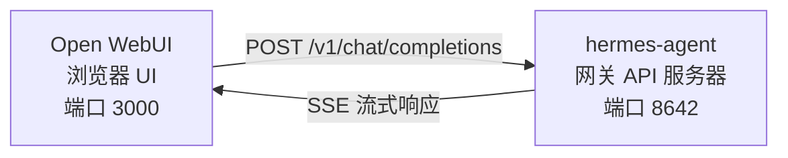

# Open WebUI 集成

[Open WebUI](https://github.com/open-webui/open-webui) (126k★) 是最流行的 AI 自托管聊天界面。借助 Hermes Agent 内置的 API 服务器，您可以使用 Open WebUI 作为您 Agent 的精美 Web 前端——它具备对话管理、用户账户和现代聊天界面等功能。

## 架构



Open WebUI 连接到 Hermes Agent 的 API 服务器的方式，就像它连接到 OpenAI 一样。您的 Agent 使用其完整的工具集——终端、文件操作、网络搜索、记忆、技能——来处理请求并返回最终响应。

Open WebUI 是服务器到服务器进行通信的，因此此集成不需要设置 `API_SERVER_CORS_ORIGINS`。

## 快速设置

### 1. 启用 API 服务器

添加到 `~/.hermes/.env`：

```bash
API_SERVER_ENABLED=true
API_SERVER_KEY=your-secret-key
```

### 2. 启动 Hermes Agent 网关

```bash
hermes gateway
```

您应该看到：

```
[API Server] API server listening on http://127.0.0.1:8642
```

### 3. 启动 Open WebUI

```bash
docker run -d -p 3000:8080 \
  -e OPENAI_API_BASE_URL=http://host.docker.internal:8642/v1 \
  -e OPENAI_API_KEY=your-secret-key \
  --add-host=host.docker.internal:host-gateway \
  -v open-webui:/app/backend/data \
  --name open-webui \
  --restart always \
  ghcr.io/open-webui/open-webui:main
```

### 4. 打开 UI

访问 **http://localhost:3000** 。创建您的管理员账户（第一个用户将成为管理员）。您应该在模型下拉菜单中看到您的 Agent（名称为您资料的名称，或默认资料的 **hermes-agent**）。开始聊天！

## Docker Compose 设置

如果需要更永久的设置，请创建一个 `docker-compose.yml`：

```yaml
services:
  open-webui:
    image: ghcr.io/open-webui/open-webui:main
    ports:
      - "3000:8080"
    volumes:
      - open-webui:/app/backend/data
    environment:
      - OPENAI_API_BASE_URL=http://host.docker.internal:8642/v1
      - OPENAI_API_KEY=your-secret-key
    extra_hosts:
      - "host.docker.internal:host-gateway"
    restart: always

volumes:
  open-webui:
```

然后：

```bash
docker compose up -d
```

## 通过管理员 UI 配置

如果您更喜欢通过 UI 而不是环境变量来配置连接：

1. 登录 Open WebUI 到 **http://localhost:3000**
2. 点击您的 **资料头像** → **管理员设置 (Admin Settings)**
3. 进入 **连接 (Connections)**
4. 在 **OpenAI API** 下，点击 **扳手图标** (管理)
5. 点击 **+ 添加新连接 (Add New Connection)**
6. 输入：
   - **URL**: `http://host.docker.internal:8642/v1`
   - **API Key**: 您的密钥或任何非空值（例如：`not-needed`）
7. 点击 **✓** 验证连接
8. **保存 (Save)**

您的 Agent 模型现在应该出现在模型下拉菜单中（名称为您资料的名称，或默认资料的 **hermes-agent**）。

:::warning
环境变量仅在 Open WebUI **首次启动**时生效。之后，连接设置会存储在其内部数据库中。如果稍后需要更改它们，请使用管理员 UI，或删除 Docker 卷并重新开始。
:::

## API 类型：聊天补全 vs 响应 (Chat Completions vs Responses)

连接到后端时，Open WebUI 支持两种 API 模式：

| 模式 | 格式 | 使用场景 |
|------|--------|-------------|
| **聊天补全 (Chat Completions)** (默认) | `/v1/chat/completions` | 推荐。开箱即用。 |
| **响应 (Responses)** (实验性) | `/v1/responses` | 用于通过 `previous_response_id` 进行服务器端对话状态管理。 |

### 使用聊天补全 (推荐)

这是默认模式，无需额外配置。Open WebUI 发送标准的 OpenAI 格式请求，而 Hermes Agent 相应地做出响应。每个请求都包含完整的对话历史。

### 使用 Responses API

要使用 Responses API 模式：

1. 进入 **管理员设置 (Admin Settings)** → **连接 (Connections)** → **OpenAI** → **管理 (Manage)**
2. 编辑您的 hermes-agent 连接
3. 将 **API 类型 (API Type)** 从 "Chat Completions" 更改为 **"Responses (Experimental)"**
4. 保存

使用 Responses API，Open WebUI 发送的请求采用 Responses 格式（`input` 数组 + `instructions`），而 Hermes Agent 可以通过 `previous_response_id` 在回合之间保留完整的工具调用历史。当 `stream: true` 时，Hermes 还会流式传输规范原生的 `function_call` 和 `function_call_output` 项，从而使渲染 Responses 事件的客户端能够实现自定义的结构化工具调用 UI。

:::note
Open WebUI 目前即使在 Responses 模式下也是在客户端管理对话历史——它在每个请求中发送完整的消息历史，而不是使用 `previous_response_id`。目前 Responses 模式的主要优势是结构化的事件流：文本增量、`function_call` 和 `function_call_output` 项作为 OpenAI Responses SSE 事件到达，而不是 Chat Completions 块。
:::

## 工作原理

当您在 Open WebUI 中发送消息时：

1. Open WebUI 发送一个包含您的消息和对话历史的 `POST /v1/chat/completions` 请求
2. Hermes Agent 创建一个具有完整工具集 的 AIAgent 实例
3. Agent 处理您的请求——它可能会调用工具（终端、文件操作、网络搜索等）
4. 在工具执行过程中，**内联进度消息会流式传输到 UI**，让您看到 Agent 正在做什么（例如：`` `💻 ls -la` ``, `` `🔍 Python 3.12 release` ``）
5. Agent 的最终文本响应流式传输回 Open WebUI
6. Open WebUI 在其聊天界面中显示响应

您的 Agent 拥有与使用 CLI 或 Telegram 时相同的工具和功能——唯一的区别是前端。

:::tip 工具进度
启用流式传输（默认设置）后，您会看到工具运行时的简短内联指示器——工具的表情符号及其关键参数。这些指示器出现在 Agent 最终答案之前，让您了解幕后发生了什么。
:::

## 配置参考

### Hermes Agent (API 服务器)

| 变量 | 默认值 | 描述 |
|----------|---------|-------------|
| `API_SERVER_ENABLED` | `false` | 是否启用 API 服务器 |
| `API_SERVER_PORT` | `8642` | HTTP 服务器端口 |
| `API_SERVER_HOST` | `127.0.0.1` | 绑定地址 |
| `API_SERVER_KEY` | _(必需)_ | 用于身份验证的 Bearer token。需匹配 `OPENAI_API_KEY`。 |

### Open WebUI

| 变量 | 描述 |
|----------|-------------|
| `OPENAI_API_BASE_URL` | Hermes Agent 的 API URL（包含 `/v1`） |
| `OPENAI_API_KEY` | 不能为空。需匹配您的 `API_SERVER_KEY`。 |

## 故障排除

### 下拉菜单中没有模型

- **检查 URL 是否包含 `/v1` 后缀**：`http://host.docker.internal:8642/v1`（而不是仅仅 `:8642`）
- **验证网关是否正在运行**：`curl http://localhost:8642/health` 应返回 `{"status": "ok"}`
- **检查模型列表**：`curl http://localhost:8642/v1/models` 应返回包含 `hermes-agent` 的列表
- **Docker 网络**：从 Docker 内部，`localhost` 指的是容器，而不是您的主机。请使用 `host.docker.internal` 或 `--network=host`。

### 连接测试通过但没有加载模型

这几乎总是缺少 `/v1` 后缀。Open WebUI 的连接测试只是一个基本的连通性检查——它并不能验证模型列表是否正常工作。

### 响应时间过长

在生成最终响应之前，Hermes Agent 可能正在执行多个工具调用（读取文件、运行命令、搜索网络）。对于复杂的查询，这是正常的。当 Agent 完成时，响应会一次性出现。

### "Invalid API key" 错误

请确保 Open WebUI 中的 `OPENAI_API_KEY` 与 Hermes Agent 中的 `API_SERVER_KEY` 匹配。

## 带资料的多用户设置

要为每个用户运行独立的 Hermes 实例——每个实例拥有自己的配置、记忆和技能——请使用 [资料 (profiles)](/docs/user-guide/features/profiles)。每个资料都在不同的端口上运行自己的 API 服务器，并自动在 Open WebUI 中将资料名称作为模型进行宣传。

### 1. 创建资料并配置 API 服务器

```bash
hermes profile create alice
hermes -p alice config set API_SERVER_ENABLED true
hermes -p alice config set API_SERVER_PORT 8643
hermes -p alice config set API_SERVER_KEY alice-secret

hermes profile create bob
hermes -p bob config set API_SERVER_ENABLED true
hermes -p bob config set API_SERVER_PORT 8644
hermes -p bob config set API_SERVER_KEY bob-secret
```

### 2. 启动每个网关

```bash
hermes -p alice gateway &
hermes -p bob gateway &
```

### 3. 在 Open WebUI 中添加连接

在 **管理员设置 (Admin Settings)** → **连接 (Connections)** → **OpenAI API** → **管理 (Manage)** 中，为每个资料添加一个连接：

| 连接 | URL | API Key |
|-----------|-----|---------|
| Alice | `http://host.docker.internal:8643/v1` | `alice-secret` |
| Bob | `http://host.docker.internal:8644/v1` | `bob-secret` |

模型下拉菜单将显示 `alice` 和 `bob` 作为不同的模型。您可以通过管理员面板将模型分配给 Open WebUI 用户，从而为每个用户提供独立的 Hermes Agent。

:::tip 自定义模型名称
模型名称默认使用资料名称。要覆盖它，请在资料的 `.env` 中设置 `API_SERVER_MODEL_NAME`：
```bash
hermes -p alice config set API_SERVER_MODEL_NAME "Alice's Agent"
```
:::

## Linux Docker (无 Docker Desktop)

在没有 Docker Desktop 的 Linux 上，`host.docker.internal` 默认无法解析。选项如下：

```bash
# 选项 1：添加主机映射
docker run --add-host=host.docker.internal:host-gateway ...

# 选项 2：使用主机网络
docker run --network=host -e OPENAI_API_BASE_URL=http://localhost:8642/v1 ...

# 选项 3：使用 Docker 网桥 IP
docker run -e OPENAI_API_BASE_URL=http://172.17.0.1:8642/v1 ...
```