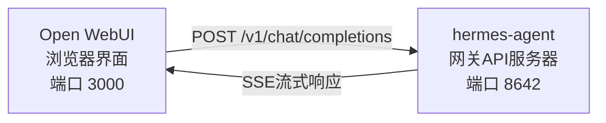

# Open WebUI集成

[Open WebUI](https://github.com/open-webui/open-webui)（126k★）是最受欢迎的自托管AI聊天界面。借助Hermes智能体内置的API服务器，您可以将Open WebUI用作智能体的精致网页前端——它具备对话管理、用户账户和现代化聊天界面等完整功能。

## 架构



Open WebUI连接到Hermes智能体的API服务器，其方式与连接OpenAI完全相同。Hermes使用其完整的工具集来处理请求——终端、文件操作、网络搜索、记忆、技能——并返回最终响应。

:::important 运行时位置
该API服务器是一个**Hermes智能体运行时**，而非纯粹的LLM代理。对于每个请求，Hermes都会在API服务器主机上创建一个服务端的`AIAgent`。工具调用在该API服务器运行的位置执行。

例如，如果一台笔记本电脑将Open WebUI或其他兼容OpenAI的客户端指向远程机器上的Hermes API服务器，那么`pwd`命令、文件工具、浏览器工具、本地MCP工具以及其他工作区工具都将在远程API服务器主机上运行，而非在笔记本电脑上运行。
:::

Open WebUI与Hermes服务器之间进行通信，因此此集成不需要配置`API_SERVER_CORS_ORIGINS`。

## 快速设置

### 一键本地引导启动（macOS/Linux，无需 Docker）

如果您希望在本地将 Hermes 与 Open WebUI 集成，并使用一个可复用的启动器，请运行：

```bash
cd ~/.hermes/hermes-agent
bash scripts/setup_open_webui.sh
```

该脚本的作用如下：

- 确保 `~/.hermes/.env` 文件中包含 `API_SERVER_ENABLED`、`API_SERVER_HOST`、`API_SERVER_KEY`、`API_SERVER_PORT` 和 `API_SERVER_MODEL_NAME` 等配置项。
- 重启 Hermes 网关以启动 API 服务器。
- 将 Open WebUI 安装到 `~/.local/open-webui-venv` 目录。
- 在 `~/.local/bin/start-open-webui-hermes.sh` 创建一个启动脚本。
- 在 macOS 上，安装一个 `launchd` 用户服务；在支持 `systemd --user` 的 Linux 系统上，则安装对应的 systemd 用户服务。

默认值：

- Hermes API 地址：`http://127.0.0.1:8642/v1`
- Open WebUI 地址：`http://127.0.0.1:8080`
- 向 Open WebUI 公开的模型名称：`Hermes Agent`

有用的覆盖选项：

```bash
OPEN_WEBUI_NAME='我的 Hermes UI' \
OPEN_WEBUI_ENABLE_SIGNUP=true \
HERMES_API_MODEL_NAME='我的 Hermes 智能体' \
bash scripts/setup_open_webui.sh
```

在 Linux 上，自动后台服务设置需要一个正常工作的 `systemd --user` 会话。如果您处于无头 SSH 环境并希望跳过服务安装，请运行：

```bash
OPEN_WEBUI_ENABLE_SERVICE=false bash scripts/setup_open_webui.sh
```

### 1. 启用 API 服务器

```bash
hermes config set API_SERVER_ENABLED true
hermes config set API_SERVER_KEY 你的密钥
```

`hermes config set` 命令会自动将标志路由到 `config.yaml`，将密钥写入 `~/.hermes/.env`。如果网关正在运行，请重启以使更改生效：

```bash
hermes gateway stop && hermes gateway
```

### 2. 启动 Hermes 智能体网关

```bash
hermes gateway
```

您应该会看到：

```
[API Server] API 服务器正在监听 http://127.0.0.1:8642
```

### 3. 验证 API 服务器是否可访问

```bash
curl -s http://127.0.0.1:8642/health
# {"status": "ok", ...}

curl -s -H "Authorization: Bearer 你的密钥" http://127.0.0.1:8642/v1/models
# {"object":"list","data":[{"id":"hermes-agent", ...}]}
```

如果 `/health` 请求失败，说明网关未识别到 `API_SERVER_ENABLED=true` — 请重启网关。如果 `/v1/models` 返回 `401`，则表示您的 `Authorization` 头与 `API_SERVER_KEY` 不匹配。

### 4. 启动 Open WebUI

```bash
docker run -d -p 3000:8080 \
  -e OPENAI_API_BASE_URL=http://host.docker.internal:8642/v1 \
  -e OPENAI_API_KEY=你的密钥 \
  -e ENABLE_OLLAMA_API=false \
  --add-host=host.docker.internal:host-gateway \
  -v open-webui:/app/backend/data \
  --name open-webui \
  --restart always \
  ghcr.io/open-webui/open-webui:main
```

`ENABLE_OLLAMA_API=false` 会禁用默认的 Ollama 后端，否则它会显示为空并使模型选择器变得混乱。如果您确实同时运行了 Ollama，则可以省略此选项。

首次启动需要 15-30 秒：Open WebUI 在第一次启动时会下载句子转换器嵌入模型（约 150MB）。请等待 `docker logs open-webui` 输出稳定后再打开 UI。

### 5. 打开 UI

访问 **http://localhost:3000** 。创建您的管理员账户（第一个用户将成为管理员）。您应该能在模型下拉菜单中看到您的智能体（名称基于您的配置文件，或默认配置文件下的 **hermes-agent**）。开始聊天吧！

## Docker Compose 设置

如需更持久的设置，请创建一个 `docker-compose.yml` 文件：

```yaml
services:
  open-webui:
    image: ghcr.io/open-webui/open-webui:main
    ports:
      - "3000:8080"
    volumes:
      - open-webui:/app/backend/data
    environment:
      - OPENAI_API_BASE_URL=http://host.docker.internal:8642/v1
      - OPENAI_API_KEY=你的密钥
      - ENABLE_OLLAMA_API=false
    extra_hosts:
      - "host.docker.internal:host-gateway"
    restart: always

volumes:
  open-webui:
```

然后：

```bash
docker compose up -d
```

## 通过管理员 UI 配置

如果您更喜欢通过 UI 而不是环境变量来配置连接：

1. 登录 Open WebUI，访问 **http://localhost:3000**
2. 点击您的 **个人头像** → **管理员设置**
3. 进入 **连接**
4. 在 **OpenAI API** 部分，点击 **扳手图标**（管理）
5. 点击 **+ 添加新连接**
6. 输入：
   - **URL**：`http://host.docker.internal:8642/v1`
   - **API Key**：与 Hermes 中的 `API_SERVER_KEY` 完全相同的值
7. 点击 **对勾图标** 以验证连接
8. **保存**

您的智能体现在应该会出现在模型下拉菜单中（名称基于您的配置文件，或默认配置文件下的 **hermes-agent**）。

:::warning
环境变量仅在 Open WebUI **首次启动**时生效。之后，连接设置会存储在其内部数据库中。要稍后更改它们，请使用管理员 UI 或删除 Docker 卷并重新启动。
:::

## API 类型：Chat Completions 与 Responses

Open WebUI 在连接后端时支持两种 API 模式：

| 模式 | 格式 | 何时使用 |
|------|------|----------|
| **Chat Completions**（默认） | `/v1/chat/completions` | 推荐。开箱即用。 |
| **Responses**（实验性） | `/v1/responses` | 用于通过 `previous_response_id` 实现的服务端对话状态管理。 |

### 使用 Chat Completions（推荐）

这是默认设置，无需额外配置。Open WebUI 发送标准的 OpenAI 格式请求，Hermes 智能体会相应地做出响应。每个请求都包含完整的对话历史记录。

### 使用 Responses API

要使用 Responses API 模式：

1. 进入 **管理员设置** → **连接** → **OpenAI** → **管理**
2. 编辑您的 hermes-agent 连接
3. 将 **API 类型** 从 "Chat Completions" 更改为 **"Responses (实验性)"**
4. 保存

使用 Responses API 时，Open WebUI 会以 Responses 格式（`input` 数组 + `instructions`）发送请求，Hermes 智能体可以通过 `previous_response_id` 跨轮次保留完整的工具调用历史记录。当 `stream: true` 时，Hermes 还会以规范的原生格式流式传输 `function_call` 和 `function_call_output` 项，这使得支持渲染 Responses 事件的客户端能够实现自定义的结构化工具调用 UI。

:::note
即使在 Responses 模式下，Open WebUI 当前仍通过客户端管理对话历史记录——它在每个请求中发送完整的消息历史记录，而不是使用 `previous_response_id`。目前 Responses 模式的主要优势在于结构化的事件流：文本增量、`function_call` 和 `function_call_output` 项会作为 OpenAI Responses SSE 事件到达，而不是 Chat Completions 块。
:::

## 工作原理

当您在 Open WebUI 中发送消息时：

1. Open WebUI 发送一个 `POST /v1/chat/completions` 请求，包含您的消息和对话历史。
2. Hermes 智能体使用 API 服务器的配置文件、模型/提供商配置、记忆、技能和配置的 API 服务器工具集，在服务端创建一个 `AIAgent` 实例。
3. 智能体处理您的请求——它可能会在 API 服务器主机上调用工具（终端、文件操作、网络搜索等）。
4. 随着工具的执行，**内联进度消息会流式传输到 UI**，以便您可以看到智能体正在做什么（例如 `` `💻 ls -la` ``、`` `🔍 Python 3.12 发布` ``）。
5. 智能体的最终文本响应会流式传输回 Open WebUI。
6. Open WebUI 在其聊天界面中显示响应。

您的智能体可以访问与该 API 服务器 Hermes 实例相同的工具和功能。如果 API 服务器是远程的，那么这些工具也是远程的。

如果您今天需要工具在您的**本地**工作区运行，请在本地运行 Hermes，并将其指向一个纯 LLM 提供商或纯 OpenAI 兼容的模型代理（例如 vLLM、LiteLLM、Ollama、llama.cpp、OpenAI、OpenRouter 等）。关于“远程大脑，本地双手”的未来拆分运行时模式正在 [#18715](https://github.com/NousResearch/hermes-agent/issues/18715) 中跟踪；它不是当前 API 服务器的行为。

:::tip 工具进度
在启用流式传输（默认）的情况下，当工具运行时，您会看到简短的内联指示器——工具的 emoji 及其关键参数。这些指示器会出现在智能体最终答案之前的响应流中，让您能够了解幕后正在发生的事情。
:::

## 配置参考

### Hermes 智能体（API 服务器）

| 变量 | 默认值 | 描述 |
|------|--------|------|
| `API_SERVER_ENABLED` | `false` | 启用 API 服务器 |
| `API_SERVER_PORT` | `8642` | HTTP 服务器端口 |
| `API_SERVER_HOST` | `127.0.0.1` | 绑定地址 |
| `API_SERVER_KEY` | _(必需)_ | 用于身份验证的 Bearer 令牌。需与 `OPENAI_API_KEY` 匹配。 |

### Open WebUI

| 变量 | 描述 |
|------|------|
| `OPENAI_API_BASE_URL` | Hermes 智能体的 API URL（包含 `/v1`） |
| `OPENAI_API_KEY` | 必须为非空。需与您的 `API_SERVER_KEY` 匹配。 |

## 故障排除

### 下拉菜单中未显示模型

- **检查 URL 是否包含 `/v1` 后缀**：`http://host.docker.internal:8642/v1`（不仅仅是 `:8642`）
- **验证网关是否正在运行**：`curl http://localhost:8642/health` 应返回 `{"status": "ok"}`
- **检查模型列表**：`curl -H "Authorization: Bearer your-secret-key" http://localhost:8642/v1/models` 应返回包含 `hermes-agent` 的列表
- **Docker 网络**：在 Docker 容器内部，`localhost` 指的是容器本身，而不是你的主机。请使用 `host.docker.internal` 或 `--network=host`。
- **空的 Ollama 后端遮挡了选择器**：如果你省略了 `ENABLE_OLLAMA_API=false`，Open WebUI 会在你的 Hermes 模型上方显示一个空的 Ollama 部分。请使用 `-e ENABLE_OLLAMA_API=false` 重启容器，或在 **管理员设置 → 连接** 中禁用 Ollama。

### 连接测试通过但未加载模型

这几乎总是由于缺少 `/v1` 后缀造成的。Open WebUI 的连接测试是一个基本的连通性检查——它不验证模型列表是否正常工作。

### 响应时间较长

Hermes 智能体可能正在执行多个工具调用（读取文件、运行命令、搜索网络）后才生成其最终响应。对于复杂查询来说，这是正常现象。当智能体完成处理后，响应会一次性出现。

### "Invalid API key" 错误

确保你在 Open WebUI 中设置的 `OPENAI_API_KEY` 与 Hermes 智能体中的 `API_SERVER_KEY` 相匹配。

:::warning
Open WebUI 在首次启动后会将兼容 OpenAI 的连接设置持久化到自己的数据库中。如果你在管理界面中意外保存了错误的密钥，仅修复环境变量是不够的——需要在 **管理员设置 → 连接** 中更新或删除已保存的连接，或者重置 Open WebUI 的数据目录/数据库。
:::

## 使用配置文件的多用户设置

要为每个用户运行独立的 Hermes 实例——每个实例拥有自己的配置、记忆和技能——请使用[配置文件](/docs/user-guide/profiles)。每个配置文件在不同端口运行自己的 API 服务器，并自动在 Open WebUI 中将配置文件名称作为模型进行广告。

### 1. 创建配置文件并配置 API 服务器

`API_SERVER_*` 是环境变量，而非 YAML 配置键，因此请将它们写入每个配置文件的 `.env` 中。选择超出默认平台范围的端口（`8644` 是 webhook 适配器，`8645` 是 wecom-callback，`8646` 是 msgraph-webhook），例如 `8650+`：

```bash
hermes profile create alice
cat >> ~/.hermes/profiles/alice/.env <<EOF
API_SERVER_ENABLED=true
API_SERVER_PORT=8650
API_SERVER_KEY=alice-secret
EOF

hermes profile create bob
cat >> ~/.hermes/profiles/bob/.env <<EOF
API_SERVER_ENABLED=true
API_SERVER_PORT=8651
API_SERVER_KEY=bob-secret
EOF
```

### 2. 启动每个网关

```bash
hermes -p alice gateway &
hermes -p bob gateway &
```

### 3. 在 Open WebUI 中添加连接

在 **管理员设置** → **连接** → **OpenAI API** → **管理** 中，为每个配置文件添加一个连接：

| 连接 | URL | API 密钥 |
|-----------|-----|---------|
| Alice | `http://host.docker.internal:8650/v1` | `alice-secret` |
| Bob | `http://host.docker.internal:8651/v1` | `bob-secret` |

模型下拉菜单将显示 `alice` 和 `bob` 作为不同的模型。你可以通过管理面板将模型分配给 Open WebUI 用户，为每个用户提供自己隔离的 Hermes 智能体。

:::tip 自定义模型名称
模型名称默认为配置文件名称。要覆盖它，请在配置文件的 `.env` 中设置 `API_SERVER_MODEL_NAME`：
```bash
hermes -p alice config set API_SERVER_MODEL_NAME "Alice's Agent"
```
:::

## Linux Docker（无 Docker Desktop）

在没有 Docker Desktop 的 Linux 上，`host.docker.internal` 默认无法解析。选项：

```bash
# 选项 1：添加主机映射
docker run --add-host=host.docker.internal:host-gateway ...

# 选项 2：使用主机网络
docker run --network=host -e OPENAI_API_BASE_URL=http://localhost:8642/v1 ...

# 选项 3：使用 Docker 网桥 IP
docker run -e OPENAI_API_BASE_URL=http://172.17.0.1:8642/v1 ...
```