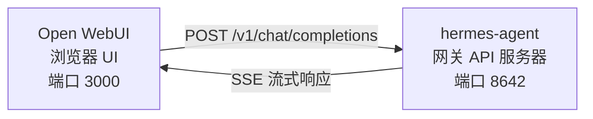

# Open WebUI 集成

[Open WebUI](https://github.com/open-webui/open-webui)（126k★）是最受欢迎的 AI 自托管聊天界面。通过 Hermes 智能体内置的 API 服务器，您可以将 Open WebUI 用作智能体的精美 Web 前端——包括对话管理、用户账户和现代化的聊天界面。

## 架构



Open WebUI 连接到 Hermes 智能体的 API 服务器，就像连接到 OpenAI 一样。Hermes 使用其完整的工具集处理请求——终端、文件操作、网络搜索、记忆、技能——并返回最终响应。

:::important 运行时位置
该 API 服务器是一个 **Hermes 智能体运行时**，而不是纯粹的 LLM 代理。对于每个请求，Hermes 都会在 API 服务器主机上创建一个服务器端 `AIAgent`。工具调用在 API 服务器所在的位置运行。

例如，如果笔记本电脑将 Open WebUI 或其他 OpenAI 兼容客户端指向远程机器上的 Hermes API 服务器，则 `pwd`、文件工具、浏览器工具、本地 MCP 工具和其他工作区工具将在远程 API 服务器主机上运行，而不是在笔记本电脑上运行。
:::

Open WebUI 与 Hermes 服务器进行服务器到服务器的通信，因此您无需为此集成配置 `API_SERVER_CORS_ORIGINS`。

## 快速设置

### 单命令本地启动（macOS/Linux，无需 Docker）

如果您希望将 Hermes 与 Open WebUI 在本地连接，并使用可复用的启动脚本，请运行：

```bash
cd ~/.hermes/hermes-agent
bash scripts/setup_open_webui.sh
```

该脚本执行的操作：

- 确保 `~/.hermes/.env` 包含 `API_SERVER_ENABLED`、`API_SERVER_HOST`、`API_SERVER_KEY`、`API_SERVER_PORT` 和 `API_SERVER_MODEL_NAME`
- 重启 Hermes 网关以启动 API 服务器
- 将 Open WebUI 安装到 `~/.local/open-webui-venv`
- 在 `~/.local/bin/start-open-webui-hermes.sh` 写入启动脚本
- 在 macOS 上安装 `launchd` 用户服务；在支持 `systemd --user` 的 Linux 上安装用户服务

默认值：

- Hermes API：`http://127.0.0.1:8642/v1`
- Open WebUI：`http://127.0.0.1:8080`
- 向 Open WebUI 发布的模型名称：`Hermes Agent`

有用的覆盖参数：

```bash
OPEN_WEBUI_NAME='My Hermes UI' \
OPEN_WEBUI_ENABLE_SIGNUP=true \
HERMES_API_MODEL_NAME='My Hermes Agent' \
bash scripts/setup_open_webui.sh
```

在 Linux 上，自动后台服务设置需要可用的 `systemd --user` 会话。如果您在仅支持 SSH 的无头服务器上，并希望跳过服务安装，请运行：

```bash
OPEN_WEBUI_ENABLE_SERVICE=false bash scripts/setup_open_webui.sh
```

### 1. 启用 API 服务器

```bash
hermes config set API_SERVER_ENABLED true
hermes config set API_SERVER_KEY your-secret-key
```

`hermes config set` 会自动将标志写入 `config.yaml`，并将密钥写入 `~/.hermes/.env`。如果网关已在运行，请重启它以使更改生效：

```bash
hermes gateway stop && hermes gateway
```

### 2. 启动 Hermes 智能体网关

```bash
hermes gateway
```

您应该会看到：

```
[API Server] API server listening on http://127.0.0.1:8642
```

### 3. 验证 API 服务器是否可达

```bash
curl -s http://127.0.0.1:8642/health
# {"status": "ok", ...}

curl -s -H "Authorization: Bearer your-secret-key" http://127.0.0.1:8642/v1/models
# {"object":"list","data":[{"id":"hermes-agent", ...}]}
```

如果 `/health` 失败，说明网关未获取到 `API_SERVER_ENABLED=true` —— 请重启它。如果 `/v1/models` 返回 `401`，说明您的 `Authorization` 标头与 `API_SERVER_KEY` 不匹配。

### 4. 启动 Open WebUI

```bash
docker run -d -p 3000:8080 \
  -e OPENAI_API_BASE_URL=http://host.docker.internal:8642/v1 \
  -e OPENAI_API_KEY=your-secret-key \
  -e ENABLE_OLLAMA_API=false \
  --add-host=host.docker.internal:host-gateway \
  -v open-webui:/app/backend/data \
  --name open-webui \
  --restart always \
  ghcr.io/open-webui/open-webui:main
```

`ENABLE_OLLAMA_API=false` 会禁用默认的 Ollama 后端，否则它会显示为空并干扰模型选择器。如果您确实有 Ollama 并行运行，请省略此参数。

首次启动需要 15–30 秒：Open WebUI 第一次启动时会下载 sentence-transformer 嵌入模型（约 150MB）。请在 `docker logs open-webui` 日志稳定后再打开 UI。

### 5. 打开 UI

访问 **http://localhost:3000** 。创建您的管理员账户（第一个用户将成为管理员）。您应该能在模型下拉菜单中看到您的智能体（以您的配置文件命名，或默认配置文件为 **hermes-agent**）。开始聊天吧！

## Docker Compose 设置

如需更持久的设置，请创建 `docker-compose.yml`：

```yaml
services:
  open-webui:
    image: ghcr.io/open-webui/open-webui:main
    ports:
      - "3000:8080"
    volumes:
      - open-webui:/app/backend/data
    environment:
      - OPENAI_API_BASE_URL=http://host.docker.internal:8642/v1
      - OPENAI_API_KEY=your-secret-key
      - ENABLE_OLLAMA_API=false
    extra_hosts:
      - "host.docker.internal:host-gateway"
    restart: always

volumes:
  open-webui:
```

然后：

```bash
docker compose up -d
```

## 通过管理 UI 配置

如果您希望通过 UI 而非环境变量配置连接：

1. 登录 Open WebUI：**http://localhost:3000**
2. 点击您的**头像** → **管理设置**
3. 进入 **连接**
4. 在 **OpenAI API** 下，点击**扳手图标**（管理）
5. 点击 **+ 添加新连接**
6. 输入：
   - **URL**：`http://host.docker.internal:8642/v1`
   - **API 密钥**：与 Hermes 中 `API_SERVER_KEY` 完全相同的值
7. 点击**对勾**以验证连接
8. **保存**

现在，您的智能体模型应出现在模型下拉菜单中（以您的配置文件命名，或默认配置文件为 **hermes-agent**）。

:::warning
环境变量仅在 Open WebUI 的**首次启动**时生效。之后，连接设置将存储在其内部数据库中。如需后续更改，请使用管理 UI 或删除 Docker 卷并重新开始。
:::

## API 类型：聊天补全 vs 响应

Open WebUI 在连接后端时支持两种 API 模式：

| 模式 | 格式 | 何时使用 |
|------|--------|-------------|
| **聊天补全**（默认） | `/v1/chat/completions` | 推荐。开箱即用。 |
| **响应**（实验性） | `/v1/responses` | 用于通过 `previous_response_id` 实现服务端对话状态管理。 |

### 使用聊天补全（推荐）

这是默认模式，无需额外配置。Open WebUI 发送标准 OpenAI 格式的请求，Hermes 智能体相应地响应。每个请求包含完整的对话历史。

### 使用响应 API

要使用响应 API 模式：

1. 进入 **管理设置** → **连接** → **OpenAI** → **管理**
2. 编辑您的 hermes-agent 连接
3. 将 **API 类型**从“聊天补全”更改为 **“响应（实验性）”**
4. 保存

使用响应 API 时，Open WebUI 以响应格式（`input` 数组 + `instructions`）发送请求，Hermes 智能体可通过 `previous_response_id` 跨轮次保留完整的工具调用历史。当 `stream: true` 时，Hermes 还会流式传输原生规范的 `function_call` 和 `function_call_output` 项目，从而在渲染响应事件的客户端中启用自定义结构化工具调用 UI。

:::note
目前，即使在响应模式下，Open WebUI 仍在客户端管理对话历史 —— 它在每个请求中发送完整的消息历史，而非使用 `previous_response_id`。目前响应模式的主要优势是结构化事件流：文本增量、`function_call` 和 `function_call_output` 项目以 OpenAI 响应 SSE 事件的形式到达，而非聊天补全块。
:::

## 工作原理

当您在 Open WebUI 中发送消息时：

1. Open WebUI 发送一个包含您的消息和对话历史的 `POST /v1/chat/completions` 请求
2. Hermes 智能体使用 API 服务器的配置文件、模型/提供商配置、内存、技能和已配置的 API 服务器工具集创建一个服务端 `AIAgent` 实例
3. 智能体处理您的请求 —— 它可能会在 API 服务器主机上调用工具（终端、文件操作、网络搜索等）
4. 工具执行时，**内联进度消息会流式传输到 UI**，以便您查看智能体的操作（例如 `` `💻 ls -la` ``、`` `🔍 Python 3.12 release` ``）
5. 智能体的最终文本响应流式传输回 Open WebUI
6. Open WebUI 在其聊天界面中显示响应

您的智能体可以访问与 API 服务器 Hermes 实例相同的工具和功能。如果 API 服务器是远程的，这些工具也是远程的。

如果您需要工具在**本地**工作空间运行，请在本地运行 Hermes，并将其指向纯 LLM 提供商或纯 OpenAI 兼容模型代理（例如 vLLM、LiteLLM、Ollama、llama.cpp、OpenAI、OpenRouter 等）。未来的“远程大脑，本地操作”分离运行时模式正在 [#18715](https://github.com/NousResearch/hermes-agent/issues/18715) 中跟踪；当前 API 服务器不具备此行为。

:::tip 工具进度
启用流式传输（默认）时，您会看到工具运行时的简短内联指示器 —— 工具表情符号及其关键参数。这些出现在智能体最终答案之前的响应流中，让您了解后台正在发生的事情。
:::

## 配置参考

### Hermes 智能体（API 服务器）

| 变量 | 默认值 | 说明 |
|----------|---------|-------------|
| `API_SERVER_ENABLED` | `false` | 启用 API 服务器 |
| `API_SERVER_PORT` | `8642` | HTTP 服务器端口 |
| `API_SERVER_HOST` | `127.0.0.1` | 绑定地址 |
| `API_SERVER_KEY` | _（必需）_ | 用于认证的 Bearer 令牌。需与 `OPENAI_API_KEY` 匹配。 |

### Open WebUI

| 变量 | 说明 |
|----------|-------------|
| `OPENAI_API_BASE_URL` | Hermes 智能体的 API URL（包含 `/v1`） |
| `OPENAI_API_KEY` | 必须非空。需与您的 `API_SERVER_KEY` 匹配。 |

## 故障排查

### 下拉菜单中未显示任何模型

- **检查 URL 是否包含 `/v1` 后缀**：`http://host.docker.internal:8642/v1`（而不仅仅是 `:8642`）
- **验证网关是否正在运行**：`curl http://localhost:8642/health` 应返回 `{"status": "ok"}`
- **检查模型列表**：`curl -H "Authorization: Bearer your-secret-key" http://localhost:8642/v1/models` 应返回包含 `hermes-agent` 的列表
- **Docker 网络**：在 Docker 内部，`localhost` 指的是容器本身，而不是宿主机。请使用 `host.docker.internal` 或 `--network=host`。
- **空的 Ollama 后端覆盖了选择器**：如果省略了 `ENABLE_OLLAMA_API=false`，Open WebUI 会在 Hermes 模型上方显示一个空的 Ollama 部分。请使用 `-e ENABLE_OLLAMA_API=false` 重启容器，或在 **管理设置 → 连接** 中禁用 Ollama。

### 连接测试通过但模型未加载

这几乎总是因为缺少 `/v1` 后缀。Open WebUI 的连接测试只是一个基本的连通性检查 —— 它不会验证模型列表功能是否正常。

### 响应耗时较长

Hermes 智能体在生成最终响应之前，可能会执行多次工具调用（读取文件、运行命令、搜索网络）。对于复杂查询，这是正常现象。当智能体完成所有操作后，响应会一次性全部显示。

### “无效 API 密钥”错误

请确保 Open WebUI 中的 `OPENAI_API_KEY` 与 Hermes 智能体中的 `API_SERVER_KEY` 相匹配。

:::warning
首次启动后，Open WebUI 会将其 OpenAI 兼容连接设置持久化存储在自身的数据库中。如果您不小心在管理界面中保存了错误的密钥，仅修复环境变量是不够的 —— 请在 **管理设置 → 连接** 中更新或删除已保存的连接，或重置 Open WebUI 数据目录/数据库。
:::

## 多用户配置文件设置

要为每个用户运行独立的 Hermes 实例 —— 每个实例拥有各自的配置、记忆和技能 —— 请使用[配置文件](/docs/user-guide/profiles)。每个配置文件都会在其不同的端口上运行自己的 API 服务器，并自动将配置文件名称作为模型名称通告给 Open WebUI。

### 1. 创建配置文件并配置 API 服务器

```bash
hermes profile create alice
hermes -p alice config set API_SERVER_ENABLED true
hermes -p alice config set API_SERVER_PORT 8643
hermes -p alice config set API_SERVER_KEY alice-secret

hermes profile create bob
hermes -p bob config set API_SERVER_ENABLED true
hermes -p bob config set API_SERVER_PORT 8644
hermes -p bob config set API_SERVER_KEY bob-secret
```

### 2. 启动每个网关

```bash
hermes -p alice gateway &
hermes -p bob gateway &
```

### 3. 在 Open WebUI 中添加连接

在 **管理设置** → **连接** → **OpenAI API** → **管理** 中，为每个配置文件添加一个连接：

| 连接 | URL | API 密钥 |
|-----------|-----|---------|
| Alice | `http://host.docker.internal:8643/v1` | `alice-secret` |
| Bob | `http://host.docker.internal:8644/v1` | `bob-secret` |

模型下拉菜单将显示 `alice` 和 `bob` 作为不同的模型。您可以通过管理面板将模型分配给 Open WebUI 用户，为每个用户提供其隔离的 Hermes 智能体。

:::tip 自定义模型名称
模型名称默认使用配置文件名称。要覆盖它，请在配置文件的 `.env` 中设置 `API_SERVER_MODEL_NAME`：
```bash
hermes -p alice config set API_SERVER_MODEL_NAME "Alice's Agent"
```
:::

## Linux Docker（无 Docker Desktop）

在没有 Docker Desktop 的 Linux 系统上，默认情况下 `host.docker.internal` 无法解析。可选方案：

```bash
# 选项 1：添加主机映射
docker run --add-host=host.docker.internal:host-gateway ...

# 选项 2：使用主机网络
docker run --network=host -e OPENAI_API_BASE_URL=http://localhost:8642/v1 ...

# 选项 3：使用 Docker 桥接 IP
docker run -e OPENAI_API_BASE_URL=http://172.17.0.1:8642/v1 ...
```