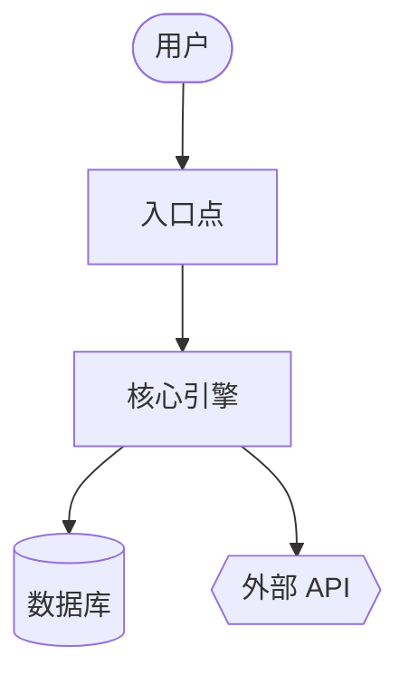
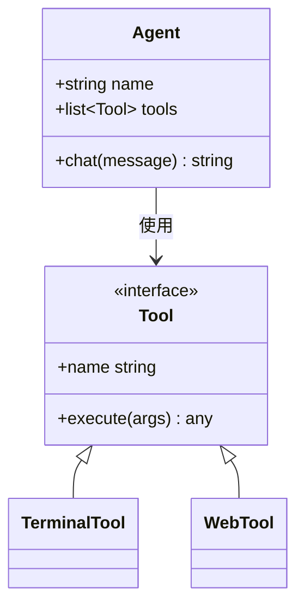
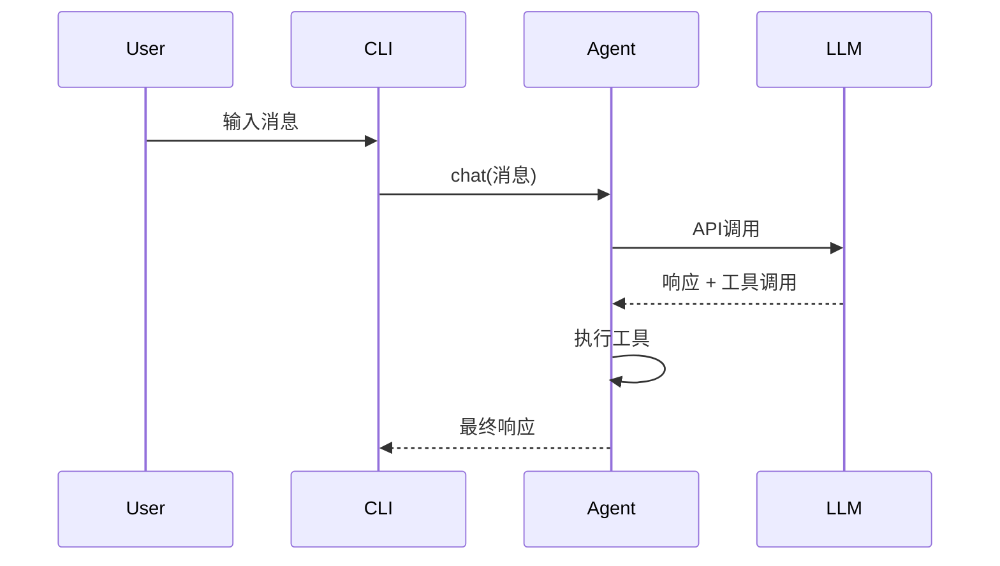

{/* 此页面由网站脚本/scripts/generate-skill-docs.py根据技能的SKILL.md自动生成。请编辑源SKILL.md文件，而非此页面。*/}

# 代码Wiki

为任何代码库生成wiki文档和Mermaid图表。

## 技能元数据

| | |
|---|---|
| 来源 | 可选 — 通过 `hermes skills install official/software-development/code-wiki` 安装 |
| 路径 | `optional-skills/software-development/code-wiki` |
| 版本 | `0.1.0` |
| 作者 | Teknium (teknium1), Hermes智能体 |
| 许可证 | MIT |
| 平台 | linux, macos, windows |
| 标签 | `文档`, `Mermaid`, `架构`, `图表`, `Wiki`, `代码分析` |
| 相关技能 | [`codebase-inspection`](/docs/user-guide/skills/bundled/github/github-codebase-inspection), [`github-repo-management`](/docs/user-guide/skills/bundled/github/github-github-repo-management) |

# 代码维基技能

为任何代码库生成全面的维基文档——概述、架构、每个模块的深入分析、Mermaid 类图和序列图。灵感来源于 Google CodeWiki，但适用于本地仓库、私有仓库和任何编程语言。仅使用现有的 Hermes 工具 (`terminal`、`read_file`、`search_files`、`write_file`)；无需 Docker、外部服务或额外依赖项。

此技能生成**参考文档**（做什么/如何做）。它不生成战略性叙述（为什么存在——那是另一个技能的范畴）。

## 何时使用

- 用户说“记录这个代码库”、“生成维基”、“制作架构图”
- 不熟悉某个仓库，需要结构化参考文档
- 用户指向一个 GitHub URL 并请求文档
- 需要一个稳定的产物（Markdown + Mermaid），可在 GitHub 上渲染

请勿将此用于：
- 单文件或单函数文档——直接回答即可
- 特定端点的 API 参考——使用 `read_file` 并直接回答
- 战略性的“为什么存在”叙述——不同的技能，不同的目的
- 用户在当前会话中正在开发的代码库——随问随答

## 前提条件

- 无需环境变量。
- `PATH` 中需要有 `git`，用于仓库 SHA 跟踪和远程克隆。
- 可选：`pygount` 用于语言细分统计（参见 `codebase-inspection` 技能）。

## 如何运行

通过 `terminal` 工具从目标仓库的根目录调用，然后使用 `read_file` / `search_files` / `write_file` 生成维基。默认输出位置是 `~/.hermes/wikis/<repo-name>/`。仅当用户明确要求时，才写入仓库内（`docs/wiki/`）。

## 快速参考

| 步骤 | 操作 |
|---|---|
| 1 | 确定目标 — 本地当前目录、给定路径，或 `git clone --depth 50 <url>` 到临时目录 |
| 2 | 扫描结构 — `ls`、`find -maxdepth 3`、清单文件、README |
| 3 | 选择 8–10 个模块进行记录 |
| 4 | 编写 `README.md`（概述 + 模块图） |
| 5 | 编写带 Mermaid 流程图的 `architecture.md` |
| 6 | 编写 `modules/` 目录下的每个模块文档 |
| 7 | 编写 `diagrams/class-diagram.md`（Mermaid 类图） |
| 8 | 编写 `diagrams/sequences.md`（Mermaid 序列图，2–4 个工作流） |
| 9 | 编写 `getting-started.md` |
| 10 | 如适用，编写 `api.md`，否则跳过 |
| 11 | 编写 `.codewiki-state.json` |
| 12 | 向用户报告路径 |

## 流程

### 1. 确定目标

对于 GitHub URL：

```bash
WIKI_TMP=$(mktemp -d)
git clone --depth 50 <url> "$WIKI_TMP/repo"
cd "$WIKI_TMP/repo"
REPO_SHA=$(git rev-parse HEAD)
REPO_NAME=$(basename <url> .git)
```

对于本地路径（如果未提供则使用当前目录）：

```bash
cd <path>
REPO_SHA=$(git rev-parse HEAD 2>/dev/null || echo "uncommitted")
REPO_NAME=$(basename "$PWD")
```

然后设置输出目录：

```bash
OUTPUT_DIR="$HOME/.hermes/wikis/$REPO_NAME"
mkdir -p "$OUTPUT_DIR/modules" "$OUTPUT_DIR/diagrams"
```

### 2. 扫描仓库结构

使用 `terminal` 工具进行 shell 操作，使用 `read_file` 读取清单：

```bash
# 首先进行浅层目录树查看
ls -la

# 更深层的目录树，过滤噪音
find . -type d \
  -not -path '*/\.*' \
  -not -path '*/node_modules*' \
  -not -path '*/venv*' \
  -not -path '*/__pycache__*' \
  -not -path '*/dist*' \
  -not -path '*/build*' \
  -not -path '*/target*' \
  -maxdepth 3 | sort

# 语言细分统计（如果 pygount 不可用则跳过）
pygount --format=summary \
  --folders-to-skip=".git,node_modules,venv,.venv,__pycache__,.cache,dist,build,target" \
  . 2>/dev/null || true
```

然后使用 `read_file` 读取相关清单（`package.json`、`pyproject.toml`、`setup.py`、`Cargo.toml`、`go.mod`、`pom.xml`、`build.gradle`）和项目 README。使用 `search_files target='files'` 来查找它们，而不是猜测名称。

### 3. 选择要记录的模块

初次记录限制在 **8–10 个模块**。按语言启发式选择：

- Python：顶级包（包含 `__init__.py` 的目录），加上子系统目录
- JS/TS：`src/<subdir>`，顶级工作区目录
- Rust：工作区中的每个 crate，或顶级 `src/<module>` 目录
- Go：每个顶级包目录
- 混合/不熟悉：包含源代码的顶级目录（非配置，非测试）

对于非常大的仓库，优先考虑：
1. 被导入次数（被许多模块导入的是核心模块）
2. 代码行数（较大的模块通常值得单独成文）
3. 在 README / 顶级文档中被提及

在大型仓库上生成每个模块文档之前，先向用户说明模块列表——给他们一个重新定向的机会。

### 4. 编写 `README.md`

读取实际的项目 README 以及前 2–3 个入口点文件。然后使用 `write_file` 写入：

````markdown
# <项目名称>

<一段话：它是什么以及用途。内容需自成一体——不要假设读者已阅读源码中的 README。>

## 核心概念

- **<概念 1>** — <一行说明>
- **<概念 2>** — <一行说明>

## 入口点

- [`path/to/main.py`](https://github.com/NousResearch/hermes-agent/blob/main/optional-skills/software-development/code-wiki/<链接>) — <启动时运行的内容>
- [`path/to/cli.py`](https://github.com/NousResearch/hermes-agent/blob/main/optional-skills/software-development/code-wiki/<链接>) — <命令行接口>

## 高级架构

<2-3 句话。详细内容在 architecture.md 中。>

参见 [architecture.md](https://github.com/NousResearch/hermes-agent/blob/main/optional-skills/software-development/code-wiki/architecture.md)。

## 模块图

| 模块 | 用途 |
|---|---|
| [`<模块>`](https://github.com/NousResearch/hermes-agent/blob/main/optional-skills/software-development/code-wiki/modules/<模块>.md) | <一行说明用途> |

## 快速入门

参见 [getting-started.md](https://github.com/NousResearch/hermes-agent/blob/main/optional-skills/software-development/code-wiki/getting-started.md)。
````

对于本地模式下的链接目标，使用相对路径。对于克隆的仓库，使用 `https://github.com/<所有者>/<仓库>/blob/<sha>/<路径>`，以便链接在未来的提交中仍然有效。

### 5. 编写 `architecture.md`

````markdown
# 架构

<2-3 段话：系统的整体形态。什么与什么通信。数据在哪里进入、在哪里退出、状态保存在哪里。>

## 组件

- **<组件>** — <1-2 句话>。参见 [`modules/<模块>.md`](https://github.com/NousResearch/hermes-agent/blob/main/optional-skills/software-development/code-wiki/modules/<模块>.md)。

## 系统图



## 数据流

1. **<步骤>** — [`<文件>`](https://github.com/NousResearch/hermes-agent/blob/main/optional-skills/software-development/code-wiki/<链接>)
2. **<步骤>** — [`<文件>`](https://github.com/NousResearch/hermes-agent/blob/main/optional-skills/software-development/code-wiki/<链接>)

## 关键设计决策

- <任何承载性的重要信息，读者应知>
````

**Mermaid 形状语义：**
- `[]` = 组件
- `[()]` = 数据库 / 存储
- `{{}}` = 外部服务
- `(())` = 入口点或终端
- `-->` = 同步调用，`-.->` = 异步/事件

每个图限制在约 20 个节点以内。如果更大，请拆分为子图。

### 6. 在 `modules/` 目录下编写每个模块文档

对于每个选定的模块，使用 `ls` 检查其布局，识别 3–5 个最重要的文件（按大小、按命名为 `core.py` / `main.py` / `__init__.py`、或按被导入次数多），然后使用 `read_file` 读取这些文件（使用 `offset` / `limit` 只读取所需部分；对于特定符号，优先使用 `search_files`）。

````markdown
# 模块: `<模块>`

<1-2 句话说明用途。>

## 职责

- <要点>
- <要点>

## 关键文件

- [`<模块>/<文件>`](https://github.com/NousResearch/hermes-agent/blob/main/optional-skills/software-development/code-wiki/<链接>) — <它做什么>

## 公共 API

<其他代码使用的函数/类/常量。将相关项分组。显示签名，而非完整实现。>

## 内部结构

<模块内部如何组织。状态管理。>

## 依赖项

- **被谁使用：** <其他模块>
- **使用了：** <其他模块 + 外部库>

## 值得注意的模式 / 易错点

- <任何不明显的地方>
````

### 7. 编写 `diagrams/class-diagram.md`

选择 5–10 个最重要的类/类型。使用 `read_file` 读取它们，然后编写：

````markdown
# 类图

## 核心类型



## 注释

<任何图表无法表达的内容——生命周期、线程等。>
````

对于没有类的语言（Go、C、Rust）：使用该图表展示结构体关系，或者跳过 class-diagram.md，转而在 architecture.md 中用文字解释。不要强行套用。

### 8. 编写 `diagrams/sequences.md`

选择 2–4 个最重要的工作流。跟踪每个调用路径通过代码（读取入口点，跟踪函数调用），然后：

````markdown
# 序列图

# 工作流：<名称>

<1句话说明此工作流的功能及运行时机。>



### 流程详解

1. **用户输入** — [`cli.py:HermesCLI.run_session`](https://github.com/NousResearch/hermes-agent/blob/main/optional-skills/software-development/code-wiki/<link>)
2. **消息分发** — [`run_agent.py:AIAgent.chat`](https://github.com/NousResearch/hermes-agent/blob/main/optional-skills/software-development/code-wiki/<link>)
````

不要虚构参与者。每个方块都必须对应读者能在代码中找到的真实组件。

### 9. 编写 `getting-started.md`

````markdown
# 入门指南

## 前置条件

<来自清单文件和 README。请具体说明——如有版本限制请注明。>

## 安装

```bash
<精确命令>
```

## 首次运行

```bash
<让系统执行有用操作的最低命令>
```

## 常见工作流

### <工作流 1>
<命令>

## 配置

- `<配置文件>` — <控制内容>
- 环境变量 `<VAR>` — <控制内容>

## 后续步骤

- 架构：[architecture.md](https://github.com/NousResearch/hermes-agent/blob/main/optional-skills/software-development/code-wiki/architecture.md)
- 模块参考：[README.md#module-map](https://github.com/NousResearch/hermes-agent/blob/main/optional-skills/software-development/code-wiki/README.md#module-map)
````

### 10. 编写 `api.md`（如不适用则跳过）

仅在项目是库或 API 服务器时编写此部分。如果是：

- 找出公共 API 接口（`__init__.py` 导出项、OpenAPI 规范、路由处理器、导出类型）
- 记录每个公共条目的签名、参数、返回类型、单行描述
- 按类别分组

### 11. 编写状态文件

```bash
cat > "$OUTPUT_DIR/.codewiki-state.json" <<EOF
{
  "repo_name": "$REPO_NAME",
  "source_path": "$PWD",
  "source_sha": "$REPO_SHA",
  "generated_at": "$(date -u +%Y-%m-%dT%H:%M:%SZ)",
  "generator": "hermes-agent code-wiki skill v0.1.0",
  "modules_documented": []
}
EOF
```

### 12. 向用户报告

准确说明生成了什么以及位置：

```
已生成 wiki 于 ~/.hermes/wikis/<repo-name>/：
  README.md                   项目概览、模块地图
  architecture.md             系统架构 + 流程图
  getting-started.md          设置、首次运行、工作流
  modules/<N 文件>           每个模块的深度详解
  diagrams/architecture.md    Mermaid 流程图
  diagrams/class-diagram.md   Mermaid 类图
  diagrams/sequences.md       Mermaid 序列图
```

如果您克隆到了临时目录，请在审阅完 wiki 后提醒用户可以删除它 (`rm -rf "$WIKI_TMP"`)。

## 范围控制

为 500K 行代码的单体仓库生成完整 wiki 会非常耗费 token。默认限制范围：

- 初始扫描：最多深入 3 层目录
- 每模块文档：上限 10 个模块，除非用户扩大范围
- 读取每个文件：优先使用 `search_files` 查找符号 + 使用 `read_file` 的 `offset`/`limit` 而非完整读取
- 跳过供应商代码（`vendor/`、`third_party/`、生成的代码、`_pb2.py`、`.min.js`）

如果用户说"彻底完整地处理整个仓库"，相信他们——但先估算成本："此仓库约有 340 个源文件，全面覆盖将非常昂贵——确认吗？"

## 重新运行/更新

如果目标路径已存在 `.codewiki-state.json`：

- 读取它以获取之前的 SHA 和模块列表
- 如果源 SHA 匹配：询问用户是重新生成还是跳过
- 如果 SHA 不同：提供仅重新生成已更改文件的模块的选项（`git diff --name-only <old-sha> HEAD`）

完整的增量重新生成是未来增强功能——目前重新生成整个内容是可接受的。

## 常见陷阱

- **虚构组件。** 每个图表节点和声称的函数调用都必须存在于源代码中。在编写前先 `read_file`。自动生成文档最大的失败模式就是看起来合理但实际是虚构的内容。
- **泛泛的 AI 文字。** "此模块负责……"是没有意义的空话。用领域特定术语说明模块实际做什么。
- **将代码复述为散文。** 一个模块文档说 "`process` 函数通过在每个项上调用 `process_item` 来处理事物"，这比直接链接到该函数更糟糕。
- **Mermaid 超过 50 个节点。** 它们无法清晰渲染。请拆分它们。
- **将测试、生成的代码或供应商依赖视为产品代码进行文档记录。** 跳过它们。
- **未经询问就在仓库内输出。** 默认路径是 `~/.hermes/wikis/`。仅在用户明确要求时才写入仓库。
- **Mermaid 特殊字符需要引号：** `A["Tool / Agent"]` 而不是 `A[Tool / Agent]`。节点内换行用 `<br>`。
- **SKILL.md 中的嵌套代码围栏。** 当编写包含 Mermaid 块的 markdown 示例时，使用四个反引号的外部围栏，这样三个反引号的内部 ` ```mermaid ` 不会关闭外部围栏。（本 SKILL.md 就是这样做的。）
- **classDiagram 泛型** 渲染为 `~T~`（例如 `List~Tool~`），而不是 `<T>`。
- **GitHub Mermaid 主题是固定的** — 不要包含 `%%{init: ...}%%` 块；它们在渲染时会被剥离。

## 验证

编写后，请验证：

1. **Mermaid 块平衡** — 每个文件的开始和结束数量相等：
   ```bash
   for f in "$OUTPUT_DIR"/diagrams/*.md "$OUTPUT_DIR"/architecture.md; do
     opens=$(grep -c '^```mermaid' "$f")
     total=$(grep -c '^```' "$f")
     echo "$f: $opens 个 mermaid 块，共 $total 个围栏（预期总数 = opens*2）"
   done
   ```
2. **所有预期文件都存在** —
   ```bash
   ls "$OUTPUT_DIR"/{README.md,architecture.md,getting-started.md,.codewiki-state.json} \
      "$OUTPUT_DIR"/modules/ "$OUTPUT_DIR"/diagrams/
   ```
3. **模块数量与预期一致** — `ls "$OUTPUT_DIR/modules" | wc -l` 应等于您在第 3 步中承诺的模块数量。
4. **无虚构路径** — 抽查 2-3 个源链接是否解析到真实文件。